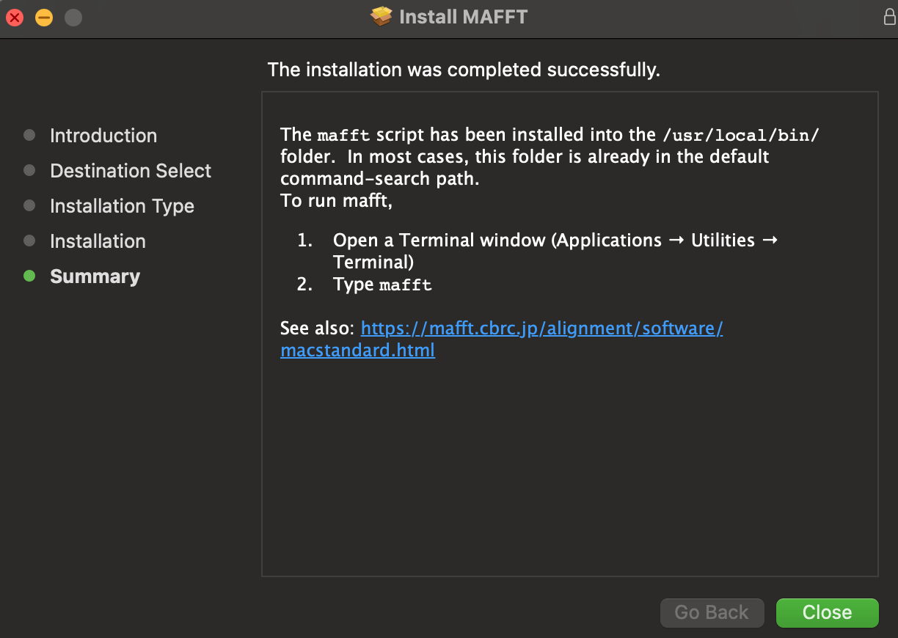

# My Project Plan

I'm going to lay out my project plan. This is a living document and I may find the need to alter it as I'm starting different parts of my work.

**Goal of Project**: Construct a phylogenetic tree of every backbone isocyandide synthesis gene in the fungal order Eurotiales. 

**Explanation of this note markdown file**

This markdown file is broken into three main parts. 

1. the intro (what you're reading)
2. TL;DR which will be my condensed completed pipeline and steps I took
3. All of my notes including failed attempts and troublshooting. This is where I'll do most of my documnetation and when I do something that works it will be copied into the TL;DR section to make it easier to reference later on.

**Background:** Secondary metabolites (SM), which are predominately produced by filamentous fungi, play a crucial role in development, virulence, and protection from environmental damage. These compounds, such as penicillin, have been historically leveraged for a variety of pharmaceutical applications. All SM that have been found in fungal genomes are arranged in a contiguous biosynthetic gene cluster (BGC). The regulation of these BGCs is a result of environmental and developmental stimuli. Temperature, light, nutrition, and stressors have all been shown to impact the synthesis of SM. 

There exists common patterns that underlys different classes of major secondary metabolite families. The main commonly studied and analyzed groups are nonribosomal peptide synthetases (NRPS), polyketide synthases (PKS), terpenes, and hybrid mixes between the other families. Bioinformaticians have been able to exploit these patterns allowing scientists to easily search for all of the BGCS within any genome(s) of interest. However, these programs rely on one very large assumtion: the program can only search for what is canonical. There are countless of examples off non-canonical BGCs in fungi, plants, and bacteria. 

There currently doesn't exist any tools geared toward helping users search for their own non-canoncal gene clusters. I have created a python tool called GBKCreator.py that has enabled me to develop the first dataset of isocyanide BGCS in every sequenced Eurotiales. These isocyanide synthatses (ICS) were first characterized the Keller Lab several years ago, and it's been found that every ICS contains the same core bacbone gene and protein domain. By searching for this protein domain in every annotated Eurotiales genome, and grabbing windows around the located backbone gene, I was also to manually analyze and network the distribution and patterns in this noval secondary metabilite family.

For class I will run a phylogenetic analysis of the backbone ICS protein domains that my program discovered (amino acid sequences). My networking program I've already been running takes into account the evolution of entire gene clusters. This phylogenetic approach will allow me to get insite into the evolution of the core backbone ICS protein domain. The resulting trees that are made by this analysis might give inside into the evolutionary history of this novel secondary metabolite family.

**Overall steps with justification of each step**

There are some things that are going to be done after step 6 but it goes far beyond the scope of this class and phlogenetic work. This pipeline is just for my phylogenetic tree building process. 

1. Create a pipeline that can grab the amino acid sequences of every ICS protein domain within Eurotiales. This pipeline then needs to condense them all into a single fasta file, while adding in the metadata to each grabbed core protein domain.

- This part of the project is straightforard in terms of goal, but will require me to make a custom bash/python pipeline to execute.

2. Make an alignment of the fasta file using both muscle and T-Coffee

- I will use both and will then evaluate which one produced the file with the highest quality sequence alignment

3. Using trimAl, remove the poorly aligned regions from my multiple sequence alignment. 

-  I have previously used trimAl and it is a great tool to automate removal of poorly aligned regions
-  I will also maintain my untrimmed-tree and depending on if it is not full of gaps, will use in parallel to the trimmed dataset 
   -  both will be evaluated after the tree building stage for quality of the trees they were able to construct
4. Using ModelFinder2 identify the optimal model of evolution for my dataset.

- This is my first time choosing a model of evolution when making a phylogenetic tree. I think this is a really sensible way to prevent me from adding too many parameters that don't necessarily improve the model
- ModelFinder2 seems to run relativley fast and will work on my dataset, and is commonly used in the field 
5. Using IQ-Tree, construct a maximum liklihood phylogenetic tree with the ideal model found by ModelFinder2.

- I have tried both IQ-Tree and RAxML but just tend to prefer IQ-Tree. Both would be more than sufficient provided that I give it them the same model. Due to my preference I'll stick with using IQ-Tree for this part of the analysis

6. Analyze the groupings that are made in the phylogenetic tree. It would be interesting to then track the branching and groupings that occured in this tree and compare it against the species tree. Could help give insight on things like if the evolutionary history of these clusters predate Eurotiales, if horizontal gene transfer occured, etc.


***References of information in background***

Blin, K. *et al.* AntiSMASH 5.0: Updates to the secondary metabolite genome mining pipeline. *Nucleic Acids Res.* **47**, W81–W87 (2019).

Caesar, L. K., Kelleher, N. L. & Keller, N. P. In the fungus where it happens: history and future propelling Aspergillus nidulans as the archetype of natural products research. *Fungal Genet. Biol.* **144**, 103477 (2020).

Keller, N. P. Fungal secondary metabolism: regulation, function and drug discovery. *Nature Reviews Microbiology* vol. 17 167–180 (2019).

Lim, F. Y. *et al.* Fungal isocyanide synthases and xanthocillin biosynthesis in Aspergillus fumigatus. *MBio* **9**, (2018).

**How I am going to keep everything reproduciple**

Everytime I run a small script I will include it in the notes document. I am also going to consistentlly use version control on github to save all of the checkpoints throughout the development of this project. All but the raw genome files and their annotations will be used to do this.

# TL;DR

## Gathering the data
I used the follow on all of the Eurotiales annotated data. This was from every sequenced genome that was present in the NCBI databse late 2020. The main goal of this section is to grab my protein domain of interest everytime it occurs in all of the genomes, converting that into a fasta format, and condensing them all into a single document while adding in metadata to uniquly identify the sequences later on.

```sh
#!/bin/bash

for dir in */ ; do
  cd ./$dir
  grep "PF05141" *.fa.tsv > tsvFiltered
  cut -f1 tsvFiltered > temp
  echo $dir > proteinFastaFiltered
  grep -f temp -A 1 *prot.fa | grep -v -- "^--$" >> proteinFastaFiltered
  rm temp
  cd ..
done

for dir in */ ; do
  cd ./$dir
  cat proteinFastaFiltered >> ../EurotialesFastaAll
  cat tsvFiltered >> ../Eurotiales_tsvAll
  rm tsvFiltered
  rm proteinFastaFiltered
  cd ..
done
```

followed by 

```python
#! /usr/bin/env python
#Author: Grant Nickles

import os
import sys
import pdb
from Bio import SeqIO
def grepFixer(fastaPath, oldFastaPath):
    allRecords = {}
    for record in SeqIO.parse(oldFastaPath, "fasta"):
        allRecords[record.id[:-2]] = record.description
    editedFasta = []
    with open(fastaPath) as fa:
        lines = fa.readlines()
        genomeName = None
        for index, line in enumerate(lines):
            line = line.strip('\n')
            if line.startswith("GC"):
                genomeName = line.replace(".tar.gz_folder/", "")
            elif line.startswith(">"):
                editedLine = line + " " + allRecords[genomeName] + "\n"
                editedFasta.append(editedLine)
            else:
                editedFasta.append(line + "\n")
    outputPath = r"/Users/gnickles/Documents/GN_Botany563/MainProject/data/FinalPF04151.fa"
    with open(outputPath, "a+") as finalFasta:
        for l in editedFasta:
            finalFasta.write(l)

fastaPath = r"/Users/gnickles/Documents/GN_Botany563/MainProject/data/EurotialesFastaAll"
oldFastaPath = r"/Users/gnickles/Documents/GN_Botany563/MainProject/data/PF05141_Euro.fa"
grepFixer(fastaPath, oldFastaPath)
```

followed by

```python
#! /usr/bin/env python
#Author: Grant Nickles
import os
import sys
import pdb
from Bio import SeqIO

def MakePF05141(tsvPath, fastaPath):
    annotationInfo = {}
    with open (tsvPath) as tsv:
        lines = tsv.readlines()
        for index, line in enumerate(lines):
            line=line.rstrip()
            separated = line.split("\t")
            name = separated[0]
            start = separated[6]
            stop = separated[7]
            annotationInfo[name] = [start, stop]
    editedRecords = []
    for record in SeqIO.parse(fastaPath, "fasta"):
        try:
            start = int(annotationInfo[record.id][0])
            stop = int(annotationInfo[record.id][1])
            editedRecords.append(record[start-1:stop])
        except:
            editedRecords.append(record)
            print(record.id + " needs to be filtered by hand.")
    outputPath = os.path.join("/Users/gnickles/Documents/GN_Botany563/MainProject/data", "PF05141.fa")
    SeqIO.write(editedRecords, outputPath, 'fasta')

tsvPath = r'/Users/gnickles/Documents/GN_Botany563/MainProject/data/Eurotiales_tsvAll'
fastaPath = r'/Users/gnickles/Documents/GN_Botany563/MainProject/data/EurotialesFastaAll'
MakePF05141(tsvPath, fastaPath)
```

This made a single fasta file with the gene names. This may be the big issue for the time being as this doesn't include any of the identifying info. I'll think about how I can add that later.

Update on 03/05/2021: I figured out how to add the identifying info. It wasn't hard and just used a single python script and and echo statement on my bash script.

```sh
rna-gnl|WGS:AHIG|ASPCADRAFT_mRNA21606 needs to be filtered by hand.
#looking into it this isn't anywhere in the tsv file. I opted to remove it.
>rna-gnl|WGS:AHIG|ASPCADRAFT_mRNA21606 GCA_001990825.1_4 Fungi,Ascomycota,Eurotiomycetes,Eurotiales,Aspergillaceae,Aspergillus,Aspergillus_carbonarius,Aspergillus_carbonarius_ITEM_5010
VSYQKLFPTRAGSHYIHIRFPNGRQFPAPAPGQAQQAVDAVIRAWEETECKQAQTPIQRELIIDANPWLRMTQWAVYLQGIHPCDLRQRARCPSAEISDPVEKAIQTLWWTVDQVVRKSQRTVQHCGVAIRMEAARTQQTELPYRPLLGYMDEDSIMKRVYPWQQVLTFFART
```


# Initial Testing, Notes, and troubleshooting 

***Botany 563 Main Project Pipeline***

Grant Nickles; gnickles@wisc.edu

Spring of 2021 Semester: Botany 563

___

## Getting the Data

In order to get the data I had to make two scripts that consolidated everything from my main project. For this I used my GBKCreator.py pipeline grabbing 0kb around the backbone genes. I then added some of the metadata to the description park of the fasta files for later use. I'll include full copies of these two scripts that are debugged on my device bellow.

### BackboneExtracter.py

this adds all of the 0kb files into one folder

```python
#! /usr/bin/env python
#Author: Grant Nickles

import os
import sys
import pdb
#using this program for the Botany 563 class. I want a dataset of all the backbone genes to practice making trees with.
def BackboneCopier(rootDirectory):
    #making all of the window folders in the root directory
    backbonePath = os.path.join(rootDirectory, "BackboneGenes")
    os.mkdir(backbonePath)
    for genomeFolders in os.listdir(rootDirectory): #stepping through the genome folders
        if os.path.isdir(os.path.join(rootDirectory, genomeFolders)) and str(genomeFolders).endswith("folder"):
            genomeFolder = os.path.join(rootDirectory, genomeFolders)
            genome = str(genomeFolders)[:15] #this removes all but the unique identifier of the genome
            for annotationFolders in os.listdir(genomeFolder): #stepping into the Annotation_Windows folder inside the genome folder
                if os.path.isdir(os.path.join(genomeFolder, annotationFolders)):
                    annoFolder = os.path.join(genomeFolder, annotationFolders)
                    for fasta in os.listdir(annoFolder):
                        if os.path.isfile(os.path.join(annoFolder, fasta)) and str(fasta).endswith(".fna"): #finding all of the zero kb files
                            kbNumber = int(fasta.split("_")[1][:-2]) #taking the number and not the kb ex 10kb = 10
                            hitNumber = fasta.split("_")[0]
                            if kbNumber == 0: #if it only has the backbone gene included then...
                                fastaPath = os.path.join(annoFolder, fasta) #save the path
                                pathToCopy = os.path.join(backbonePath, hitNumber + "_" + str(kbNumber) + "_" + genome + ".fna")
                                cmd = "cp " + fastaPath + " " + pathToCopy
                                os.system(cmd)

BackboneCopier(r'/Volumes/HardDrive/ICSProject/Eurotiales_all')

```

### BackboneFastaCombiner

this makes all the backbone fasta files into one fasta file

```python
#! /usr/bin/env python
#Author: Grant Nickles
from Bio import SeqIO
import os
import sys
import pdb
import pandas as pd
#This program will take all the fasta files and combine them to one file, adding on the GCA name as it does so.
def BackboneFastaCombiner(backboneDirectory, accession):
    #loading in the two files from their location on the computer
    accessionDF = pd.read_csv(accession, sep="\t", header=None)
    SpeciesInfo = accessionDF.iloc[:, -1] #seleting the last column in the DF and storing as series
    TempName = accessionDF.iloc[:,0]
    TempAndSpecies = pd.merge(TempName, SpeciesInfo, right_index = True, left_index = True)
    TempAndSpecies.columns = ["TempName", "SpeciesName"]
    accessionDict = {}
    for index, row in TempAndSpecies.iterrows(): #saving the accession data to a dictionary for easy access later on
        accessionDict[row["TempName"]] = row["SpeciesName"].strip()
    #going through all of the fasta files
    allFasta = []
    for fasta in os.listdir(backboneDirectory):
        if os.path.isfile(os.path.join(backboneDirectory, fasta)) and str(fasta).endswith(".fna"):
            fnaPath = os.path.join(backboneDirectory, fasta)
            genome = ".".join("_".join(fnaPath.split("_")[-2:]).split(".")[0:2]) #extracting only the genome name
            annotationNumber = fasta.split("_")[0]
            for record in SeqIO.parse(fnaPath, "fasta"):
                record.id = genome + "_" + annotationNumber #sets the things immediatly following the > to be the temp name
                record.description = accessionDict[genome] #this sets the description in the fasta to be the species information
                allFasta.append(record)
    outputPath = os.path.join(backboneDirectory, "ICS_BackboneGenes.fa")
    SeqIO.write(allFasta, outputPath, "fasta")

bbDir = r"/Volumes/HardDrive/ICSProject/Eurotiales_all/BackboneGenes"
accession = r"/Volumes/HardDrive/ICSProject/final_accession_sorted"
BackboneFastaCombiner(bbDir, accession)
```

### PF05141

This took a lot more work than I orignially was planning. It ended up being a computationallly tricky problem and I had to learn new things in Python that I hadn't previously known about. Hoping to helps my future work as I'll be able to recycle a lot of this code.

This program edits all of the fasta files to only have the PF05141 domain instead of the entire gene.

```python
#! /usr/bin/env python
#Author: Grant Nickles
import os
from pandas import read_csv
import sys
import pdb
from Bio import SeqIO

def PF05141Filterer(rootDirectory, backboneFile, annotation):
    filteringRangesAll = {}
    filteringRanges = {}
    editedRecords = []
    for genomeDirs in os.listdir(rootDirectory):
        if os.path.isdir(os.path.join(rootDirectory, genomeDirs)):
            if genomeDirs.startswith("G"):
                genomeDir = os.path.join(rootDirectory, genomeDirs)
                genome = str(genomeDirs)[:15] #this removes all but the unique identifier of the genome
                for file in os.listdir(genomeDir):
                    if os.path.isfile(os.path.join(genomeDir, file)):
                        if file.endswith('.tsv'):
                            tsvPath = os.path.join(genomeDir, file)
                            protTSV = read_csv(tsvPath, sep='\t', names=['Protein Accession', 'Sequence MD5 digest', 'Sequence length', 'Analysis', 'Signature accession', 'Signature description', 'Start location', 'Stop location', 'Score', 'Status', 'Date', 'InterPro annotations - accession', 'InterPro annotations - description', 'GO annotations', 'Pathways annotations'])
                            rows = protTSV.loc[protTSV['Signature accession'] == annotation] #this selects all rows with PF05141
                            names = rows['Protein Accession'].tolist()
                            #startStop = [rows['Protein Accession'],rows['Start location'],rows['Stop location']]
                            filteringRangesAll[genome] = []
                            filteringRanges[genome] = []
                            for index, row in rows.iterrows():
                                filteringRangesAll[genome].append([row['Protein Accession'],row['Start location'],row['Stop location']]) #this line works
                            for f in filteringRangesAll[genome]: #genomes
                                if f[0] not in (item for sublist in filteringRanges[genome] for item in sublist):
                                    filteringRanges[genome].append(f) #checks if it is anywhere in the list of list
                            if len(names) != 0:
                                for file in os.listdir(genomeDir): #find the correct order of the files in the GIO folder
                                    if os.path.isfile(os.path.join(genomeDir, file)):
                                        if file.endswith('GIO_new.txt'):
                                            faPath = os.path.join(genomeDir, file)
                                            with open(faPath) as GIO:
                                                names = [i for n, i in enumerate(names) if i not in names[:n]] #removes redundancy in the name list
                                                lines = GIO.readlines()
                                                nameIndex = {}
                                                counter = 1
                                                genomeGIO = "_".join(file.split("_")[0:2])
                                                #will give the line number and the line itself
                                                for index, line in enumerate(lines):
                                                    line=line.rstrip()
                                                    for name in names:
                                                        if name in line: #for each occurance of the annotation
                                                            nameIndex[name] = counter
                                                            counter += 1
                                                filteringRanges[genomeGIO].sort(key=lambda x: nameIndex[x[0]])

    orderedDictionary = {}
    for g in filteringRanges: #genome
        counter = 1
        for entry in filteringRanges[g]: #list of lists
            newName = g + "_" + str(counter)
            counter += 1
            orderedDictionary[newName] = [entry[1], entry[2]]
    for record in SeqIO.parse(backboneFile, "fasta"):
        #the id should be the same as the genome that is in the filteringRanges dictionary
        try:
            start = orderedDictionary[record.id][0] #start
            stop = orderedDictionary[record.id][-1] #stop
            editedRecords.append(record[start-1:stop])
        except:
            editedRecords.append(record)
            print(record.id + " needs to be filtered by hand.")
    outputPath = os.path.join("/Users/gnickles/Documents/GN_Botany563/MainProject/data", "PF05141_Euro.fa")
    SeqIO.write(editedRecords,"/Users/gnickles/Documents/GN_Botany563/MainProject/data/PF05141_Euro.fa", "fasta")


rootDirectory = r'/Volumes/HardDrive/ICSProject/Eurotiales_all'
backboneFile = r'/Users/gnickles/Documents/GN_Botany563/MainProject/data/ICS_BackboneGenes.fa'
annotation = "PF05141"
PF05141Filterer(rootDirectory, backboneFile, annotation)

```


This gave me the final output file that is titled PF05141_Euro.fa


### Big update on 02/23/2021

I thought really long and hard about the input data I was using. This is a custom dataset that only I have generated with Eurotiales. If I want to make an alignment I should be building it off the PF05141 domain only and not the other elements. Thus I need to copy and modify my GBKCreator pipeline to do this. I will copy in the code into this MainProject folder and make the needed edits.

Final output will be: all of the fasta locations that had PF05141 domain. Will NOT include the entire gene.


### Final Updating on gathering the data

03/04/2021

After trying to run some new stuff in R from the class today I realized whatever the hell I had done before was garbage. I also realized I could use bash to do a majority of what I was trying to do... This took about two hours but I checked and it's actually making PFAM domains now. Thank god.

I used the following pipeline to make this work.

```sh
#!/bin/bash

for dir in */ ; do
  cd ./$dir
  grep "PF05141" *.fa.tsv > tsvFiltered
  cut -f1 tsvFiltered > temp
  echo $dir > proteinFastaFiltered
  grep -f temp -A 1 *prot.fa | grep -v -- "^--$" >> proteinFastaFiltered
  rm temp
  cd ..
done

for dir in */ ; do
  cd ./$dir
  cat proteinFastaFiltered >> ../EurotialesFastaAll
  cat tsvFiltered >> ../Eurotiales_tsvAll
  rm tsvFiltered
  rm proteinFastaFiltered
  cd ..
done
```

followed by 

```python
#! /usr/bin/env python
#Author: Grant Nickles

import os
import sys
import pdb
from Bio import SeqIO
def grepFixer(fastaPath, oldFastaPath):
    allRecords = {}
    for record in SeqIO.parse(oldFastaPath, "fasta"):
        allRecords[record.id[:-2]] = record.description
    editedFasta = []
    with open(fastaPath) as fa:
        lines = fa.readlines()
        genomeName = None
        for index, line in enumerate(lines):
            line = line.strip('\n')
            if line.startswith("GC"):
                genomeName = line.replace(".tar.gz_folder/", "")
            elif line.startswith(">"):
                editedLine = line + " " + allRecords[genomeName] + "\n"
                editedFasta.append(editedLine)
            else:
                editedFasta.append(line + "\n")
    outputPath = r"/Users/gnickles/Documents/GN_Botany563/MainProject/data/FinalPF04151.fa"
    with open(outputPath, "a+") as finalFasta:
        for l in editedFasta:
            finalFasta.write(l)

fastaPath = r"/Users/gnickles/Documents/GN_Botany563/MainProject/data/EurotialesFastaAll"
oldFastaPath = r"/Users/gnickles/Documents/GN_Botany563/MainProject/data/PF05141_Euro.fa"
grepFixer(fastaPath, oldFastaPath)
```

followed by

```python
#! /usr/bin/env python
#Author: Grant Nickles
import os
import sys
import pdb
from Bio import SeqIO

def MakePF05141(tsvPath, fastaPath):
    annotationInfo = {}
    with open (tsvPath) as tsv:
        lines = tsv.readlines()
        for index, line in enumerate(lines):
            line=line.rstrip()
            separated = line.split("\t")
            name = separated[0]
            start = separated[6]
            stop = separated[7]
            annotationInfo[name] = [start, stop]
    editedRecords = []
    for record in SeqIO.parse(fastaPath, "fasta"):
        try:
            start = int(annotationInfo[record.id][0])
            stop = int(annotationInfo[record.id][1])
            editedRecords.append(record[start-1:stop])
        except:
            editedRecords.append(record)
            print(record.id + " needs to be filtered by hand.")
    outputPath = os.path.join("/Users/gnickles/Documents/GN_Botany563/MainProject/data", "PF05141.fa")
    SeqIO.write(editedRecords, outputPath, 'fasta')

tsvPath = r'/Users/gnickles/Documents/GN_Botany563/MainProject/data/Eurotiales_tsvAll'
fastaPath = r'/Users/gnickles/Documents/GN_Botany563/MainProject/data/EurotialesFastaAll'
MakePF05141(tsvPath, fastaPath)
```

This made a single fasta file with the gene names. This may be the big issue for the time being as this doesn't include any of the identifying info. I'll think about how I can add that later.

Update on 03/05/2021: I figured out how to add the identifying info. It wasn't hard and just used a single python script and and echo statement on my bash script.

```sh
rna-gnl|WGS:AHIG|ASPCADRAFT_mRNA21606 needs to be filtered by hand.
#looking into it this isn't anywhere in the tsv file. I opted to remove it.
>rna-gnl|WGS:AHIG|ASPCADRAFT_mRNA21606 GCA_001990825.1_4 Fungi,Ascomycota,Eurotiomycetes,Eurotiales,Aspergillaceae,Aspergillus,Aspergillus_carbonarius,Aspergillus_carbonarius_ITEM_5010
VSYQKLFPTRAGSHYIHIRFPNGRQFPAPAPGQAQQAVDAVIRAWEETECKQAQTPIQRELIIDANPWLRMTQWAVYLQGIHPCDLRQRARCPSAEISDPVEKAIQTLWWTVDQVVRKSQRTVQHCGVAIRMEAARTQQTELPYRPLLGYMDEDSIMKRVYPWQQVLTFFART
```


___

## Running alignment programs on the data

Date started: 02/22/2021

For this I will be downloading and testing out three different programs that can do alignments. I will keep all of the outputs, commands I used to run them, and will indicate roughly how long each took (min, hours? etc.) 

*NOTES: Adding things to you path*

```shell
#listing your path variable
echo $PATH 
#adding a directory to the $PATH
export PATH=[directory to add]:$PATH
#THIS ABOVE COMMAND DOES NOT MAKE IT A PERMANENT CHANGE
#To make it permanent you need to edit the .bashrc file
nano ~/.bash_profile #call from home directory
#add the export path command here
```


___

### Progam 1: ClustalW

link used to download: http://www.clustal.org/download/current/

- I downloaded the clustalw-2.1-macosx.dmg and installed it
  - all it had was the unix command `clustalw2` and the help file `clustalw_help`
- put the unix command into my bioinformatics software folder on box
- adding this to my $PATH


  


___

### Program 2: T-COFFEE

link used to download: http://www.tcoffee.org/Packages/Stable/Latest/

- I downloaded T-COFFEE_installer_Version_<version>_linux_x64.tar.gz
  - this said it had pre-compiled binaries for linux
- Added this to the bioinformatics software folder and put the bin in my $PATH

*Running the program: Notes from their documentation*


>To fetch and use structural templates:
>##: t_coffee <yourseq> -mode expresso
>
>To fetch and use profile templates:
>##: t_coffee <your seq> -mode psicoffee
>
>To fetch everything possible and get the best templates, structure or profile:
>##: t_coffee <your seq> -mode accurate

I found out through this I accidentally downloaded a binary file that can't be run on my mac computer... I'll follow a different link instead on their documentation website.

1. downloaded T-COFFEE_distribution_Version_13.45.0 
2. unzipped it
3. launched the installer `./install tcoffee`
4. Realized i needed to use a proxy value and my email address to use expresso and psiblast `./install tcoffee -email=gnickles@wisc.edu`

- said the proxy is only really needed if you are woring behind a firewall, for now I'll leave this blank

5. I then had to install any of the T-Coffee mode I am interested in. 
   1. to make this easy on myself I'll just install them all with `./install all
6. I then made the command available from everywhere on my computer by putting int into the bash_profile
7. If I ever need t-coffee to be recompiled on the system I can use

```sh
./install t_coffee -update -nobinaries
```

**I realized what the problem was! It was installing the Mac command into: `/Users/gnickles/.t_coffee/bin/macosx`**

I then ran 

```sh
t_coffee PF05141_Euro.fa
```

This took all night to run and outputed three files: `PF05141_Euro.aln   PF05141_Euro.dnd    PF05141_Euro.html`

The results are weird in the html?? It cut off most of my sequences at really weird locations.

___

### Program 3: Muscle

link used to download: https://www.drive5.com/muscle/downloads.htm

- downloaded Mac OS X Intel i86 64 bit tar.gz file
  - When I untarred this it only gave me a single file? same thing happend on the 32 bit file

Looking at the documentation on Muscle this is correct. Just need to add the Bioinformatics folder into my $PATH so it is able to find it.

> ~*MUSCLE is a stand-alone binary*~
> Muscle is distributed as one file, known as the binary file or executable file. It is completely self-contained: it does not require configuration files, environment variables, third-party libraries or other external dependencies. There is no setup script or installer because they're not needed. To install it, all you do is download or copy the binary to a directory that is accessible from the computer where you want to run the code. For convenience, you may want to rename the binary file to muscle to avoid typing long names like muscle3.8.98_i86linux32.

___

*Running the program: Notes from their documentation*

Make an alignment and save to a file in FASTA format:

```muscle -in seqs.fa -out seqs.afa```

Write alignment to the console in CLUSTALW format (more readable than FASTA):

 ```muscle -in seqs.fa -clw```

I am opting to save the alignment in fasta format. If I end up needing it in the other format I can change that later on.

> ~*Issue that I had*~
>
> I wasn't finding the muscle command. I restarted the terminal and everything was deleted from the path??? I realized this was because I needed to add the command to the bashrc file. I will do that for all of them.
>
> I also had to allow the program to run in my security and privacy settings.

This gave me a ```Bus error: 10``` which from my research is from the amount of memory I have on my device. Likley I have some sequences that are simply too long.

- according to the program in order to fix this I need to run the `muscle -in seqs.fa -out seqs.afa -maxiters 1 -diags1 -sv` command 
  - This also might be an issue with my code 

**Command Run:**

```shell
muscle -in ./ICS_BackboneGenes.fa -out MuscleBackbone.afa
```

<u>02/24/2021</u>

Running the program again now that I have the edited fasta files!

The program was super easy to run but the output alignment was so-so. There are a lot of gaps in some, and others have ~50% gaps. This might be ok however. I havn't seem enough alignments to know from visualization what a "good" alignment looks like.

---

<u>03/16/2021</u>

Running an alinment with Muscle on new data

```sh
(base) gnickles@Nymeria-Keller-Lab:~$ muscle -in Documents/GN_Botany563/MainProject/data/PF05141.fa -out Documents/GN_Botany563/MainProject/data/PF05141.afa

MUSCLE v3.8.1551 by Robert C. Edgar

http://www.drive5.com/muscle
This software is donated to the public domain.
Please cite: Edgar, R.C. Nucleic Acids Res 32(5), 1792-97.

PF05141 363 seqs, lengths min 48, max 330, avg 253
00:00:01      3 MB(0%)  Iter   1  100.00%  K-mer dist pass 1
00:00:01      3 MB(0%)  Iter   1  100.00%  K-mer dist pass 2
00:00:04     62 MB(1%)  Iter   1  100.00%  Align node       
00:00:04     63 MB(1%)  Iter   1  100.00%  Root alignment
00:00:06     63 MB(1%)  Iter   2  100.00%  Refine tree   
00:00:06     63 MB(1%)  Iter   2  100.00%  Root alignment
00:00:06     63 MB(1%)  Iter   2  100.00%  Root alignment
00:00:45     63 MB(1%)  Iter   3  100.00%  Refine biparts
00:01:10     63 MB(1%)  Iter   4  100.00%  Refine biparts
00:01:10     63 MB(1%)  Iter   5  100.00%  Refine biparts
00:01:10     63 MB(1%)  Iter   5  100.00%  Refine biparts
```

**Why I ended up liking Muscle the best:** Standalone binary file that made it really easy to run and it was the fastest on my personal desktop and for the scale of my data set.


## Running RAxML

RAxML is used for ML based phylogenetic inference. I will be using it to analyze the alignment that was made using Muscle. 

### Installation

Installation. Downloaded binary and ran the unix executable. Then moved this into my bioinformatics software folder in Box.

- following this link: https://hal.inria.fr/PGE/hal-02535311

https://hal.archives-ouvertes.fr/hal-02535311/document (GO THROUGH THIS LATER)

Checking to make sure it installed properly

```
raxml-ng -v

RAxML-NG v. 0.9.0 released on 20.05.2019 by The Exelixis Lab.
Developed by: Alexey M. Kozlov and Alexandros Stamatakis.
Contributors: Diego Darriba, Tomas Flouri, Benoit Morel, Sarah Lutteropp, Ben Bettisworth.
Latest version: https://github.com/amkozlov/raxml-ng
Questions/problems/suggestions? Please visit: https://groups.google.com/forum/#!forum/raxml
```

### Pre-processing the alignment

this checks for common formatting issues and data inconsistencies

This gave a lot of errors so I'll take this one error at a time

```
raxml-ng --check --msa PF05141.afa --model GTR+G

RAxML-NG v. 0.9.0 released on 20.05.2019 by The Exelixis Lab.
Developed by: Alexey M. Kozlov and Alexandros Stamatakis.
Contributors: Diego Darriba, Tomas Flouri, Benoit Morel, Sarah Lutteropp, Ben Bettisworth.
Latest version: https://github.com/amkozlov/raxml-ng
Questions/problems/suggestions? Please visit: https://groups.google.com/forum/#!forum/raxml

RAxML-NG was called at 23-Mar-2021 09:51:36 as follows:

raxml-ng --check --msa PF05141.afa --model GTR+G

Analysis options:
  run mode: Alignment validation
  start tree(s): 
  random seed: 1616511096
  SIMD kernels: AVX2
  parallelization: PTHREADS (4 threads), thread pinning: OFF

[00:00:00] Reading alignment from file: PF05141.afa
[00:00:00] Loaded alignment with 363 taxa and 366 sites

ERROR: Invalid character in sequence 1 at position 100: E
ERROR: Invalid character in sequence 1 at position 105: L
ERROR: Invalid character in sequence 1 at position 107: Q
ERROR: Invalid character in sequence 1 at position 109: I
ERROR: Invalid character in sequence 1 at position 111: Q
ERROR: Invalid character in sequence 1 at position 163: Q
ERROR: Invalid character in sequence 1 at position 167: E
ERROR: Invalid character in sequence 1 at position 169: F
ERROR: Invalid character in sequence 1 at position 213: F
ERROR: Invalid character in sequence 1 at position 216: E
ERROR: Invalid character in sequence 1 at position 218: L
...
ERROR: Following taxon name contains invalid characters: rna-gnl|WGS:NWUH|COH20_003759-RA_mrna GCA_002456175.2_2 Fungi,Ascomycota,Eurotiomycetes,Eurotiales,Aspergillaceae,Aspergillus,Aspergillus_flavus,
ERROR: Following taxon name contains invalid characters: rna-gnl|WGS:NWUG|COH21_002197-RA_mrna GCA_002443215.2_2 Fungi,Ascomycota,Eurotiomycetes,Eurotiales,Aspergillaceae,Aspergillus,Aspergillus_flavus,
ERROR: Following taxon name contains invalid characters: rna-gnl|china|mrna.AO1008_07125 GCA_000691885.1_3 Fungi,Ascomycota,Eurotiomycetes,Eurotiales,Aspergillaceae,Aspergillus,Aspergillus_oryzae,Aspergillus_oryzae_100-8
ERROR: Following taxon name contains invalid characters: rna-gnl|WGS:NWUI|AFGD_010153-RA_mrna GCA_002443195.2_2 Fungi,Ascomycota,Eurotiomycetes,Eurotiales,Aspergillaceae,Aspergillus,Aspergillus_flavus,
ERROR: Following taxon name contains invalid characters: rna-gnl|WGS:JZDT|AFLA70_7g007700-mRNA-1_mrna GCA_000952835.1_2 Fungi,Ascomycota,Eurotiomycetes,Eurotiales,Aspergillaceae,Aspergillus,Aspergillus_flavus,Aspergillus_flavus_AF70
...
NOTE: Following symbols are not allowed in taxa names to ensure Newick compatibility:
NOTE: " " (space), ";" (semicolon), ":" (colon), "," (comma), "()" (parentheses), "'" (quote). 
NOTE: Please either correct the names manually, or use the reduced alignment file
NOTE: generated by RAxML-NG (see above).
```

First I'll fix the issue with naming by changing all | characters to a _

```sh
sed 's/|/_/g' PF05141Muscle.afa > PF05141temp1.afa
tail PF05141temp1.afa
>rna-gnl_WGS:VIFY_MPDQ_006355-T1_mrna GCA_006542485.1_1 Fungi,Ascomycota,Eurotiomycetes,Eurotiales,Aspergillaceae,Monascus,Monascus_purpureus,
-----VEFFVSRNLRLELCLPA---FPCKSSN----SRKVLGVVPDKGEELALRRL----
------------------------------------------------------------
--HEFVH-----------------------------------------------------
------------------------------------------------------------
------------------------------------------------------------
------------------------------------------------------------
------
sed 's/ /___/g' PF05141temp1.afa > PF05141temp2.afa
tail PF05141temp2.afa
>rna-gnl_WGS:VIFY_MPDQ_006355-T1_mrna GCA_006542485.1_1 Fungi,A___comycota,Eurotiomycete___,Eurotiale___,A___pergillaceae,Mona___cu___,Mona___cu____purpureu___,
>rna-gnl_WGS:VIFY_MPDQ_006355-T1_mrna___GCA_006542485.1_1___Fungi,Ascomycota,Eurotiomycetes,Eurotiales,Aspergillaceae,Monascus,Monascus_purpureus,
-----VEFFVSRNLRLELCLPA---FPCKSSN----SRKVLGVVPDKGEELALRRL----
------------------------------------------------------------
--HEFVH-----------------------------------------------------
------------------------------------------------------------
------------------------------------------------------------
------------------------------------------------------------
------
sed 's/:/-/g' PF05141temp2.afa > PF05141temp3.afa
tail PF05141temp3.afa
>rna-gnl_WGS-VIFY_MPDQ_006355-T1_mrna___GCA_006542485.1_1___Fungi,Ascomycota,Eurotiomycetes,Eurotiales,Aspergillaceae,Monascus,Monascus_purpureus,
-----VEFFVSRNLRLELCLPA---FPCKSSN----SRKVLGVVPDKGEELALRRL----
------------------------------------------------------------
--HEFVH-----------------------------------------------------
------------------------------------------------------------
------------------------------------------------------------
------------------------------------------------------------
------
sed 's/;/-/g' PF05141temp3.afa > PF05141temp4.afa
mv PF05141temp4.afa PF05141.afa
rm *temp*
```

Now I'm going to try running it again and will go from there. I'm also changing the model to an amino acid specified one `PROTCATAUTO`

```sh
raxml-ng --check --msa PF05141.afa --model PROTCATAUTO

RAxML-NG v. 0.9.0 released on 20.05.2019 by The Exelixis Lab.
Developed by: Alexey M. Kozlov and Alexandros Stamatakis.
Contributors: Diego Darriba, Tomas Flouri, Benoit Morel, Sarah Lutteropp, Ben Bettisworth.
Latest version: https://github.com/amkozlov/raxml-ng
Questions/problems/suggestions? Please visit: https://groups.google.com/forum/#!forum/raxml

RAxML-NG was called at 23-Mar-2021 10:28:03 as follows:

raxml-ng --check --msa PF05141.afa --model PROTCATAUTO

Analysis options:
  run mode: Alignment validation
  start tree(s): 
  random seed: 1616513283
  SIMD kernels: AVX2
  parallelization: PTHREADS (4 threads), thread pinning: OFF


ERROR: ERROR model initialization |PROTCATAUTO| (LIBPLL-5002): Invalid rates symmetry definition: CATAUTO
 
#going to try something else based on following this link: 
#https://cme.h-its.org/exelixis/web/software/raxml/hands_on.html
raxml-ng --check --msa PF05141.afa --model PROTGAMMAAUTO
raxml-ng --check --msa PF05141.afa --model PROTGAMMAAUTO

RAxML-NG v. 0.9.0 released on 20.05.2019 by The Exelixis Lab.
Developed by: Alexey M. Kozlov and Alexandros Stamatakis.
Contributors: Diego Darriba, Tomas Flouri, Benoit Morel, Sarah Lutteropp, Ben Bettisworth.
Latest version: https://github.com/amkozlov/raxml-ng
Questions/problems/suggestions? Please visit: https://groups.google.com/forum/#!forum/raxml

RAxML-NG was called at 23-Mar-2021 10:31:45 as follows:

raxml-ng --check --msa PF05141.afa --model PROTGAMMAAUTO

Analysis options:
  run mode: Alignment validation
  start tree(s): 
  random seed: 1616513505
  SIMD kernels: AVX2
  parallelization: PTHREADS (4 threads), thread pinning: OFF


ERROR: ERROR model initialization |PROTGAMMAAUTO| (LIBPLL-5002): Invalid rates symmetry definition: GAMMAAUTO
#weird I'll try something else
raxml-ng --check --msa PF05141.afa --model PROTGAMMAWAG

RAxML-NG v. 0.9.0 released on 20.05.2019 by The Exelixis Lab.
Developed by: Alexey M. Kozlov and Alexandros Stamatakis.
Contributors: Diego Darriba, Tomas Flouri, Benoit Morel, Sarah Lutteropp, Ben Bettisworth.
Latest version: https://github.com/amkozlov/raxml-ng
Questions/problems/suggestions? Please visit: https://groups.google.com/forum/#!forum/raxml

RAxML-NG was called at 23-Mar-2021 10:34:09 as follows:

raxml-ng --check --msa PF05141.afa --model PROTGAMMAWAG

Analysis options:
  run mode: Alignment validation
  start tree(s): 
  random seed: 1616513649
  SIMD kernels: AVX2
  parallelization: PTHREADS (4 threads), thread pinning: OFF


ERROR: ERROR model initialization |PROTGAMMAWAG| (LIBPLL-5002): Invalid rates symmetry definition: GAMMAWAG

```

This must be a version thing where my versions documentation doesn't match up with the stuff I'm reading online. I'm going to use the -h documentation to guide me.

```sh
#--data-type AA
#--model AUTO
raxml-ng --check --data-type AA --msa PF05141.afa --model BLOSUM62
ERROR: Following taxon name contains invalid characters: rna-gnl_WGS-JAAAQA_NODE_89_length_71111_cov_16.10.g3330.t1___GCA_012656185.1_4___Fungi,Ascomycota,Eurotiomycetes,Eurotiales,Aspergillaceae,Aspergillus,Aspergillus_fumigatus,
ERROR: Following taxon name contains invalid characters: rna-gnl_WGS-NKHS_CDV58_03672-T1_mrna___GCA_002234985.1_4___Fungi,Ascomycota,Eurotiomycetes,Eurotiales,Aspergillaceae,Aspergillus,Aspergillus_fumigatus,
ERROR: Following taxon name contains invalid characters: rna-gnl_WGS-NKHT_CDV57_03129-T1_mrna___GCA_002234955.1_4___Fungi,Ascomycota,Eurotiomycetes,Eurotiales,Aspergillaceae,Aspergillus,Aspergillus_fumigatus,
ERROR: Following taxon name contains invalid characters: rna-XM_749162.1___GCF_000002655.1_4___Fungi,Ascomycota,Eurotiomycetes,Eurotiales,Aspergillaceae,Aspergillus,Aspergillus_fumigatus,Aspergillus_fumigatus_Af293

```

Aparently the raxml reduced file will have a 'fixed' version that can be ready by raxml. It'll autofix my characters and stuff hat it doesn't like which mostly seemed to be the commas I forgot to remove.

```sh
(base) gnickles@Nymeria-Keller-Lab:~/Documents/GN_Botany563/MainProject/data$ raxml-ng --check --data-type AA --msa PF05141.afa.raxml.reduced.phy --model BLOSUM62

RAxML-NG v. 0.9.0 released on 20.05.2019 by The Exelixis Lab.
Developed by: Alexey M. Kozlov and Alexandros Stamatakis.
Contributors: Diego Darriba, Tomas Flouri, Benoit Morel, Sarah Lutteropp, Ben Bettisworth.
Latest version: https://github.com/amkozlov/raxml-ng
Questions/problems/suggestions? Please visit: https://groups.google.com/forum/#!forum/raxml

RAxML-NG was called at 23-Mar-2021 10:42:53 as follows:

raxml-ng --check --data-type AA --msa PF05141.afa.raxml.reduced.phy --model BLOSUM62

Analysis options:
  run mode: Alignment validation
  start tree(s): 
  random seed: 1616514173
  SIMD kernels: AVX2
  parallelization: PTHREADS (4 threads), thread pinning: OFF

[00:00:00] Reading alignment from file: PF05141.afa.raxml.reduced.phy
[00:00:00] Loaded alignment with 259 taxa and 366 sites

Alignment comprises 1 partitions and 366 patterns

Partition 0: noname
Model: BLOSUM62
Alignment sites / patterns: 366 / 366
Gaps: 29.96 %
Invariant sites: 7.38 %


Alignment can be successfully read by RAxML-NG.


Execution log saved to: /Users/gnickles/Documents/GN_Botany563/MainProject/data/PF05141.afa.raxml.reduced.phy.raxml.log

Analysis started: 23-Mar-2021 10:42:53 / finished: 23-Mar-2021 10:42:53

Elapsed time: 0.015 seconds
```

Cool! I'm ready to move on now. 

### Inferrring ML tree

```sh
#command
(base) gnickles@Nymeria-Keller-Lab:~/Documents/GN_Botany563/MainProject/data$ raxml-ng --msa PF05141.afa.raxml.reduced.phy --data-type AA --model BLOSUM62 --threads 2 --seed 2
#output
RAxML-NG v. 0.9.0 released on 20.05.2019 by The Exelixis Lab.
Developed by: Alexey M. Kozlov and Alexandros Stamatakis.
Contributors: Diego Darriba, Tomas Flouri, Benoit Morel, Sarah Lutteropp, Ben Bettisworth.
Latest version: https://github.com/amkozlov/raxml-ng
Questions/problems/suggestions? Please visit: https://groups.google.com/forum/#!forum/raxml

RAxML-NG was called at 23-Mar-2021 11:04:58 as follows:

raxml-ng --msa PF05141.afa.raxml.reduced.phy --data-type AA --model BLOSUM62 --threads 2 --seed 2

Analysis options:
  run mode: ML tree search
  start tree(s): random (10) + parsimony (10)
  random seed: 2
  tip-inner: OFF
  pattern compression: ON
  per-rate scalers: OFF
  site repeats: ON
  fast spr radius: AUTO
  spr subtree cutoff: 1.000000
  branch lengths: proportional (ML estimate, algorithm: NR-FAST)
  SIMD kernels: AVX2
  parallelization: PTHREADS (2 threads), thread pinning: OFF

[00:00:00] Reading alignment from file: PF05141.afa.raxml.reduced.phy
[00:00:00] Loaded alignment with 259 taxa and 366 sites

Alignment comprises 1 partitions and 365 patterns

Partition 0: noname
Model: BLOSUM62
Alignment sites / patterns: 366 / 365
Gaps: 29.96 %
Invariant sites: 7.38 %


NOTE: Binary MSA file created: PF05141.afa.raxml.reduced.phy.raxml.rba

[00:00:00] Generating 10 random starting tree(s) with 259 taxa
[00:00:00] Generating 10 parsimony starting tree(s) with 259 taxa
[00:00:00] Data distribution: max. partitions/sites/weight per thread: 1 / 183 / 3660

Starting ML tree search with 20 distinct starting trees

[00:00:00 -142788.434219] Initial branch length optimization
[00:00:01 -119514.633336] Model parameter optimization (eps = 10.000000)
[00:00:01 -119511.262879] AUTODETECT spr round 1 (radius: 5)
[00:00:05 -69097.418629] AUTODETECT spr round 2 (radius: 10)
[00:00:13 -46573.159506] AUTODETECT spr round 3 (radius: 15)
[00:00:25 -39233.678861] AUTODETECT spr round 4 (radius: 20)
[00:00:40 -39033.980860] AUTODETECT spr round 5 (radius: 25)
[00:00:56 -39006.361350] SPR radius for FAST iterations: 25 (autodetect)
[00:00:56 -39006.361350] Model parameter optimization (eps = 3.000000)
[00:00:56 -39006.335515] FAST spr round 1 (radius: 25)
[00:01:08 -35287.986140] FAST spr round 2 (radius: 25)
[00:01:16 -35114.245303] FAST spr round 3 (radius: 25)
[00:01:22 -35093.001390] FAST spr round 4 (radius: 25)
[00:01:27 -35092.998920] Model parameter optimization (eps = 1.000000)
[00:01:28 -35092.998753] SLOW spr round 1 (radius: 5)
[00:01:39 -35084.442417] SLOW spr round 2 (radius: 5)
[00:01:49 -35084.369747] SLOW spr round 3 (radius: 10)
[00:02:00 -35084.369427] SLOW spr round 4 (radius: 15)
[00:02:22 -35084.369291] SLOW spr round 5 (radius: 20)
[00:02:46 -35084.369233] SLOW spr round 6 (radius: 25)
[00:03:07 -35084.369209] Model parameter optimization (eps = 0.100000)

[00:03:08] ML tree search #1, logLikelihood: -35084.369203

[00:03:08 -139869.985052] Initial branch length optimization
[00:03:08 -116466.273089] Model parameter optimization (eps = 10.000000)
[00:03:08 -116464.573699] AUTODETECT spr round 1 (radius: 5)
[00:03:19 -65818.423659] AUTODETECT spr round 2 (radius: 10)
[00:03:29 -46211.566463] AUTODETECT spr round 3 (radius: 15)
[00:03:42 -40219.952497] AUTODETECT spr round 4 (radius: 20)
[00:03:59 -40097.312311] AUTODETECT spr round 5 (radius: 25)
[00:04:14 -40094.413053] SPR radius for FAST iterations: 25 (autodetect)
[00:04:14 -40094.413053] Model parameter optimization (eps = 3.000000)
[00:04:14 -40094.410797] FAST spr round 1 (radius: 25)
[00:04:24 -35368.518390] FAST spr round 2 (radius: 25)
[00:04:31 -35143.255866] FAST spr round 3 (radius: 25)
[00:04:37 -35101.583595] FAST spr round 4 (radius: 25)
[00:04:42 -35091.016980] FAST spr round 5 (radius: 25)
[00:04:47 -35091.016429] Model parameter optimization (eps = 1.000000)
[00:04:47 -35091.016363] SLOW spr round 1 (radius: 5)
[00:04:58 -35087.617612] SLOW spr round 2 (radius: 5)
[00:05:08 -35087.617368] SLOW spr round 3 (radius: 10)
[00:05:19 -35087.617338] SLOW spr round 4 (radius: 15)
[00:05:41 -35087.617328] SLOW spr round 5 (radius: 20)
[00:06:06 -35087.617324] SLOW spr round 6 (radius: 25)
[00:06:23 -35087.617322] Model parameter optimization (eps = 0.100000)

[00:06:23] ML tree search #2, logLikelihood: -35087.617322

[00:06:23 -140971.354462] Initial branch length optimization
[00:06:24 -118393.532966] Model parameter optimization (eps = 10.000000)
[00:06:24 -118392.293813] AUTODETECT spr round 1 (radius: 5)
[00:06:30 -69894.095134] AUTODETECT spr round 2 (radius: 10)
[00:06:38 -46007.491346] AUTODETECT spr round 3 (radius: 15)
[00:06:49 -39009.113764] AUTODETECT spr round 4 (radius: 20)
[00:07:07 -38938.071931] AUTODETECT spr round 5 (radius: 25)
[00:07:20 -38918.384286] SPR radius for FAST iterations: 25 (autodetect)
[00:07:20 -38918.384286] Model parameter optimization (eps = 3.000000)
[00:07:20 -38918.355762] FAST spr round 1 (radius: 25)
[00:07:29 -35214.065815] FAST spr round 2 (radius: 25)
[00:07:36 -35112.976912] FAST spr round 3 (radius: 25)
[00:07:43 -35094.557584] FAST spr round 4 (radius: 25)
[00:07:48 -35094.555828] Model parameter optimization (eps = 1.000000)
[00:07:48 -35094.555571] SLOW spr round 1 (radius: 5)
[00:07:57 -35080.083331] SLOW spr round 2 (radius: 5)
[00:08:06 -35079.068189] SLOW spr round 3 (radius: 5)
[00:08:14 -35079.067114] SLOW spr round 4 (radius: 10)
[00:08:23 -35079.066643] SLOW spr round 5 (radius: 15)
[00:08:44 -35079.066440] SLOW spr round 6 (radius: 20)
[00:09:09 -35079.066354] SLOW spr round 7 (radius: 25)
[00:09:34 -35079.066317] Model parameter optimization (eps = 0.100000)

[00:09:34] ML tree search #3, logLikelihood: -35079.066308

[00:09:34 -142122.832590] Initial branch length optimization
[00:09:35 -119611.763645] Model parameter optimization (eps = 10.000000)
[00:09:35 -119609.848452] AUTODETECT spr round 1 (radius: 5)
[00:09:43 -72329.465516] AUTODETECT spr round 2 (radius: 10)
[00:09:54 -49765.413070] AUTODETECT spr round 3 (radius: 15)
[00:10:09 -40375.917003] AUTODETECT spr round 4 (radius: 20)
[00:10:23 -40113.956196] AUTODETECT spr round 5 (radius: 25)
[00:10:37 -40113.955251] SPR radius for FAST iterations: 20 (autodetect)
[00:10:37 -40113.955251] Model parameter optimization (eps = 3.000000)
[00:10:37 -40113.954804] FAST spr round 1 (radius: 20)
[00:10:45 -35244.203147] FAST spr round 2 (radius: 20)
[00:10:52 -35114.164242] FAST spr round 3 (radius: 20)
[00:10:57 -35108.622025] FAST spr round 4 (radius: 20)
[00:11:02 -35108.621968] Model parameter optimization (eps = 1.000000)
[00:11:02 -35108.621958] SLOW spr round 1 (radius: 5)
[00:11:12 -35090.045611] SLOW spr round 2 (radius: 5)
[00:11:21 -35090.025284] SLOW spr round 3 (radius: 10)
[00:11:31 -35089.698058] SLOW spr round 4 (radius: 5)
[00:11:47 -35089.698027] SLOW spr round 5 (radius: 10)
[00:11:59 -35089.698010] SLOW spr round 6 (radius: 15)
[00:12:22 -35089.698000] SLOW spr round 7 (radius: 20)
[00:12:50 -35089.697994] SLOW spr round 8 (radius: 25)
[00:13:07 -35089.697991] Model parameter optimization (eps = 0.100000)

[00:13:07] ML tree search #4, logLikelihood: -35089.697990

[00:13:07 -145028.956205] Initial branch length optimization
[00:13:08 -120648.851339] Model parameter optimization (eps = 10.000000)
[00:13:08 -120645.632818] AUTODETECT spr round 1 (radius: 5)
[00:13:14 -68715.847727] AUTODETECT spr round 2 (radius: 10)
[00:13:22 -47348.579544] AUTODETECT spr round 3 (radius: 15)
[00:13:32 -42315.940292] AUTODETECT spr round 4 (radius: 20)
[00:13:45 -41472.509847] AUTODETECT spr round 5 (radius: 25)
[00:14:02 -40797.791572] SPR radius for FAST iterations: 25 (autodetect)
[00:14:02 -40797.791572] Model parameter optimization (eps = 3.000000)
[00:14:02 -40797.787433] FAST spr round 1 (radius: 25)
[00:14:12 -35345.974427] FAST spr round 2 (radius: 25)
[00:14:19 -35103.353806] FAST spr round 3 (radius: 25)
[00:14:25 -35091.491102] FAST spr round 4 (radius: 25)
[00:14:31 -35090.547006] FAST spr round 5 (radius: 25)
[00:14:41 -35090.543337] Model parameter optimization (eps = 1.000000)
[00:14:42 -35090.543204] SLOW spr round 1 (radius: 5)
[00:14:54 -35086.394049] SLOW spr round 2 (radius: 5)
[00:15:02 -35085.675199] SLOW spr round 3 (radius: 5)
[00:15:11 -35085.674979] SLOW spr round 4 (radius: 10)
[00:15:20 -35085.674861] SLOW spr round 5 (radius: 15)
[00:15:40 -35085.674743] SLOW spr round 6 (radius: 20)
[00:16:00 -35085.674626] SLOW spr round 7 (radius: 25)
[00:16:16 -35085.674508] Model parameter optimization (eps = 0.100000)

[00:16:16] ML tree search #5, logLikelihood: -35085.674449

[00:16:16 -140987.868283] Initial branch length optimization
[00:16:17 -117730.559518] Model parameter optimization (eps = 10.000000)
[00:16:17 -117726.755369] AUTODETECT spr round 1 (radius: 5)
[00:16:23 -66222.873850] AUTODETECT spr round 2 (radius: 10)
[00:16:30 -44691.456061] AUTODETECT spr round 3 (radius: 15)
[00:16:41 -39456.298088] AUTODETECT spr round 4 (radius: 20)
[00:16:54 -39047.408485] AUTODETECT spr round 5 (radius: 25)
[00:17:04 -38719.782365] SPR radius for FAST iterations: 25 (autodetect)
[00:17:04 -38719.782365] Model parameter optimization (eps = 3.000000)
[00:17:05 -38719.780844] FAST spr round 1 (radius: 25)
[00:17:12 -35381.199882] FAST spr round 2 (radius: 25)
[00:17:19 -35121.893375] FAST spr round 3 (radius: 25)
[00:17:25 -35107.175318] FAST spr round 4 (radius: 25)
[00:17:31 -35103.965867] FAST spr round 5 (radius: 25)
[00:17:36 -35100.794039] FAST spr round 6 (radius: 25)
[00:17:41 -35100.793889] Model parameter optimization (eps = 1.000000)
[00:17:41 -35100.793879] SLOW spr round 1 (radius: 5)
[00:17:50 -35086.644932] SLOW spr round 2 (radius: 5)
[00:17:59 -35086.639437] SLOW spr round 3 (radius: 10)
[00:18:09 -35086.639316] SLOW spr round 4 (radius: 15)
[00:18:28 -35086.639198] SLOW spr round 5 (radius: 20)
[00:18:48 -35086.639081] SLOW spr round 6 (radius: 25)
[00:19:03 -35086.638964] Model parameter optimization (eps = 0.100000)

[00:19:03] ML tree search #6, logLikelihood: -35086.638905

[00:19:03 -145526.232867] Initial branch length optimization
[00:19:04 -122123.083302] Model parameter optimization (eps = 10.000000)
[00:19:04 -122119.702752] AUTODETECT spr round 1 (radius: 5)
[00:19:09 -68099.993512] AUTODETECT spr round 2 (radius: 10)
[00:19:16 -48118.296816] AUTODETECT spr round 3 (radius: 15)
[00:19:25 -40145.106611] AUTODETECT spr round 4 (radius: 20)
[00:19:36 -38919.452258] AUTODETECT spr round 5 (radius: 25)
[00:19:49 -38886.054525] SPR radius for FAST iterations: 25 (autodetect)
[00:19:49 -38886.054525] Model parameter optimization (eps = 3.000000)
[00:19:50 -38886.053755] FAST spr round 1 (radius: 25)
[00:19:56 -35218.094136] FAST spr round 2 (radius: 25)
[00:20:03 -35112.700407] FAST spr round 3 (radius: 25)
[00:20:08 -35107.163706] FAST spr round 4 (radius: 25)
[00:20:12 -35106.537716] FAST spr round 5 (radius: 25)
[00:20:16 -35106.536521] Model parameter optimization (eps = 1.000000)
[00:20:17 -35106.536148] SLOW spr round 1 (radius: 5)
[00:20:25 -35094.288405] SLOW spr round 2 (radius: 5)
[00:20:33 -35094.216590] SLOW spr round 3 (radius: 10)
[00:20:42 -35094.216279] SLOW spr round 4 (radius: 15)
[00:21:01 -35094.216201] SLOW spr round 5 (radius: 20)
[00:21:22 -35094.216157] SLOW spr round 6 (radius: 25)
[00:21:39 -35094.216132] Model parameter optimization (eps = 0.100000)

[00:21:39] ML tree search #7, logLikelihood: -35094.216123

[00:21:39 -139228.850130] Initial branch length optimization
[00:21:40 -116696.250839] Model parameter optimization (eps = 10.000000)
[00:21:40 -116688.241730] AUTODETECT spr round 1 (radius: 5)
[00:21:46 -65692.045562] AUTODETECT spr round 2 (radius: 10)
[00:21:53 -47505.781690] AUTODETECT spr round 3 (radius: 15)
[00:22:03 -41020.971378] AUTODETECT spr round 4 (radius: 20)
[00:22:12 -40303.347058] AUTODETECT spr round 5 (radius: 25)
[00:22:24 -40081.434397] SPR radius for FAST iterations: 25 (autodetect)
[00:22:24 -40081.434397] Model parameter optimization (eps = 3.000000)
[00:22:24 -40081.377989] FAST spr round 1 (radius: 25)
[00:22:31 -35214.156555] FAST spr round 2 (radius: 25)
[00:22:37 -35094.076664] FAST spr round 3 (radius: 25)
[00:22:41 -35087.830443] FAST spr round 4 (radius: 25)
[00:22:46 -35087.830426] Model parameter optimization (eps = 1.000000)
[00:22:46 -35087.830426] SLOW spr round 1 (radius: 5)
[00:22:55 -35080.732670] SLOW spr round 2 (radius: 5)
[00:23:03 -35080.730387] SLOW spr round 3 (radius: 10)
[00:23:12 -35080.359128] SLOW spr round 4 (radius: 5)
[00:23:25 -35080.359120] SLOW spr round 5 (radius: 10)
[00:23:35 -35080.359117] SLOW spr round 6 (radius: 15)
[00:23:52 -35080.359116] SLOW spr round 7 (radius: 20)
[00:24:13 -35080.359115] SLOW spr round 8 (radius: 25)
[00:24:29 -35080.359115] Model parameter optimization (eps = 0.100000)

[00:24:29] ML tree search #8, logLikelihood: -35080.359115

[00:24:29 -141785.251253] Initial branch length optimization
[00:24:29 -119131.768758] Model parameter optimization (eps = 10.000000)
[00:24:29 -119131.225001] AUTODETECT spr round 1 (radius: 5)
[00:24:36 -69789.033158] AUTODETECT spr round 2 (radius: 10)
[00:24:43 -45418.624747] AUTODETECT spr round 3 (radius: 15)
[00:24:54 -38192.954271] AUTODETECT spr round 4 (radius: 20)
[00:25:07 -37981.488208] AUTODETECT spr round 5 (radius: 25)
[00:25:17 -37971.510560] SPR radius for FAST iterations: 25 (autodetect)
[00:25:17 -37971.510560] Model parameter optimization (eps = 3.000000)
[00:25:17 -37971.501954] FAST spr round 1 (radius: 25)
[00:25:24 -35405.349982] FAST spr round 2 (radius: 25)
[00:25:30 -35136.436386] FAST spr round 3 (radius: 25)
[00:25:35 -35120.621919] FAST spr round 4 (radius: 25)
[00:25:40 -35112.473030] FAST spr round 5 (radius: 25)
[00:25:45 -35107.635881] FAST spr round 6 (radius: 25)
[00:25:49 -35107.634537] Model parameter optimization (eps = 1.000000)
[00:25:49 -35107.634326] SLOW spr round 1 (radius: 5)
[00:25:58 -35090.881227] SLOW spr round 2 (radius: 5)
[00:26:07 -35082.949676] SLOW spr round 3 (radius: 5)
[00:26:15 -35082.471595] SLOW spr round 4 (radius: 5)
[00:26:22 -35082.469596] SLOW spr round 5 (radius: 10)
[00:26:31 -35082.468552] SLOW spr round 6 (radius: 15)
[00:26:50 -35082.468060] SLOW spr round 7 (radius: 20)
[00:27:10 -35082.467841] SLOW spr round 8 (radius: 25)
[00:27:26 -35082.467744] Model parameter optimization (eps = 0.100000)

[00:27:26] ML tree search #9, logLikelihood: -35082.467718

[00:27:26 -142188.072435] Initial branch length optimization
[00:27:27 -119933.697166] Model parameter optimization (eps = 10.000000)
[00:27:27 -119932.595952] AUTODETECT spr round 1 (radius: 5)
[00:27:33 -66071.282960] AUTODETECT spr round 2 (radius: 10)
[00:27:42 -44628.349764] AUTODETECT spr round 3 (radius: 15)
[00:27:51 -39471.140922] AUTODETECT spr round 4 (radius: 20)
[00:28:03 -39281.134085] AUTODETECT spr round 5 (radius: 25)
[00:28:16 -39281.079153] SPR radius for FAST iterations: 20 (autodetect)
[00:28:16 -39281.079153] Model parameter optimization (eps = 3.000000)
[00:28:16 -39281.040851] FAST spr round 1 (radius: 20)
[00:28:24 -35340.809135] FAST spr round 2 (radius: 20)
[00:28:31 -35130.208616] FAST spr round 3 (radius: 20)
[00:28:37 -35116.048717] FAST spr round 4 (radius: 20)
[00:28:42 -35106.297315] FAST spr round 5 (radius: 20)
[00:28:47 -35101.076438] FAST spr round 6 (radius: 20)
[00:28:52 -35101.076020] Model parameter optimization (eps = 1.000000)
[00:28:52 -35101.076007] SLOW spr round 1 (radius: 5)
[00:29:01 -35090.089342] SLOW spr round 2 (radius: 5)
[00:29:09 -35088.783861] SLOW spr round 3 (radius: 5)
[00:29:17 -35088.783457] SLOW spr round 4 (radius: 10)
[00:29:26 -35088.783338] SLOW spr round 5 (radius: 15)
[00:29:47 -35088.783220] SLOW spr round 6 (radius: 20)
[00:30:07 -35088.783102] SLOW spr round 7 (radius: 25)
[00:30:23 -35088.782984] Model parameter optimization (eps = 0.100000)

[00:30:23] ML tree search #10, logLikelihood: -35088.782926

[00:30:23 -42688.947366] Initial branch length optimization
[00:30:24 -35479.554291] Model parameter optimization (eps = 10.000000)
[00:30:24 -35478.977486] AUTODETECT spr round 1 (radius: 5)
[00:30:28 -35109.148920] AUTODETECT spr round 2 (radius: 10)
[00:30:36 -35105.354263] AUTODETECT spr round 3 (radius: 15)
[00:30:48 -35105.344310] SPR radius for FAST iterations: 10 (autodetect)
[00:30:48 -35105.344310] Model parameter optimization (eps = 3.000000)
[00:30:48 -35105.337692] FAST spr round 1 (radius: 10)
[00:30:53 -35091.268088] FAST spr round 2 (radius: 10)
[00:30:58 -35084.839923] FAST spr round 3 (radius: 10)
[00:31:03 -35084.839919] Model parameter optimization (eps = 1.000000)
[00:31:03 -35084.839918] SLOW spr round 1 (radius: 5)
[00:31:11 -35081.033629] SLOW spr round 2 (radius: 5)
[00:31:20 -35080.093872] SLOW spr round 3 (radius: 5)
[00:31:27 -35080.086536] SLOW spr round 4 (radius: 10)
[00:31:36 -35080.085999] SLOW spr round 5 (radius: 15)
[00:31:55 -35080.085915] SLOW spr round 6 (radius: 20)
[00:32:15 -35080.085886] SLOW spr round 7 (radius: 25)
[00:32:30 -35080.085875] Model parameter optimization (eps = 0.100000)

[00:32:30] ML tree search #11, logLikelihood: -35080.085872

[00:32:30 -42675.300250] Initial branch length optimization
[00:32:30 -35517.246547] Model parameter optimization (eps = 10.000000)
[00:32:31 -35516.401314] AUTODETECT spr round 1 (radius: 5)
[00:32:35 -35144.273035] AUTODETECT spr round 2 (radius: 10)
[00:32:43 -35132.152437] AUTODETECT spr round 3 (radius: 15)
[00:32:55 -35132.125876] SPR radius for FAST iterations: 10 (autodetect)
[00:32:55 -35132.125876] Model parameter optimization (eps = 3.000000)
[00:32:55 -35132.107321] FAST spr round 1 (radius: 10)
[00:33:01 -35092.410698] FAST spr round 2 (radius: 10)
[00:33:06 -35086.588110] FAST spr round 3 (radius: 10)
[00:33:10 -35086.588072] Model parameter optimization (eps = 1.000000)
[00:33:10 -35086.588062] SLOW spr round 1 (radius: 5)
[00:33:20 -35080.600400] SLOW spr round 2 (radius: 5)
[00:33:29 -35079.649001] SLOW spr round 3 (radius: 5)
[00:33:37 -35079.611008] SLOW spr round 4 (radius: 10)
[00:33:46 -35079.610867] SLOW spr round 5 (radius: 15)
[00:34:08 -35079.610743] SLOW spr round 6 (radius: 20)
[00:34:31 -35079.610622] SLOW spr round 7 (radius: 25)
[00:34:47 -35079.610502] Model parameter optimization (eps = 0.100000)

[00:34:47] ML tree search #12, logLikelihood: -35079.610443

[00:34:47 -42827.162702] Initial branch length optimization
[00:34:48 -35554.016539] Model parameter optimization (eps = 10.000000)
[00:34:48 -35552.543704] AUTODETECT spr round 1 (radius: 5)
[00:34:52 -35113.794689] AUTODETECT spr round 2 (radius: 10)
[00:35:00 -35109.841239] AUTODETECT spr round 3 (radius: 15)
[00:35:13 -35109.816560] SPR radius for FAST iterations: 10 (autodetect)
[00:35:13 -35109.816560] Model parameter optimization (eps = 3.000000)
[00:35:13 -35109.800715] FAST spr round 1 (radius: 10)
[00:35:20 -35087.537891] FAST spr round 2 (radius: 10)
[00:35:26 -35086.296655] FAST spr round 3 (radius: 10)
[00:35:32 -35086.295372] Model parameter optimization (eps = 1.000000)
[00:35:32 -35086.295328] SLOW spr round 1 (radius: 5)
[00:35:44 -35080.481521] SLOW spr round 2 (radius: 5)
[00:35:55 -35079.569557] SLOW spr round 3 (radius: 5)
[00:36:06 -35079.553434] SLOW spr round 4 (radius: 10)
[00:36:18 -35079.553242] SLOW spr round 5 (radius: 15)
[00:36:41 -35079.553091] SLOW spr round 6 (radius: 20)
[00:37:02 -35079.552956] SLOW spr round 7 (radius: 25)
[00:37:18 -35079.552829] Model parameter optimization (eps = 0.100000)

[00:37:18] ML tree search #13, logLikelihood: -35079.552767

[00:37:18 -42703.646149] Initial branch length optimization
[00:37:19 -35502.935882] Model parameter optimization (eps = 10.000000)
[00:37:19 -35502.030712] AUTODETECT spr round 1 (radius: 5)
[00:37:23 -35123.560697] AUTODETECT spr round 2 (radius: 10)
[00:37:31 -35110.735669] AUTODETECT spr round 3 (radius: 15)
[00:37:44 -35110.716228] SPR radius for FAST iterations: 10 (autodetect)
[00:37:44 -35110.716228] Model parameter optimization (eps = 3.000000)
[00:37:45 -35110.702639] FAST spr round 1 (radius: 10)
[00:37:50 -35099.932647] FAST spr round 2 (radius: 10)
[00:37:55 -35097.621107] FAST spr round 3 (radius: 10)
[00:38:00 -35097.620675] Model parameter optimization (eps = 1.000000)
[00:38:00 -35097.620587] SLOW spr round 1 (radius: 5)
[00:38:09 -35086.383725] SLOW spr round 2 (radius: 5)
[00:38:18 -35084.734712] SLOW spr round 3 (radius: 5)
[00:38:26 -35084.733422] SLOW spr round 4 (radius: 10)
[00:38:35 -35084.732694] SLOW spr round 5 (radius: 15)
[00:38:56 -35084.732253] SLOW spr round 6 (radius: 20)
[00:39:23 -35084.731964] SLOW spr round 7 (radius: 25)
[00:39:43 -35084.731754] Model parameter optimization (eps = 0.100000)

[00:39:43] ML tree search #14, logLikelihood: -35084.731667

[00:39:43 -42750.625692] Initial branch length optimization
[00:39:43 -35533.309530] Model parameter optimization (eps = 10.000000)
[00:39:43 -35532.242771] AUTODETECT spr round 1 (radius: 5)
[00:39:50 -35115.282567] AUTODETECT spr round 2 (radius: 10)
[00:39:59 -35115.243401] SPR radius for FAST iterations: 5 (autodetect)
[00:39:59 -35115.243401] Model parameter optimization (eps = 3.000000)
[00:40:00 -35115.216097] FAST spr round 1 (radius: 5)
[00:40:06 -35089.916315] FAST spr round 2 (radius: 5)
[00:40:10 -35089.915427] Model parameter optimization (eps = 1.000000)
[00:40:10 -35089.915133] SLOW spr round 1 (radius: 5)
[00:40:20 -35082.668172] SLOW spr round 2 (radius: 5)
[00:40:29 -35081.235223] SLOW spr round 3 (radius: 5)
[00:40:37 -35081.161911] SLOW spr round 4 (radius: 10)
[00:40:47 -35081.161693] SLOW spr round 5 (radius: 15)
[00:41:06 -35081.161600] SLOW spr round 6 (radius: 20)
[00:41:27 -35081.161560] SLOW spr round 7 (radius: 25)
[00:41:44 -35081.161543] Model parameter optimization (eps = 0.100000)

[00:41:44] ML tree search #15, logLikelihood: -35081.161539

[00:41:44 -42687.755571] Initial branch length optimization
[00:41:44 -35508.642997] Model parameter optimization (eps = 10.000000)
[00:41:44 -35508.250831] AUTODETECT spr round 1 (radius: 5)
[00:41:49 -35119.445202] AUTODETECT spr round 2 (radius: 10)
[00:41:57 -35119.424222] SPR radius for FAST iterations: 5 (autodetect)
[00:41:57 -35119.424222] Model parameter optimization (eps = 3.000000)
[00:41:57 -35119.412586] FAST spr round 1 (radius: 5)
[00:42:03 -35096.584083] FAST spr round 2 (radius: 5)
[00:42:08 -35093.440808] FAST spr round 3 (radius: 5)
[00:42:12 -35093.439540] Model parameter optimization (eps = 1.000000)
[00:42:12 -35093.439169] SLOW spr round 1 (radius: 5)
[00:42:24 -35085.843214] SLOW spr round 2 (radius: 5)
[00:42:32 -35085.840405] SLOW spr round 3 (radius: 10)
[00:42:42 -35085.500490] SLOW spr round 4 (radius: 5)
[00:42:56 -35085.500363] SLOW spr round 5 (radius: 10)
[00:43:06 -35085.500245] SLOW spr round 6 (radius: 15)
[00:43:25 -35085.500128] SLOW spr round 7 (radius: 20)
[00:43:47 -35085.500010] SLOW spr round 8 (radius: 25)
[00:44:03 -35085.499893] Model parameter optimization (eps = 0.100000)

[00:44:03] ML tree search #16, logLikelihood: -35085.499834

[00:44:03 -42498.864910] Initial branch length optimization
[00:44:03 -35378.982135] Model parameter optimization (eps = 10.000000)
[00:44:03 -35377.647479] AUTODETECT spr round 1 (radius: 5)
[00:44:08 -35107.423555] AUTODETECT spr round 2 (radius: 10)
[00:44:16 -35099.790713] AUTODETECT spr round 3 (radius: 15)
[00:44:28 -35099.735599] SPR radius for FAST iterations: 10 (autodetect)
[00:44:28 -35099.735599] Model parameter optimization (eps = 3.000000)
[00:44:28 -35099.696868] FAST spr round 1 (radius: 10)
[00:44:34 -35094.234723] FAST spr round 2 (radius: 10)
[00:44:39 -35093.958729] FAST spr round 3 (radius: 10)
[00:44:43 -35093.957378] Model parameter optimization (eps = 1.000000)
[00:44:43 -35093.956956] SLOW spr round 1 (radius: 5)
[00:44:53 -35084.764796] SLOW spr round 2 (radius: 5)
[00:45:02 -35083.827468] SLOW spr round 3 (radius: 5)
[00:45:15 -35083.377487] SLOW spr round 4 (radius: 5)
[00:45:24 -35083.377083] SLOW spr round 5 (radius: 10)
[00:45:33 -35083.376957] SLOW spr round 6 (radius: 15)
[00:45:53 -35083.376839] SLOW spr round 7 (radius: 20)
[00:46:13 -35083.376721] SLOW spr round 8 (radius: 25)
[00:46:34 -35083.376603] Model parameter optimization (eps = 0.100000)

[00:46:34] ML tree search #17, logLikelihood: -35083.376545

[00:46:34 -42414.027262] Initial branch length optimization
[00:46:34 -35309.866999] Model parameter optimization (eps = 10.000000)
[00:46:34 -35309.143042] AUTODETECT spr round 1 (radius: 5)
[00:46:39 -35115.706944] AUTODETECT spr round 2 (radius: 10)
[00:46:48 -35113.106972] AUTODETECT spr round 3 (radius: 15)
[00:47:00 -35113.085021] SPR radius for FAST iterations: 10 (autodetect)
[00:47:00 -35113.085021] Model parameter optimization (eps = 3.000000)
[00:47:00 -35113.069685] FAST spr round 1 (radius: 10)
[00:47:06 -35088.736548] FAST spr round 2 (radius: 10)
[00:47:10 -35088.719645] Model parameter optimization (eps = 1.000000)
[00:47:10 -35088.719226] SLOW spr round 1 (radius: 5)
[00:47:20 -35081.334279] SLOW spr round 2 (radius: 5)
[00:47:28 -35081.333899] SLOW spr round 3 (radius: 10)
[00:47:37 -35081.333773] SLOW spr round 4 (radius: 15)
[00:47:56 -35081.333716] SLOW spr round 5 (radius: 20)
[00:48:17 -35081.333690] SLOW spr round 6 (radius: 25)
[00:48:33 -35081.333677] Model parameter optimization (eps = 0.100000)

[00:48:33] ML tree search #18, logLikelihood: -35081.333674

[00:48:33 -42631.942481] Initial branch length optimization
[00:48:33 -35467.108921] Model parameter optimization (eps = 10.000000)
[00:48:34 -35465.882418] AUTODETECT spr round 1 (radius: 5)
[00:48:38 -35135.414949] AUTODETECT spr round 2 (radius: 10)
[00:48:46 -35132.340212] AUTODETECT spr round 3 (radius: 15)
[00:48:59 -35132.305149] SPR radius for FAST iterations: 10 (autodetect)
[00:48:59 -35132.305149] Model parameter optimization (eps = 3.000000)
[00:49:00 -35132.285809] FAST spr round 1 (radius: 10)
[00:49:05 -35113.675140] FAST spr round 2 (radius: 10)
[00:49:09 -35113.674363] Model parameter optimization (eps = 1.000000)
[00:49:09 -35113.674141] SLOW spr round 1 (radius: 5)
[00:49:19 -35098.214779] SLOW spr round 2 (radius: 5)
[00:49:28 -35093.958087] SLOW spr round 3 (radius: 5)
[00:49:36 -35092.419619] SLOW spr round 4 (radius: 5)
[00:49:44 -35092.419075] SLOW spr round 5 (radius: 10)
[00:49:53 -35090.954720] SLOW spr round 6 (radius: 5)
[00:50:08 -35079.020039] SLOW spr round 7 (radius: 5)
[00:50:19 -35079.019917] SLOW spr round 8 (radius: 10)
[00:50:28 -35079.019799] SLOW spr round 9 (radius: 15)
[00:50:47 -35079.019682] SLOW spr round 10 (radius: 20)
[00:51:08 -35079.019564] SLOW spr round 11 (radius: 25)
[00:51:24 -35079.019447] Model parameter optimization (eps = 0.100000)

[00:51:24] ML tree search #19, logLikelihood: -35079.019388

[00:51:24 -42550.513703] Initial branch length optimization
[00:51:24 -35349.361666] Model parameter optimization (eps = 10.000000)
[00:51:24 -35348.965384] AUTODETECT spr round 1 (radius: 5)
[00:51:29 -35136.102261] AUTODETECT spr round 2 (radius: 10)
[00:51:37 -35118.979000] AUTODETECT spr round 3 (radius: 15)
[00:51:50 -35118.963813] SPR radius for FAST iterations: 10 (autodetect)
[00:51:50 -35118.963813] Model parameter optimization (eps = 3.000000)
[00:51:50 -35118.952930] FAST spr round 1 (radius: 10)
[00:51:55 -35102.121539] FAST spr round 2 (radius: 10)
[00:52:00 -35102.121414] Model parameter optimization (eps = 1.000000)
[00:52:00 -35102.121377] SLOW spr round 1 (radius: 5)
[00:52:09 -35090.997392] SLOW spr round 2 (radius: 5)
[00:52:19 -35088.504500] SLOW spr round 3 (radius: 5)
[00:52:27 -35087.513702] SLOW spr round 4 (radius: 5)
[00:52:36 -35087.513173] SLOW spr round 5 (radius: 10)
[00:52:45 -35087.512949] SLOW spr round 6 (radius: 15)
[00:53:05 -35087.512774] SLOW spr round 7 (radius: 20)
[00:53:26 -35087.512625] SLOW spr round 8 (radius: 25)
[00:53:41 -35087.512490] Model parameter optimization (eps = 0.100000)

[00:53:41] ML tree search #20, logLikelihood: -35087.512426


Optimized model parameters:

   Partition 0: noname
   Rate heterogeneity: NONE
   Base frequencies (model): 0.074000 0.052000 0.045000 0.054000 0.025000 0.034000 0.054000 0.074000 0.026000 0.068000 0.099000 0.058000 0.025000 0.047000 0.039000 0.057000 0.051000 0.013000 0.032000 0.073000 
   Substitution rates (model): 0.735790 0.485391 0.543162 1.459995 1.199706 1.170949 1.955884 0.716241 0.605899 0.800017 1.295201 1.253758 0.492965 1.173276 4.325093 1.729178 0.465839 0.718207 2.187775 1.297447 0.500964 0.227827 3.020834 1.360574 0.418763 1.456141 0.232036 0.622712 5.411115 0.983693 0.371645 0.448134 1.122783 0.914666 0.426382 0.720517 0.438388 3.180100 0.397359 1.839216 1.240489 1.355872 2.414501 0.283017 0.211888 1.593137 0.648441 0.354861 0.494887 2.904102 1.898174 0.191482 0.538223 0.312859 0.240837 1.190946 3.761625 0.798473 0.778143 0.418556 0.218132 1.032448 0.222622 0.281731 0.730628 1.582754 0.934188 0.145345 0.261422 0.258129 0.329802 0.140749 0.418203 0.354058 0.774894 0.831843 0.285079 0.767689 0.441337 0.356008 1.197188 1.119831 0.527664 0.470238 1.116352 5.528919 0.609846 2.435341 0.236202 0.580737 3.945278 2.494896 0.144357 0.858571 1.934871 1.277480 0.758654 0.958990 0.530786 0.423580 1.626891 0.186848 0.372625 2.802427 0.555415 0.291409 0.926564 1.769893 1.071097 0.407636 0.596719 0.524254 0.539859 0.189296 0.217721 0.752042 0.459436 0.368166 0.504087 1.509326 0.641436 0.508359 0.308056 0.253341 0.252718 0.348072 1.022507 0.984312 0.714534 0.527007 1.117030 0.585407 0.301249 4.218954 0.201556 3.890964 0.406194 3.364798 1.517359 0.388355 0.357544 1.179091 0.341986 0.674617 8.311839 0.445570 6.030559 2.064840 0.374556 0.352969 0.915260 0.691475 0.811246 2.231406 1.073061 0.266925 1.047383 1.752166 1.303875 0.332243 0.717993 0.498138 1.773855 0.454124 0.918723 1.488548 0.888101 0.951682 2.575851 0.233598 0.540028 0.488206 2.074325 6.747260 0.838120 1.169130 1.005452 0.252215 0.369405 0.496908 5.151556 0.387926 0.796752 0.561925 0.513128 0.801010 2.253074 4.054419 0.266509 1.000000 


Final LogLikelihood: -35079.019388

AIC score: 71188.038777 / AICc score: 602668.038777 / BIC score: 73197.894944
Free parameters (model + branch lengths): 515

WARNING: Number of free parameters (K=515) is larger than alignment size (n=366).
         This might lead to overfitting and compromise tree inference results!


Best ML tree saved to: /Users/gnickles/Documents/GN_Botany563/MainProject/data/PF05141.afa.raxml.reduced.phy.raxml.bestTree
All ML trees saved to: /Users/gnickles/Documents/GN_Botany563/MainProject/data/PF05141.afa.raxml.reduced.phy.raxml.mlTrees
Optimized model saved to: /Users/gnickles/Documents/GN_Botany563/MainProject/data/PF05141.afa.raxml.reduced.phy.raxml.bestModel

Execution log saved to: /Users/gnickles/Documents/GN_Botany563/MainProject/data/PF05141.afa.raxml.reduced.phy.raxml.log

Analysis started: 23-Mar-2021 11:04:58 / finished: 23-Mar-2021 11:58:40

Elapsed time: 3222.037 seconds

```

## Running Mafft and T-Coffee on my final dataset 

### Muscle

I ran the following:

```sh
$ muscle -in ./PF05141.fa -out MusclePf05141.afa

MUSCLE v3.8.1551 by Robert C. Edgar

http://www.drive5.com/muscle
This software is donated to the public domain.
Please cite: Edgar, R.C. Nucleic Acids Res 32(5), 1792-97.

PF05141 363 seqs, lengths min 48, max 330, avg 253
00:00:01      3 MB(0%)  Iter   1  100.00%  K-mer dist pass 1
00:00:01      3 MB(0%)  Iter   1  100.00%  K-mer dist pass 2
00:00:02     62 MB(1%)  Iter   1  100.00%  Align node       
00:00:02     62 MB(1%)  Iter   1  100.00%  Root alignment
00:00:03     63 MB(1%)  Iter   2  100.00%  Refine tree   
00:00:03     63 MB(1%)  Iter   2  100.00%  Root alignment
00:00:03     63 MB(1%)  Iter   2  100.00%  Root alignment
00:00:19     63 MB(1%)  Iter   3  100.00%  Refine biparts
00:00:34     63 MB(1%)  Iter   4  100.00%  Refine biparts
00:00:34     63 MB(1%)  Iter   5  100.00%  Refine biparts
00:00:34     63 MB(1%)  Iter   5  100.00%  Refine biparts
```

- this was super fast
- For the most part I'm pretty happy with how it looks
  
- most sequences have decent coverage with not a ton of gaps

Some are almost entirly gaps, I have to decide if I want to remove those ones and re-run the alignment. If there is a potential sequence I'll remove I'll include it below. 

I'm also realizing I need to remove identical copies. This dataset has multiple species genomes, thus they may have perfectly identical sequences. If there are any identical species that have the same sequence I will remove it.

```shell
#! /usr/bin/env python
#Author: Grant Nickles

import os
import sys
import pdb
from Bio import SeqIO

oldFastaPath = "/Users/gnickles/Documents/GN_Botany563/MainProject/data/PF05141.fa"

RecordsToSave = []
SavedRecords = {}
for record in SeqIO.parse(oldFastaPath, "fasta"):
    species = str(record.description).split(",")[6]
    if species not in SavedRecords: #checks if key is already in the dictionary
        SavedRecords[species] = [record.seq]
        RecordsToSave.append(record)
    else:
        if str(record.seq) in SavedRecords[species]:
            continue
        else:
            SavedRecords[species].append(record.seq)
            RecordsToSave.append(record)

outputPath = r"/Users/gnickles/Documents/GN_Botany563/MainProject/data/PF05141_NoSameSeq.fa"
SeqIO.write(RecordsToSave, outputPath, 'fasta')
```

My program took the sequences from 363 to 267. This removed a significant proportion of the redundancy that was from duplicate copies. I now re-ran that under Muscle.

```sh
$ rm MuscleAlignment/MusclePf05141.afa 
$ muscle -in ./PF05141_NoSameSeq.fa -out MuscleAlignment/MusclePf05141.afa

MUSCLE v3.8.1551 by Robert C. Edgar

http://www.drive5.com/muscle
This software is donated to the public domain.
Please cite: Edgar, R.C. Nucleic Acids Res 32(5), 1792-97.

PF05141_NoSameSeq 267 seqs, lengths min 48, max 330, avg 257
00:00:00      2 MB(0%)  Iter   1  100.00%  K-mer dist pass 1
00:00:00      2 MB(0%)  Iter   1  100.00%  K-mer dist pass 2
00:00:01     47 MB(1%)  Iter   1  100.00%  Align node       
00:00:01     47 MB(1%)  Iter   1  100.00%  Root alignment
00:00:01     48 MB(1%)  Iter   2  100.00%  Refine tree   
00:00:01     48 MB(1%)  Iter   2  100.00%  Root alignment
00:00:01     48 MB(1%)  Iter   2  100.00%  Root alignment
00:00:08     48 MB(1%)  Iter   3  100.00%  Refine biparts
00:00:15     48 MB(1%)  Iter   4  100.00%  Refine biparts
00:00:15     48 MB(1%)  Iter   5  100.00%  Refine biparts
00:00:15     48 MB(1%)  Iter   5  100.00%  Refine biparts
```

- this seems to have helped in the alignment
- I still have the option of removing a couple problem sequences, for now I'm opting to not do that out of fear in losing information but I might in the future

```sh
# example of normal sequence in msa
>rna-gnl|WGS:LHCL|ZTR_00170_mrna GCA_001305275.1_6 Fungi,Ascomycota,Eurotiomycetes,Eurotiales,Trichocomaceae,Talaromyces,Talaromyces_verruculosus,
-------HWIRLNEPVRMVLPA---FPFKSAN----PDKVSSLLPDFAEFLGLSRLNQMC
LDIRKVYSPGAQITLATDGVVFN---------DLV-LVGDNEVWKYGQEI-----RRMVE
E-------NFFDHNIKVVYAMELLG------------------ITNQVDPDEKTFFATID
KCRDQIIA-QFTQHEEAMQHLIDEDPDSRLT-YTGIKTFCKVDQENS--IYRTRAPSRKA
FLRDMSSLALKILARSE---GFGHLIRNQLPHHIRLSIHPSS-GAAKLSICLLPQPS-GA
--------------------------------------VARAPWMSSIAVDEK-GNYLSV
HSKDVRETH----
# example of one of the poor ones
>rna-gnl|WGS:VIFY|MPDQ_006355-T1_mrna GCA_006542485.1_1 Fungi,Ascomycota,Eurotiomycetes,Eurotiales,Aspergillaceae,Monascus,Monascus_purpureus,
-----VEFFVSRNLRLELCLPA---FPCKSSN----SRKVLGVVPDKGEELALRRL----
------------------------------------------------------------
--------HEFVH-----------------------------------------------
------------------------------------------------------------
------------------------------------------------------------
------------------------------------------------------------
-------------

```


### T-Coffee

I ran the following:

```sh
t_coffee PF05141_NoSameSeq.fa -mode mcoffee

PROGRAM: T-COFFEE Version_13.45.0.4846264 (Version_13.45.0.4846264)
-full_log      	S	[0] 
-genepred_score	S	[0] 	nsd
-run_name      	S	[0] 
-mem_mode      	S	[0] 	mem
-extend        	D	[1] 	1 
-extend_mode   	S	[0] 	very_fast_triplet
-max_n_pair    	D	[0] 	10 
-seq_name_for_quadruplet	S	[0] 	all
-compact       	S	[0] 	default
-clean         	S	[0] 	no
-do_self       	FL	[0] 	0
-do_normalise  	D	[0] 	1000 
-template_file 	S	[0] 
-setenv        	S	[0] 	0
-export        	S	[0] 	0
-template_mode 	S	[0] 
-flip          	D	[0] 	0 
-remove_template_file	D	[0] 	0 
-profile_template_file	S	[0] 
-in            	S	[1] 	Mclustalw2_msa	Mt_coffee_msa	Mpoa_msa	Mmuscle_msa	Mmafft_msa	Mdialignt_msa	Mpcma_msa	Mprobcons_msa
-seq           	S	[1] 	PF05141_NoSameSeq.fa
-aln           	S	[0] 
-method_limits 	S	[0] 
-method        	S	[0] 
-lib           	S	[0] 
-profile       	S	[0] 
-profile1      	S	[0] 
-profile2      	S	[0] 
-pdb           	S	[0] 
-relax_lib     	D	[0] 	1 
-filter_lib    	D	[0] 	0 
-shrink_lib    	D	[0] 	0 
-out_lib       	W_F	[0] 	no
-out_lib_mode  	S	[0] 	primary
-lib_only      	D	[0] 	0 
-outseqweight  	W_F	[0] 	no
-seq_source    	S	[0] 	ANY
-cosmetic_penalty	D	[0] 	0 
-gapopen       	D	[0] 	0 
-gapext        	D	[0] 	0 
-fgapopen      	D	[0] 	0 
-fgapext       	D	[0] 	0 
-nomatch       	D	[0] 	0 
-newtree       	W_F	[0] 	default
-tree          	W_F	[0] 	NO
-usetree       	R_F	[0] 
-tree_mode     	S	[0] 	nj
-distance_matrix_mode	S	[0] 	ktup
-distance_matrix_sim_mode	S	[0] 	idmat_sim1
-quicktree     	FL	[0] 	0
-outfile       	W_F	[0] 	default
-maximise      	FL	[1] 	1
-output        	S	[0] 	aln	html
-len           	D	[0] 	0 
-infile        	R_F	[0] 
-matrix        	S	[0] 	default
-tg_mode       	D	[0] 	1 
-profile_mode  	S	[0] 	cw_profile_profile
-profile_comparison	S	[0] 	profile
-dp_mode       	S	[0] 	linked_pair_wise
-ktuple        	D	[0] 	1 
-ndiag         	D	[0] 	0 
-diag_threshold	D	[0] 	0 
-diag_mode     	D	[0] 	0 
-sim_matrix    	S	[0] 	vasiliky
-transform     	S	[0] 
-extend_seq    	FL	[0] 	0
-outorder      	S	[0] 	input
-inorder       	S	[0] 	aligned
-seqnos        	S	[0] 	off
-case          	S	[0] 	keep
-cpu           	D	[0] 	0 
-ulimit        	D	[0] 	-1 
-maxnseq       	D	[0] 	-1 
-maxlen        	D	[0] 	-1 
-sample_dp     	D	[0] 	0 
-weight        	S	[0] 	default
-seq_weight    	S	[0] 	no
-align         	FL	[1] 	1
-mocca         	FL	[0] 	0
-domain        	FL	[0] 	0
-start         	D	[0] 	0 
-len           	D	[0] 	0 
-scale         	D	[0] 	0 
-mocca_interactive	FL	[0] 	0
-method_evaluate_mode	S	[0] 	default
-color_mode    	S	[0] 	new
-aln_line_length	D	[0] 	0 
-evaluate_mode 	S	[0] 	triplet
-get_type      	FL	[0] 	0
-clean_aln     	D	[0] 	0 
-clean_threshold	D	[1] 	1 
-clean_iteration	D	[1] 	1 
-clean_evaluate_mode	S	[0] 	t_coffee_fast
-extend_matrix 	FL	[0] 	0
-prot_min_sim  	D	[0] 	0 
-prot_max_sim  	D	[100] 	100 
-psiJ          	D	[0] 	3 
-psitrim_mode  	S	[0] 	regtrim
-psitrim_tree  	S	[0] 	codnd
-psitrim       	D	[100] 	100 
-prot_min_cov  	D	[90] 	90 
-pdb_type      	S	[0] 	d
-pdb_min_sim   	D	[35] 	35 
-pdb_max_sim   	D	[100] 	100 
-pdb_min_cov   	D	[50] 	50 
-pdb_blast_server	W_F	[0] 	EBI
-blast         	W_F	[0] 
-blast_server  	W_F	[0] 	EBI
-pdb_db        	W_F	[0] 	pdb
-protein_db    	W_F	[0] 	uniref50
-method_log    	W_F	[0] 	no
-struc_to_use  	S	[0] 
-cache         	W_F	[0] 	use
-print_cache   	FL	[0] 	0
-align_pdb_param_file	W_F	[0] 	no
-align_pdb_hasch_mode	W_F	[0] 	hasch_ca_trace_bubble
-external_aligner	S	[0] 	NO
-msa_mode      	S	[0] 	tree
-et_mode       	S	[0] 	et
-master        	S	[0] 	no
-blast_nseq    	D	[0] 	0 
-lalign_n_top  	D	[0] 	10 
-iterate       	D	[0] 	0 
-trim          	D	[0] 	0 
-split         	D	[0] 	0 
-trimfile      	S	[0] 	default
-split         	D	[0] 	0 
-split_nseq_thres	D	[0] 	0 
-split_score_thres	D	[0] 	0 
-check_pdb_status	D	[0] 	0 
-clean_seq_name	D	[0] 	0 
-seq_to_keep   	S	[0] 
-dpa_master_aln	S	[0] 
-dpa_maxnseq   	D	[0] 	0 
-dpa_min_score1	D	[0] 
-dpa_min_score2	D	[0] 
-dpa_keep_tmpfile	FL	[0] 	0
-dpa_debug     	D	[0] 	0 
-multi_core    	S	[1] 	methods_relax_msa
-n_core        	D	[0] 	1 
-thread        	D	[0] 	1 
-max_n_proc    	D	[0] 	1 
-lib_list      	S	[0] 
-prune_lib_mode	S	[0] 	5
-tip           	S	[0] 	none
-rna_lib       	S	[0] 
-no_warning    	D	[0] 	0 
-run_local_script	D	[0] 	0 
-proxy         	S	[0] 	unset
-email         	S	[0] 
-clean_overaln 	D	[0] 	0 
-overaln_param 	S	[0] 
-overaln_mode  	S	[0] 
-overaln_model 	S	[0] 
-overaln_threshold	D	[0] 	0 
-overaln_target	D	[0] 	0 
-overaln_P1    	D	[0] 	0 
-overaln_P2    	D	[0] 	0 
-overaln_P3    	D	[0] 	0 
-overaln_P4    	D	[0] 	0 
-exon_boundaries	S	[0] 
-display       	D	[0] 	100 

INPUT FILES
	Input File (M) clustalw2_msa 
	Input File (M) t_coffee_msa 
	Input File (M) poa_msa 
	Input File (M) muscle_msa 
	Input File (M) mafft_msa 
	Input File (M) dialignt_msa 
	Input File (M) pcma_msa 
	Input File (M) probcons_msa 
	Input File (S) PF05141_NoSameSeq.fa  Format fasta_seq

Identify Master Sequences [no]:

Master Sequences Identified
INPUT SEQUENCES: 267 SEQUENCES  [PROTEIN]
	Multi Core Mode (read): 1 processor(s):

	--- Process Method/Library/Aln Mclustalw2_msa
pid 17175 -- COMMAND FAILED: clustalw2  -INFILE=/var/tmp/tco/tcotb57kncn17155//4402417174dza9t1442  -OUTFILE=/var/tmp/tco/tcotb57kncn17155//4402417174dza9t1443        -OUTORDER=INPUT -NEWTREE=SCRATCH_FILE -align   >>/dev/null 2>&1

	xxx Retrieved Mclustalw2_msa
	--- Process Method/Library/Aln Mt_coffee_msa
	xxx Retrieved Mt_coffee_msa
	--- Process Method/Library/Aln Mpoa_msa
	xxx Retrieved Mpoa_msa
	--- Process Method/Library/Aln Mmuscle_msa
	xxx Retrieved Mmuscle_msa
	--- Process Method/Library/Aln Mmafft_msa
	xxx Retrieved Mmafft_msa
	--- Process Method/Library/Aln Mdialignt_msa
	xxx Retrieved Mdialignt_msa
	--- Process Method/Library/Aln Mpcma_msa
	xxx Retrieved Mpcma_msa
	--- Process Method/Library/Aln Mprobcons_msa
	xxx Retrieved Mprobcons_msa
	--- Process Method/Library/Aln SPF05141_NoSameSeq.fa
	xxx Retrieved SPF05141_NoSameSeq.fa

	All Methods Retrieved

MANUAL PENALTIES: gapopen=0 gapext=0

	Library Total Size: [420966]

Library Relaxation: Multi_proc [1]
 
!		[Relax Library][TOT=  267][100 %]

Relaxation Summary: [420966]--->[420646]


UN-WEIGHTED MODE: EVERY SEQUENCE WEIGHTS 1

MAKE GUIDE TREE 
	[MODE=nj][DONE]

PROGRESSIVE_ALIGNMENT [Tree Based]

#Single Thread
	Group  533: [Group  532 (  46 seq)] with [Group  487 ( 221 seq)]-->[Len=  395][PID:17155]


!		[Final Evaluation][TOT=  197][100 %]


OUTPUT RESULTS
	#### File Type= GUIDE_TREE      Format= newick          Name= PF05141_NoSameSeq.dnd
	#### File Type= MSA             Format= aln             Name= PF05141_NoSameSeq.aln
	#### File Type= MSA             Format= html            Name= PF05141_NoSameSeq.html

# Command Line: t_coffee PF05141_NoSameSeq.fa -mode mcoffee  [PROGRAM:T-COFFEE]
# T-COFFEE Memory Usage: Current= 44.455 Mb, Max= 68.336 Mb
# Results Produced with T-COFFEE Version_13.45.0.4846264 (Version_13.45.0.4846264)
# T-COFFEE is available from http://www.tcoffee.org
# Register on: https://groups.google.com/group/tcoffee/


*************************************************************************************************
*                        MESSAGES RECAPITULATION                                    
17175 -- WARNING: COMMAND FAILED: clustalw2  -INFILE=/var/tmp/tco/tcotb57kncn17155//4402417174dza9t1442  -OUTFILE=/var/tmp/tco/tcotb57kncn17155//4402417174dza9t1443        -OUTORDER=INPUT -NEWTREE=SCRATCH_FILE -align   >>/dev/null 2>&1
*************************************************************************************************
```

- the html file has almost everything listed in the good column! This is way better than my first attempt when I used the gene and not the protein domain of interest

- looking into the alignment file there are multiple regions that are all listed on the file
  - I think **probably 8 groups** as there are 8 copies of the sequences I cmd f'd


# Full Runthrough notes and troubleshooting

Before I was trying out different programs but the organization was haphazard. I was also using old datasets for half of the analysis and need to re-do those. 

## Step one: gathering the Data

My pipeline that is above in the TL&DR is the most up to date and was correct. I decided to upload the correct files into the git repository as they are relativley small fasta files. These files that are of major importance are `/GN_Botany563/MainProject/data/PF05141.fa` and `/GN_Botany563/MainProject/data/PF05141_NoSameSeq.fa`

- the nosameseq file was made from the other fasta by removing duplicate sequences, this made sure I wasn't enriching for duplicates of the same species in my runs

## Step two: editing the sequences

This was in a recomendation by a reviewer. I'll remove the really poor sequences that I seem to have.

- after looking through my sequences some are vastly shorter than others. I might want to remove any sequences that are extremly short or extremly long as they are outliers
- The vast majority of the other sequences are the same size
- I still seem to have a large number of duplicates species wise and I should think about changing how I name these sequences
  - The ones that are left are not perfectly identical and have minor aa changes but are 90% the same

1. First I'm going to remove sequences that are extremly short

```python
$ python
Python 3.7.9 (default, Aug 31 2020, 07:22:35) 
[Clang 10.0.0 ] :: Anaconda, Inc. on darwin
Type "help", "copyright", "credits" or "license" for more information.
>>> fastaPath = r'/Users/gnickles/Documents/GN_Botany563/MainProject/data/PF05141_NoSameSeq.fa'
>>> from Bio import SeqIO
>>> import sys
>>> import os
>>> avgSeqLength = 0
>>> for record in SeqIO.parse(fastaPath, "fasta"):
... break
  File "<stdin>", line 2
    break
        ^
IndentationError: expected an indented block
>>> print(avgSeqLength)
0
>>> counter = 0
>>> total = 0
>>> for record in SeqIO.parse(fastaPath, "fasta"):
... total = total + len(record.seq)
  File "<stdin>", line 2
    total = total + len(record.seq)
        ^
IndentationError: expected an indented block
>>> for record in SeqIO.parse(fastaPath, "fasta"):
...     total = total + len(record.seq)
... 
>>> print(total)
68816
>>> total = 0
>>> for record in SeqIO.parse(fastaPath, "fasta"):
...     total = total + len(record.seq)
...     count = count + 1
... 
Traceback (most recent call last):
  File "<stdin>", line 3, in <module>
NameError: name 'count' is not defined
>>> for record in SeqIO.parse(fastaPath, "fasta"):
... 
  File "<stdin>", line 2
    
    ^
IndentationError: expected an indented block
>>> print total
  File "<stdin>", line 1
    print total
              ^
SyntaxError: Missing parentheses in call to 'print'. Did you mean print(total)?
>>> total = 0
>>> print(counter)
0
>>> for record in SeqIO.parse(fastaPath, "fasta"):
...     total = total + len(record.seq)
...     counter = counter + 1
... 
>>> print(counter)
267
>>> avgSeqLength = int(total) / int(counter)
>>> print(avgSeqLength)
257.7378277153558

```

According to this program the avg for all sequences is 257. I'll remove any sequences are are smaller than 150 aa and will see how many this took out.

```python
>>> print(counter)
267
>>> avgSeqLength = int(total) / int(counter)
>>> print(avgSeqLength)
257.7378277153558
>>> seqToSave = []
>>> for record in SeqIO.parse(fastaPath, "fasta"):
...     seqlength = len(record.seq)
...     if int(seqlength) >= 150:
...             seqToSave.append(record)
... 
>>> print(len(seqToSave))
247

```

This removed only 20 sequences! I'm more than happy with this. I'll do the same for extremly large sizes.

```python
>>> seqToSave2 = []
>>> for record in SeqIO.parse(fastaPath, "fasta"):
...     seqlength = len(record.seq)
...     if int(seqlength) >= 150 and int(seqlength) <= 350:
...             seqToSave2.append(record)
... 
>>> print(len(seqToSave2))
247
```

This didn't remove any other sequences. I'll write out this to a file called `PF05141_editedSeqs.fa`

```python
>>> SeqIO.write(seqToSave2, "/Users/gnickles/Documents/GN_Botany563/MainProject/data/PF05141_editedSeqs.fa", 'fasta')
247
```

## Step three: making the alignment

For this step I will be using Muscle and mafft. I chose them due to there efficiency and ability to auto choose the best alignment parameters.

### mafft

I realized that I didn't have the mafft program installed so I downloaded it from this link:

https://mafft.cbrc.jp/alignment/software/macosx.html



The GUI installer gave me this prompt at the end meaning it installed into my `/usr/local/bin/` folder.

```sh
$ /usr/local/bin/mafft -h
/usr/local/bin/mafft: Cannot open -h.

------------------------------------------------------------------------------
  MAFFT v7.475 (2020/Nov/23)
  https://mafft.cbrc.jp/alignment/software/
  MBE 30:772-780 (2013), NAR 30:3059-3066 (2002)
------------------------------------------------------------------------------
High speed:
  % mafft in > out
  % mafft --retree 1 in > out (fast)

High accuracy (for <~200 sequences x <~2,000 aa/nt):
  % mafft --maxiterate 1000 --localpair  in > out (% linsi in > out is also ok)
  % mafft --maxiterate 1000 --genafpair  in > out (% einsi in > out)
  % mafft --maxiterate 1000 --globalpair in > out (% ginsi in > out)

If unsure which option to use:
  % mafft --auto in > out

--op # :         Gap opening penalty, default: 1.53
--ep # :         Offset (works like gap extension penalty), default: 0.0
--maxiterate # : Maximum number of iterative refinement, default: 0
--clustalout :   Output: clustal format, default: fasta
--reorder :      Outorder: aligned, default: input order
--quiet :        Do not report progress
--thread # :     Number of threads (if unsure, --thread -1)
--dash :         Add structural information (Rozewicki et al, submitted)

```

I'm going to run the auto option

```sh
$ /usr/local/bin/mafft --auto PF05141_editedSeqs.fa > PF05141_aln.fas
nthread = 0
nthreadpair = 0
nthreadtb = 0
ppenalty_ex = 0
stacksize: 8192 kb
rescale = 1
Gap Penalty = -1.53, +0.00, +0.00


Making a distance matrix ..
  201 / 247
done.

Constructing a UPGMA tree (efffree=0) ... 
  240 / 247
done.

Progressive alignment 1/2... 
STEP   233 / 246  f
Reallocating..done. *alloclen = 1666
STEP   246 / 246  d
done.

Making a distance matrix from msa.. 
  200 / 247
done.

Constructing a UPGMA tree (efffree=1) ... 
  240 / 247
done.

Progressive alignment 2/2... 
STEP   236 / 246  f
Reallocating..done. *alloclen = 1666
STEP   246 / 246  d
done.

disttbfast (aa) Version 7.475
alg=A, model=BLOSUM62, 1.53, -0.00, -0.00, noshift, amax=0.0
0 thread(s)

rescale = 1
dndpre (aa) Version 7.475
alg=X, model=BLOSUM62, 1.53, +0.12, -0.00, noshift, amax=0.0
0 thread(s)

minimumweight = 0.000010
autosubalignment = 0.000000
nthread = 0
randomseed = 0
blosum 62 / kimura 200
poffset = 0
niter = 2
sueff_global = 0.100000
nadd = 2
rescale = 1

  240 / 247
Segment   1/  1    1- 384
done 002-001-1  identical.   
dvtditr (aa) Version 7.475
alg=A, model=BLOSUM62, 1.53, -0.00, -0.00, noshift, amax=0.0
0 thread(s)


Strategy:
 FFT-NS-i (Standard)
 Iterative refinement method (max. 2 iterations)

If unsure which option to use, try 'mafft --auto input > output'.
For more information, see 'mafft --help', 'mafft --man' and the mafft page.

The default gap scoring scheme has been changed in version 7.110 (2013 Oct).
It tends to insert more gaps into gap-rich regions than previous versions.
To disable this change, add the --leavegappyregion option.

```

### Muscle

```sh
 muscle -h
Invalid command line option "h"

MUSCLE v3.8.1551 by Robert C. Edgar

http://www.drive5.com/muscle
This software is donated to the public domain.
Please cite: Edgar, R.C. Nucleic Acids Res 32(5), 1792-97.


Basic usage

    muscle -in <inputfile> -out <outputfile>

Common options (for a complete list please see the User Guide):

    -in <inputfile>    Input file in FASTA format (default stdin)
    -out <outputfile>  Output alignment in FASTA format (default stdout)
    -diags             Find diagonals (faster for similar sequences)
    -maxiters <n>      Maximum number of iterations (integer, default 16)
    -maxhours <h>      Maximum time to iterate in hours (default no limit)
    -html              Write output in HTML format (default FASTA)
    -msf               Write output in GCG MSF format (default FASTA)
    -clw               Write output in CLUSTALW format (default FASTA)
    -clwstrict         As -clw, with 'CLUSTAL W (1.81)' header
    -log[a] <logfile>  Log to file (append if -loga, overwrite if -log)
    -quiet             Do not write progress messages to stderr
    -version           Display version information and exit

Without refinement (very fast, avg accuracy similar to T-Coffee): -maxiters 2
Fastest possible (amino acids): -maxiters 1 -diags -sv -distance1 kbit20_3
Fastest possible (nucleotides): -maxiters 1 -diags

```

I will be specifying the -in, -out but will not adjust the maxiters (aka the basic usage parameters)

```sh
$ muscle -in PF05141_editedSeqs.fa -out ./MuscleAlignment/PF05141_aln.fas

MUSCLE v3.8.1551 by Robert C. Edgar

http://www.drive5.com/muscle
This software is donated to the public domain.
Please cite: Edgar, R.C. Nucleic Acids Res 32(5), 1792-97.

PF05141_editedSeqs 247 seqs, lengths min 156, max 330, avg 270
00:00:00      2 MB(0%)  Iter   1  100.00%  K-mer dist pass 1
00:00:00      2 MB(0%)  Iter   1  100.00%  K-mer dist pass 2
00:00:01     45 MB(1%)  Iter   1  100.00%  Align node       
00:00:01     45 MB(1%)  Iter   1  100.00%  Root alignment
00:00:01     45 MB(1%)  Iter   2  100.00%  Refine tree   
00:00:01     45 MB(1%)  Iter   2  100.00%  Root alignment
00:00:01     45 MB(1%)  Iter   2  100.00%  Root alignment
00:00:03     45 MB(1%)  Iter   3  100.00%  Refine biparts
00:00:05     45 MB(1%)  Iter   4  100.00%  Refine biparts
00:00:05     45 MB(1%)  Iter   5  100.00%  Refine biparts
00:00:05     45 MB(1%)  Iter   5  100.00%  Refine biparts
00:00:07     45 MB(1%)  Iter   6  100.00%  Refine biparts
00:00:08     45 MB(1%)  Iter   7  100.00%  Refine biparts
00:00:08     45 MB(1%)  Iter   8  100.00%  Refine biparts
00:00:08     45 MB(1%)  Iter   8  100.00%  Refine biparts

```

### Determining best alignment

Both of the programs made the alignments very fast. I was very dissapointed at both programs not making the score explicitly clear on the std.err/out pages. However, mafft displayed vastly more information about what it used to do it's alignment. I strongly think both would work for my purposes, but due to the increase in information that mafft provided in it's online documentation and output on my terminal I will choose to move forward with it.

## Step four: trimming out the gaps

I wanted to try trimming out the gaps and leaving them in. Both options will be carried through to iqtree to creat the phylogenies for each gene.

I was unsure where trimal was installed on my computer so I ran a script to find it:

```sh
$ sudo find . -name trimal
Password:
find: ./Box: No such file or directory
./bin/trimAl/source/trimal
find: ./Library/VoiceTrigger/SAT: Operation not permitted
./anaconda3/pkgs/trimal-1.4.1-ha1b3eb9_4/bin/trimal
./anaconda3/envs/phyluce/bin/trimal

```

This was stored in the` ./bin/trimAl` in addition to some python bio packages.

The parameters for trimAl are as follows:

```sh
$ ./bin/trimAl/source/trimal -h

trimAl 1.2rev59. Copyright (C) 2009. Salvador Capella-Gutierrez and Toni Gabaldón.

trimAl webpage: http://trimal.cgenomics.org

This program is free software: you can redistribute it and/or modify 
it under the terms of the GNU General Public License as published by 
the Free Software Foundation, the last available version.

Please cite:	Salvador Capella-Gutierrez, Jose M. Silla-Martinez and
            	Toni Gabaldon. trimAl: a tool for automated alignment 
            	trimming (2009).

Basic usage
	trimal -in <inputfile> -out <outputfile> -(other options).

Common options (for a complete list please see the User Guide or visit http://trimal.cgenomics.org):

    -h                       Print this information and show some examples.
    --version                Print the trimAl version.

    -in <inputfile>          Input file in several formats (clustal, fasta, NBRF/PIR, nexus, phylip3.2, phylip).
    -compareset <inputfile>  Input list of paths for the files containing the alignments to compare.
    -matrix <inpufile>       Input file for user-defined similarity matrix (default is Blosum62).

    -out <outputfile>        Output alignment in the same input format (default stdout). (default input format)
    -htmlout <outputfile>    Get a summary of trimal's work in an HTML file.

    -clustal                 Output file in CLUSTAL format
    -fasta                   Output file in FASTA format
    -nbrf                    Output file in NBRF/PIR format
    -nexus                   Output file in NEXUS format
    -mega                    Output file in MEGA format
    -phylip3.2               Output file in PHYLIP3.2 format
    -phylip                  Output file in PHYLIP/PHYLIP4 format

    -complementary           Get the complementary alignment.
    -colnumbering            Get the relationship between the columns in the old and new alignment.

    -select { n,l,m-k }      Selection of columns to be removed from the alignment. (see User Guide).
    -gt -gapthreshold <n>    1 - (fraction of sequences with a gap allowed).
    -st -simthreshold <n>    Minimum average similarity allowed.
    -ct -conthreshold <n>    Minimum consistency value allowed.
    -cons <n>                Minimum percentage of the positions in the original alignment to conserve.

    -nogaps                  Remove all positions with gaps in the alignment.
    -noallgaps               Remove columns composed only by gaps.

    -gappyout                Use automated selection on "gappyout" mode. This method only uses information based on gaps' distribution. (see User Guide).
    -strict                  Use automated selection on "strict" mode. (see User Guide).
    -strictplus              Use automated selection on "strictplus" mode. (see User Guide).
                             (Optimized for Neighbour Joining phylogenetic tree reconstruction).

    -automated1              Use a heuristic selection of the automatic method based on similarity statistics. (see User Guide).
                             (Optimized for Maximum Likelihood phylogenetic tree reconstruction).

    -resoverlap              Minimum overlap of a positions with other positions in the column to be considered a "good position". (see User Guide).
    -seqoverlap              Minimum percentage of "good positions" that a sequence must have in order to be conserved. (see User Guide).

    -w <n>                   (half) Window size, score of position i is the average of the window (i - n) to (i + n).
    -gw <n>                  (half) Window size only applies to statistics/methods based on Gaps.
    -sw <n>                  (half) Window size only applies to statistics/methods based on Similarity.
    -cw <n>                  (half) Window size only applies to statistics/methods based on Consistency.

    -sgc                     Print gap percentage count for columns in the input alignment.
    -sgt                     Print accumulated gap percentage count.
    -scc                     Print conservation values for columns in the input alignment.
    -sct                     Print accumulated conservation values count.
    -sfc                     Print compare values for columns in the selected alignment from compare files method.
    -sft                     Print accumulated compare values count for the selected alignment from compare files method.
    -sident                  Print identity statistics for all sequences in the alignemnt. (see User Guide).

Some Examples:

1) Removes all positions in the alignment with gaps in 10% or more of
   the sequences, unless this leaves less than 60%. In such case, print
   the 60% best (with less gaps) positions.

   trimal -in <inputfile> -out <outputfile> -gt 0.9 -cons 60

2) As above but, the gap percentage is averaged over a window starting
   3 positions before and ending 3 positions after the column.

   trimal -in <inputfile> -out <outputfile> -gt 0.9 -cons 60 -w 3

3) Uses an automatic method to decide optimal thresholds, based in the gap percentage
   count over the whole alignment. (see User Guide for details).

   trimal -in <inputfile> -out <outputfile> -gappyout

4) Uses automatics methods to decide optimal thresholds, based on the combination 
   of strict method and similarity values. (see User Guide for details).

   trimal -in <inputfile> -out <outputfile> -strictplus

5) Uses an heuristic to decide the optimal method to trimming the alignment. 
   (see User Guide for details).

   trimal -in <inputfile> -out <outputfile> -automated1

6) Uses residue and sequences overlap thresholds to delete some sequences from the 
   alignemnt. (see User Guide for details).

   trimal -in <inputfile> -out <outputfile> -resoverlap 0.8 -seqoverlap 75

7) Selection of columns to be deleted from the alignment. The selection can 
   be a column's number or a column's number interval.

   trimal -in <inputfile> -out <outputfile> -select { 2,3,10,45-60,68,70-78 }

8) Get the complementary alignment from the alignment previously trimmed.

   trimal -in <inputfile> -out <outputfile> -select { 2,3,45-60 } -complementary
```

I want to avoid removing too much. So I will try the automated verison of the software to see how that performs, and I will try running it is a really generous `-gt 0.1` to only remove columns with 90% or more gaps.

```sh
$ ~/bin/trimAl/source/trimal -in ./MafftAlignment/PF05141_aln.fas -out ./MafftAlignment/PF05141_aln_trimmed.fas -gappyout
#running it again with the -gt parameter
$ ~/bin/trimAl/source/trimal -in ./MafftAlignment/PF05141_aln.fas -out ./MafftAlignment/PF05141_aln_trimmed2.fas -gt 0.1
```

The gappyout command removed almost 100 bp more than the gt 0.1 method. Since this is my first time trying out different trimAl commands I'll keep both and will make trees from them. I'm really curious what ends up scoring the best. 

I noticed a big error in the trimAl program, it removes the comments on all the fasta files. This means I have no idea what sequence is what anymore. What I'm going to do is make a script that changes the metadata look like this:

```sh
#before:
>rna-ANIA_02705 GCA_000011425.1_2 Fungi,Ascomycota,Eurotiomycetes,Eurotiales,Aspergillaceae,Aspergillus,Aspergillus_nidulans,Aspergillus_nidulans_FGSC_A4
-----VYLFIKDNKKIEFCLP---AFPCKSS--N-PDKVAGVVPDAAEYLALEHLNDFVQ
KVGSIYEPGATLWVISDGHVFS---------DCIGVDDALVDSYGA------ILASQYKA
TTKNQPS--NSNIQFTGLEDLF-FSSPES-TSSFSTNMLDSISIPQPIETVLTESAQKCR
LLLDT-VGGIDRKHLRGLIDRKHSETLALYQGQSRFMLEDLGAYLSE---RNIGSKARKR
IASKVAEEMIARNH---AYSNLVELLFPHHVRLSIHAHTNAGPKFGIRLFPRGAVRAAPT
AQAILS------ISQSKSESE--------SGAITNPLYEFQIPTPWHNCLVRVEG--LEG
MLLTRSGIIRDAIS---
#after:
>Aspergillus_nidulans_FGSC_A4:rna-ANIA_02705(GCA_000011425.1_2)
-----VYLFIKDNKKIEFCLP---AFPCKSS--N-PDKVAGVVPDAAEYLALEHLNDFVQ
KVGSIYEPGATLWVISDGHVFS---------DCIGVDDALVDSYGA------ILASQYKA
TTKNQPS--NSNIQFTGLEDLF-FSSPES-TSSFSTNMLDSISIPQPIETVLTESAQKCR
LLLDT-VGGIDRKHLRGLIDRKHSETLALYQGQSRFMLEDLGAYLSE---RNIGSKARKR
IASKVAEEMIARNH---AYSNLVELLFPHHVRLSIHAHTNAGPKFGIRLFPRGAVRAAPT
AQAILS------ISQSKSESE--------SGAITNPLYEFQIPTPWHNCLVRVEG--LEG
MLLTRSGIIRDAIS---
```

If the species doesn't have strain specific information I will put the species that it came from:

**Script: ID_Editor.py** this is also stored in the code section of the github repository

```python
from Bio import SeqIO
import pdb
fastaPath = r'/Users/gnickles/Documents/GN_Botany563/MainProject/data/MafftAlignment/PF05141_aln.fas'
recordToSave = []
for record in SeqIO.parse(fastaPath, "fasta"):
    name = record.description
    gene = record.id
    species = name.split(",")[-1]
    if species == "":
        species = name.split(",")[-2]
    tempName = name.split()[1]
    newName = species + ":" + gene + "()" + tempName + ")"
    record.id = newName
    record.description = ""
    recordToSave.append(record)

SeqIO.write(recordToSave, "/Users/gnickles/Documents/GN_Botany563/MainProject/data/MafftAlignment/PF05141_aln_edited.fas", 'fasta')

```

Now I'll re-run the trimAl program:

```sh
$ ~/bin/trimAl/source/trimal -in ./MafftAlignment/PF05141_aln_edited.fas -out ./MafftAlignment/PF05141_aln_trimmedGappyout.fas -gappyout
#running it again with the -gt parameter
$ ~/bin/trimAl/source/trimal -in ./MafftAlignment/PF05141_aln_edited.fas -out ./MafftAlignment/PF05141_aln_trimmed10.fas -gt 0.1
```

Annoyingly trimAl still removed the sequences ID's that I had edited onto them. They now only have the species.

```sh
>Aspergillus_niger 246 bp
IRAKQPIRMILPAFPFKSPNGNKTLGSLPDKGEEICLAHLNGLCAAISDVYEYGAKLTIV
SDGLVYNDILGVSDRDVWEYGHALREMVAENKYDHIEFARLRDLVHSEDVKLDGETYERL
APVFRQELIEQHTPVGFDAAVMIKSDENICTTYRGYIKFLTKDLEHLYVEGTTSRKAHKK
YLGNVAKAMITRGAAFAEAIIKNYSGYIRLSIHPSNGLTKISINVLPRSPVTPWHSAPCY
TVDGRF
>Aspergillus_nidulans_FGSC_A4 246 bp
IKDNKKIEFCLPAFPCKSSNPDKVAGVVPDAAEYLALEHLNDFVQKVGSIYEPGATLWVI
SDGHVFSDCIGVDDALVDSYGAILASQYKATTKSNIQFTGLEDLF-FSIPQPIETVLTES
AQKCRLLLDTVGGIDRKHLRGLIDRHSETLALYQGQSRFMLEDLGAYLSERNIGSKARKR
IASKVAEEMIARNHAYSNLVELLFPHHVRLSIHAHTNAGKFGIRLFPRGAITPWHNCLVR
VELEGM
```

I'm going to run the ID editor again replacing everything with commas. I can go in later to change these.

```python
from Bio import SeqIO
import pdb
fastaPath = r'/Users/gnickles/Documents/GN_Botany563/MainProject/data/MafftAlignment/PF05141_aln.fas'
recordToSave = []
for record in SeqIO.parse(fastaPath, "fasta"):
    name = record.description
    gene = record.id
    species = name.split(",")[-1]
    if species == "":
        species = name.split(",")[-2]
    tempName = name.split()[1]
    newName = species + "," + gene + "," + tempName + ","
    record.id = newName
    record.description = ""
    recordToSave.append(record)

SeqIO.write(recordToSave, "/Users/gnickles/Documents/GN_Botany563/MainProject/data/MafftAlignment/PF05141_editedSeqs_fixedID2.fa", 'fasta')

```

```sh
$ ~/bin/trimAl/source/trimal -in ./MafftAlignment/PF05141_editedSeqs_fixedID2.fa -out ./MafftAlignment/PF05141_aln_trimmedGappyout_2.fas -gappyout
#running it again with the -gt parameter
$ ~/bin/trimAl/source/trimal -in ./MafftAlignment/PF05141_editedSeqs_fixedID2.fa -out ./MafftAlignment/PF05141_aln_trimmed10_2.fas -gt 0.1
```

This also didn't work. I'll try using `__`

```sh
$ ~/bin/trimAl/source/trimal -in ./MafftAlignment/PF05141_aln_edited2.fas -out ./MafftAlignment/PF05141_aln_trimmedGappyout.fas -gappyout
#running it again with the -gt parameter
$ ~/bin/trimAl/source/trimal -in ./MafftAlignment/PF05141_aln_edited2.fas -out ./MafftAlignment/PF05141_aln_trimmed10.fas -gt 0.1
```

That worked! Now I'll change the characters back to what they should be:

**Script: __Fixer.py** which is stored in the code section of the gitHub repository

```python
from Bio import SeqIO
import pdb
fastaPath1 = r'/Users/gnickles/Documents/GN_Botany563/MainProject/data/MafftAlignment/PF05141_aln_trimmed10.fas'
fastaPath2 = r'/Users/gnickles/Documents/GN_Botany563/MainProject/data/MafftAlignment/PF05141_aln_trimmedGappyout.fas'
recordToSave1 = []
recordToSave2 = []
for record in SeqIO.parse(fastaPath1, "fasta"):
    name = record.id
    nameSplit = name.split("__")
    if len(nameSplit) == 4:
        part1 = nameSplit[0]
        part2 = nameSplit[1]
        part3 = nameSplit[2]
        newName = part1 + ":" + part2 + "(" + part3 + ")"
        record.description = ""
        record.id = newName
    recordToSave1.append(record)

for record in SeqIO.parse(fastaPath2, "fasta"):
    name = record.id
    nameSplit = name.split("__")
    if len(nameSplit) == 4:
        part1 = nameSplit[0]
        part2 = nameSplit[1]
        part3 = nameSplit[2]
        newName = part1 + ":" + part2 + "(" + part3 + ")"
        record.description = ""
        record.id = newName
    recordToSave2.append(record)

SeqIO.write(recordToSave1, "/Users/gnickles/Documents/GN_Botany563/MainProject/data/MafftAlignment/PF05141_aln_editedTrimmed10.fas", 'fasta')
SeqIO.write(recordToSave2, "/Users/gnickles/Documents/GN_Botany563/MainProject/data/MafftAlignment/PF05141_aln_editedTrimmedGappyout.fas", 'fasta')

```


## Step five: running IQTree

I had to download this software on my computer from this link:

http://www.iqtree.org/

After unzipping this file I coppies the bin to my `~/bin/`

```sh
(base) gnickles@Nymeria-Keller-Lab:~/Box/Bioinformatics_Software$ cd iqtree-1.6.12-MacOSX
(base) gnickles@Nymeria-Keller-Lab:~/Box/Bioinformatics_Software/iqtree-1.6.12-MacOSX$ ls
bin/         example.cf   example.nex  example.phy  models.nex
(base) gnickles@Nymeria-Keller-Lab:~/Box/Bioinformatics_Software/iqtree-1.6.12-MacOSX$ cd bin/
(base) gnickles@Nymeria-Keller-Lab:~/Box/Bioinformatics_Software/iqtree-1.6.12-MacOSX/bin$ ls
iqtree*
(base) gnickles@Nymeria-Keller-Lab:~/Box/Bioinformatics_Software/iqtree-1.6.12-MacOSX/bin$ cp * ~/bin/
(base) gnickles@Nymeria-Keller-Lab:~/Box/Bioinformatics_Software/iqtree-1.6.12-MacOSX$ ls ~/bin/
EMBOSS-6.6.0/            emboss-latest.tar        share/
SamTools/                iqtree*                  trimAl/
datasets*                run_bigscape*            trimal.v1.2rev59.tar.gz

```

The parameters:

```sh
$ iqtree -h
IQ-TREE multicore version 2.0.3 for Mac OS X 64-bit built Dec 19 2020
Developed by Bui Quang Minh, Nguyen Lam Tung, Olga Chernomor,
Heiko Schmidt, Dominik Schrempf, Michael Woodhams.

Usage: iqtree [-s ALIGNMENT] [-p PARTITION] [-m MODEL] [-t TREE] ...

GENERAL OPTIONS:
  -h, --help           Print (more) help usages
  -s FILE[,...,FILE]   PHYLIP/FASTA/NEXUS/CLUSTAL/MSF alignment file(s)
  -s DIR               Directory of alignment files
  --seqtype STRING     BIN, DNA, AA, NT2AA, CODON, MORPH (default: auto-detect)
  -t FILE|PARS|RAND    Starting tree (default: 99 parsimony and BIONJ)
  -o TAX[,...,TAX]     Outgroup taxon (list) for writing .treefile
  --prefix STRING      Prefix for all output files (default: aln/partition)
  --seed NUM           Random seed number, normally used for debugging purpose
  --safe               Safe likelihood kernel to avoid numerical underflow
  --mem NUM[G|M|%]     Maximal RAM usage in GB | MB | %
  --runs NUM           Number of indepedent runs (default: 1)
  --redo               Ignore checkpoint and overwrite outputs (default: OFF)
  -v, --verbose        Verbose mode, printing more messages to screen
  -V, --version        Display version number
  --quiet              Quiet mode, suppress printing to screen (stdout)
  -fconst f1,...,fN    Add constant patterns into alignment (N=no. states)
  --epsilon NUM        Likelihood epsilon for parameter estimate (default 0.01)
  -T NUM|AUTO          No. cores/threads or AUTO-detect (default: 1)
  --threads-max NUM    Max number of threads for -T AUTO (default: all cores)

PARTITION MODEL:
  -p FILE|DIR          NEXUS/RAxML partition file or directory with alignments
                       Edge-linked proportional partition model
  -q FILE|DIR          Like -p but edge-linked equal partition model 
  -Q FILE|DIR          Like -p but edge-unlinked partition model
  -S FILE|DIR          Like -p but separate tree inference
  --subsample NUM      Randomly sub-sample partitions (negative for complement)
  --subsample-seed NUM Random number seed for --subsample

LIKELIHOOD/QUARTET MAPPING:
  --lmap NUM           Number of quartets for likelihood mapping analysis
  --lmclust FILE       NEXUS file containing clusters for likelihood mapping
  --quartetlh          Print quartet log-likelihoods to .quartetlh file

TREE SEARCH ALGORITHM:
  --ninit NUM          Number of initial parsimony trees (default: 100)
  --ntop NUM           Number of top initial trees (default: 20)
  --nbest NUM          Number of best trees retained during search (defaut: 5)
  -n NUM               Fix number of iterations to stop (default: OFF)
  --nstop NUM          Number of unsuccessful iterations to stop (default: 100)
  --perturb NUM        Perturbation strength for randomized NNI (default: 0.5)
  --radius NUM         Radius for parsimony SPR search (default: 6)
  --allnni             Perform more thorough NNI search (default: OFF)
  -g FILE              (Multifurcating) topological constraint tree file
  --fast               Fast search to resemble FastTree
  --polytomy           Collapse near-zero branches into polytomy
  --tree-fix           Fix -t tree (no tree search performed)
  --treels             Write locally optimal trees into .treels file
  --show-lh            Compute tree likelihood without optimisation
  --terrace            Check if the tree lies on a phylogenetic terrace

ULTRAFAST BOOTSTRAP/JACKKNIFE:
  -B, --ufboot NUM     Replicates for ultrafast bootstrap (>=1000)
  -J, --ufjack NUM     Replicates for ultrafast jackknife (>=1000)
  --jack-prop NUM      Subsampling proportion for jackknife (default: 0.5)
  --sampling STRING    GENE|GENESITE resampling for partitions (default: SITE)
  --boot-trees         Write bootstrap trees to .ufboot file (default: none)
  --wbtl               Like --boot-trees but also writing branch lengths
  --nmax NUM           Maximum number of iterations (default: 1000)
  --nstep NUM          Iterations for UFBoot stopping rule (default: 100)
  --bcor NUM           Minimum correlation coefficient (default: 0.99)
  --beps NUM           RELL epsilon to break tie (default: 0.5)
  --bnni               Optimize UFBoot trees by NNI on bootstrap alignment

NON-PARAMETRIC BOOTSTRAP/JACKKNIFE:
  -b, --boot NUM       Replicates for bootstrap + ML tree + consensus tree
  -j, --jack NUM       Replicates for jackknife + ML tree + consensus tree
  --jack-prop NUM      Subsampling proportion for jackknife (default: 0.5)
  --bcon NUM           Replicates for bootstrap + consensus tree
  --bonly NUM          Replicates for bootstrap only
  --tbe                Transfer bootstrap expectation

SINGLE BRANCH TEST:
  --alrt NUM           Replicates for SH approximate likelihood ratio test
  --alrt 0             Parametric aLRT test (Anisimova and Gascuel 2006)
  --abayes             approximate Bayes test (Anisimova et al. 2011)
  --lbp NUM            Replicates for fast local bootstrap probabilities

MODEL-FINDER:
  -m TESTONLY          Standard model selection (like jModelTest, ProtTest)
  -m TEST              Standard model selection followed by tree inference
  -m MF                Extended model selection with FreeRate heterogeneity
  -m MFP               Extended model selection followed by tree inference
  -m ...+LM            Additionally test Lie Markov models
  -m ...+LMRY          Additionally test Lie Markov models with RY symmetry
  -m ...+LMWS          Additionally test Lie Markov models with WS symmetry
  -m ...+LMMK          Additionally test Lie Markov models with MK symmetry
  -m ...+LMSS          Additionally test strand-symmetric models
  --mset STRING        Restrict search to models supported by other programs
                       (raxml, phyml or mrbayes)
  --mset STR,...       Comma-separated model list (e.g. -mset WAG,LG,JTT)
  --msub STRING        Amino-acid model source
                       (nuclear, mitochondrial, chloroplast or viral)
  --mfreq STR,...      List of state frequencies
  --mrate STR,...      List of rate heterogeneity among sites
                       (e.g. -mrate E,I,G,I+G,R is used for -m MF)
  --cmin NUM           Min categories for FreeRate model [+R] (default: 2)
  --cmax NUM           Max categories for FreeRate model [+R] (default: 10)
  --merit AIC|AICc|BIC  Akaike|Bayesian information criterion (default: BIC)
  --mtree              Perform full tree search for every model
  --mredo              Ignore .model.gz checkpoint file (default: OFF)
  --madd STR,...       List of mixture models to consider
  --mdef FILE          Model definition NEXUS file (see Manual)
  --modelomatic        Find best codon/protein/DNA models (Whelan et al. 2015)

PARTITION-FINDER:
  --merge              Merge partitions to increase model fit
  --merge greedy|rcluster|rclusterf
                       Set merging algorithm (default: rclusterf)
  --merge-model 1|all  Use only 1 or all models for merging (default: 1)
  --merge-model STR,...
                       Comma-separated model list for merging
  --merge-rate 1|all   Use only 1 or all rate heterogeneity (default: 1)
  --merge-rate STR,...
                       Comma-separated rate list for merging
  --rcluster NUM       Percentage of partition pairs for rcluster algorithm
  --rclusterf NUM      Percentage of partition pairs for rclusterf algorithm
  --rcluster-max NUM   Max number of partition pairs (default: 10*partitions)

SUBSTITUTION MODEL:
  -m STRING            Model name string (e.g. GTR+F+I+G)
                 DNA:  HKY (default), JC, F81, K2P, K3P, K81uf, TN/TrN, TNef,
                       TIM, TIMef, TVM, TVMef, SYM, GTR, or 6-digit model
                       specification (e.g., 010010 = HKY)
             Protein:  LG (default), Poisson, cpREV, mtREV, Dayhoff, mtMAM,
                       JTT, WAG, mtART, mtZOA, VT, rtREV, DCMut, PMB, HIVb,
                       HIVw, JTTDCMut, FLU, Blosum62, GTR20, mtMet, mtVer, mtInv, Q.LG
			Q.pfam, Q.pfam_gb, Q.bird, Q.mammal, Q.insect, Q.plant, Q.yeast
     Protein mixture:  C10,...,C60, EX2, EX3, EHO, UL2, UL3, EX_EHO, LG4M, LG4X
              Binary:  JC2 (default), GTR2
     Empirical codon:  KOSI07, SCHN05
   Mechanistic codon:  GY (default), MG, MGK, GY0K, GY1KTS, GY1KTV, GY2K,
                       MG1KTS, MG1KTV, MG2K
Semi-empirical codon:  XX_YY where XX is empirical and YY is mechanistic model
      Morphology/SNP:  MK (default), ORDERED, GTR
      Lie Markov DNA:  1.1, 2.2b, 3.3a, 3.3b, 3.3c, 3.4, 4.4a, 4.4b, 4.5a,
                       4.5b, 5.6a, 5.6b, 5.7a, 5.7b, 5.7c, 5.11a, 5.11b, 5.11c,
                       5.16, 6.6, 6.7a, 6.7b, 6.8a, 6.8b, 6.17a, 6.17b, 8.8,
                       8.10a, 8.10b, 8.16, 8.17, 8.18, 9.20a, 9.20b, 10.12,
                       10.34, 12.12 (optionally prefixed by RY, WS or MK)
      Non-reversible:  STRSYM (strand symmetric model, equiv. WS6.6),
                       NONREV, UNREST (unrestricted model, equiv. 12.12)
           Otherwise:  Name of file containing user-model parameters

STATE FREQUENCY:
  -m ...+F             Empirically counted frequencies from alignment
  -m ...+FO            Optimized frequencies by maximum-likelihood
  -m ...+FQ            Equal frequencies
  -m ...+FRY           For DNA, freq(A+G)=1/2=freq(C+T)
  -m ...+FWS           For DNA, freq(A+T)=1/2=freq(C+G)
  -m ...+FMK           For DNA, freq(A+C)=1/2=freq(G+T)
  -m ...+Fabcd         4-digit constraint on ACGT frequency
                       (e.g. +F1221 means f_A=f_T, f_C=f_G)
  -m ...+FU            Amino-acid frequencies given protein matrix
  -m ...+F1x4          Equal NT frequencies over three codon positions
  -m ...+F3x4          Unequal NT frequencies over three codon positions

RATE HETEROGENEITY AMONG SITES:
  -m ...+I             A proportion of invariable sites
  -m ...+G[n]          Discrete Gamma model with n categories (default n=4)
  -m ...*G[n]          Discrete Gamma model with unlinked model parameters
  -m ...+I+G[n]        Invariable sites plus Gamma model with n categories
  -m ...+R[n]          FreeRate model with n categories (default n=4)
  -m ...*R[n]          FreeRate model with unlinked model parameters
  -m ...+I+R[n]        Invariable sites plus FreeRate model with n categories
  -m ...+Hn            Heterotachy model with n classes
  -m ...*Hn            Heterotachy model with n classes and unlinked parameters
  --alpha-min NUM      Min Gamma shape parameter for site rates (default: 0.02)
  --gamma-median       Median approximation for +G site rates (default: mean)
  --rate               Write empirical Bayesian site rates to .rate file
  --mlrate             Write maximum likelihood site rates to .mlrate file

POLYMORPHISM AWARE MODELS (PoMo):
  -s FILE              Input counts file (see manual)
  -m ...+P             DNA substitution model (see above) used with PoMo
  -m ...+N<POPSIZE>    Virtual population size (default: 9)
  -m ...+WB|WH|S]      Weighted binomial sampling
  -m ...+WH            Weighted hypergeometric sampling
  -m ...+S             Sampled sampling
  -m ...+G[n]          Discrete Gamma rate with n categories (default n=4)

COMPLEX MODELS:
  -m "MIX{m1,...,mK}"  Mixture model with K components
  -m "FMIX{f1,...fK}"  Frequency mixture model with K components
  --mix-opt            Optimize mixture weights (default: detect)
  -m ...+ASC           Ascertainment bias correction
  --tree-freq FILE     Input tree to infer site frequency model
  --site-freq FILE     Input site frequency model file
  --freq-max           Posterior maximum instead of mean approximation

TREE TOPOLOGY TEST:
  --trees FILE         Set of trees to evaluate log-likelihoods
  --test NUM           Replicates for topology test
  --test-weight        Perform weighted KH and SH tests
  --test-au            Approximately unbiased (AU) test (Shimodaira 2002)
  --sitelh             Write site log-likelihoods to .sitelh file

ANCESTRAL STATE RECONSTRUCTION:
  --ancestral          Ancestral state reconstruction by empirical Bayes
  --asr-min NUM        Min probability of ancestral state (default: equil freq)

TEST OF SYMMETRY:
  --symtest               Perform three tests of symmetry
  --symtest-only          Do --symtest then exist
  --symtest-remove-bad    Do --symtest and remove bad partitions
  --symtest-remove-good   Do --symtest and remove good partitions
  --symtest-type MAR|INT  Use MARginal/INTernal test when removing partitions
  --symtest-pval NUMER    P-value cutoff (default: 0.05)
  --symtest-keep-zero     Keep NAs in the tests

CONCORDANCE FACTOR ANALYSIS:
  -t FILE              Reference tree to assign concordance factor
  --gcf FILE           Set of source trees for gene concordance factor (gCF)
  --df-tree            Write discordant trees associated with gDF1
  --scf NUM            Number of quartets for site concordance factor (sCF)
  -s FILE              Sequence alignment for --scf
  -p FILE|DIR          Partition file or directory for --scf
  --cf-verbose         Write CF per tree/locus to cf.stat_tree/_loci

TIME TREE RECONSTRUCTION:
  --date FILE          Dates of tips or ancestral nodes
  --date TAXNAME       Extract dates from taxon names after last '|'
  --date-tip STRING    Tip dates as a real number or YYYY-MM-DD
  --date-root STRING   Root date as a real number or YYYY-MM-DD
  --dating STRING      Dating method: LSD for least square dating (default)

```


<u>Parameters I will use:</u>

`-m MFP` : which will tell the program to perform ModelFinder in order to select the ideal model for my data

`-s [alignment file]` 

`--safe` according to the documentation this will avoid numerical underflow. Mickey often runs this when he is making trees and I will do the same

`--mem 8 ` as my computer has a max of 8 gigs of ram

`-T 4` as my computer has 4 cores and the default is only 1 core being used

`-B 1000` tells the program to run an UFBoot of 1000 on the tree that is constructed 

- this is `-bb` in the first version of the software which is why Mickey uses `-bb`

`--prefix [prefix]` depending on which trimmed or untrimmed alignment I am making a tree from

Since my data has severe model violations (the data doesn't have single copy orthologs and instead includes paralogs) I will also add the `-bnni` after `-B` which will prevent overestimating branch supports with UFBoot from the model violations

I looked into the other parameters but I won't specify an outgroup as I want mine to me unrooted, I don't have a partition model, and I don't want to set any of the model parameters as model finder is going to do that for me.

Thus I will run the following:

```sh
(base) gnickles@Nymeria-Keller-Lab:~/Documents/GN_Botany563/MainProject/data/MafftAlignment$ iqtree -s PF05141_editedSeqs.fa -m MFP --safe --mem 8G -T 4 -B 1000 --prefix PF05141_noTrim

IQ-TREE multicore version 2.0.3 for Mac OS X 64-bit built Dec 19 2020
Developed by Bui Quang Minh, Nguyen Lam Tung, Olga Chernomor,
Heiko Schmidt, Dominik Schrempf, Michael Woodhams.

Host:    Nymeria-Keller-Lab.local (AVX512, FMA3, 8 GB RAM)
Command: iqtree -s PF05141_editedSeqs.fa -m MFP --safe --mem 8G -T 4 -B 1000 --prefix PF05141_noTrim
Seed:    451786 (Using SPRNG - Scalable Parallel Random Number Generator)
Time:    Mon Apr 26 21:08:04 2021
OMP: Info #270: omp_set_nested routine deprecated, please use omp_set_max_active_levels instead.
Kernel:  Safe AVX+FMA - 4 threads (8 CPU cores detected)

Reading alignment file PF05141_editedSeqs.fa ... Fasta format detected
ERROR: Sequence rna-ANIA_02705 contains too many characters (321)
ERROR: Sequence rna-ANIA_02606 contains too many characters (270)
ERROR: Sequence rna-AFUB_101900 contains not enough characters (257)
...
#this goes on like this for every sequence I inputed
```

This is likley an issue of the sequences not being the same length. Thus it would be best to only use the auto trimmed and strict trimming files which are different from each other by ~100bp.

```sh
IQ-TREE multicore version 2.0.3 for Mac OS X 64-bit built Dec 19 2020
Developed by Bui Quang Minh, Nguyen Lam Tung, Olga Chernomor,
Heiko Schmidt, Dominik Schrempf, Michael Woodhams.

Host:    Nymeria-Keller-Lab.local (AVX512, FMA3, 8 GB RAM)
Command: iqtree -s PF05141_aln_editedTrimmed10.fas -m MFP --safe --mem 8G -T 4 -B 1000 --prefix PF05141_trim10
Seed:    703958 (Using SPRNG - Scalable Parallel Random Number Generator)
Time:    Mon Apr 26 21:13:16 2021
OMP: Info #270: omp_set_nested routine deprecated, please use omp_set_max_active_levels instead.
Kernel:  Safe AVX+FMA - 4 threads (8 CPU cores detected)

Reading alignment file PF05141_aln_editedTrimmed10.fas ... Fasta format detected
NOTE: Change sequence name 'Penicillium_oxalicum_114-2__rna-gnl|WGS 325 bp' -> Penicillium_oxalicum_114-2__rna-gnl|WGS_325_bp
NOTE: Change sequence name 'Penicillium_oxalicum_114-2__rna-gnl|WGS 325 bp' -> Penicillium_oxalicum_114-2__rna-gnl|WGS_325_bp
NOTE: Change sequence name 'Penicillium_oxalicum_114-2__rna-gnl|WGS 325 bp' -> Penicillium_oxalicum_114-2__rna-gnl|WGS_325_bp
NOTE: Change sequence name 'Penicillium_oxalicum_114-2__rna-gnl|WGS 325 bp' -> Penicillium_oxalicum_114-2__rna-gnl|WGS_325_bp
NOTE: Change sequence name 'Penicillium_chrysogenum__rna-gnl|WGS 325 bp' -> Penicillium_chrysogenum__rna-gnl|WGS_325_bp
NOTE: Change sequence name 'Penicillium_chrysogenum__rna-gnl|WGS 325 bp' -> Penicillium_chrysogenum__rna-gnl|WGS_325_bp
NOTE: Change sequence name 'Penicillium_chrysogenum__rna-gnl|WGS 325 bp' -> Penicillium_chrysogenum__rna-gnl|WGS_325_bp
NOTE: Change sequence name 'Aspergillus_flavus_AF70__rna-gnl|WGS 325 bp' -> Aspergillus_flavus_AF70__rna-gnl|WGS_325_bp
NOTE: Change sequence name 'Aspergillus_flavus_AF70__rna-gnl|WGS 325 bp' -> Aspergillus_flavus_AF70__rna-gnl|WGS_325_bp
NOTE: Change sequence name 'Aspergillus_parasiticus_SU-1__rna-gnl|WGS 325 bp' -> Aspergillus_parasiticus_SU-1__rna-gnl|WGS_325_bp
NOTE: Change sequence name 'Aspergillus_rambellii__rna-gnl|WGS 325 bp' -> Aspergillus_rambellii__rna-gnl|WGS_325_bp
NOTE: Change sequence name 'Aspergillus_fumigatus_Z5__rna-gnl|WGS 325 bp' -> Aspergillus_fumigatus_Z5__rna-gnl|WGS_325_bp
NOTE: Change sequence name 'Aspergillus_fumigatus_Z5__rna-gnl|WGS 325 bp' -> Aspergillus_fumigatus_Z5__rna-gnl|WGS_325_bp
...
ERROR: Duplicated sequence name Penicillium_nordicum__rna-gnl|WGS_325_bp
ERROR: Duplicated sequence name Penicillium_nordicum__rna-gnl|WGS_325_bp
ERROR: Duplicated sequence name Penicillium_oxalicum_114-2__rna-gnl|WGS_325_bp
ERROR: Duplicated sequence name Penicillium_oxalicum_114-2__rna-gnl|WGS_325_bp
ERROR: Duplicated sequence name Penicillium_oxalicum_114-2__rna-gnl|WGS_325_bp
ERROR: Duplicated sequence name Penicillium_polonicum__rna-gnl|WGS_325_bp
ERROR: Duplicated sequence name Penicillium_polonicum__rna-gnl|WGS_325_bp
ERROR: Duplicated sequence name Penicillium_polonicum__rna-gnl|WGS_325_bp
ERROR: Duplicated sequence name Penicillium_polonicum__rna-gnl|WGS_325_bp
ERROR: Duplicated sequence name Penicillium_polonicum__rna-gnl|WGS_325_bp

```

It seems I had some duplicate names in my files. Thinking this through the easiest option is to keep the unique gene names for now. I can go back later into the newick files and change the node names to have the species. Thus I'll re-do the trimming without messing with any of the names.

```sh
$ ~/bin/trimAl/source/trimal -in ./MafftAlignment/PF05141_aln.fas -out ./MafftAlignment/PF05141_aln_trimmedGappyout.fas -gappyout
#running it again with the -gt parameter
$ ~/bin/trimAl/source/trimal -in ./MafftAlignment/PF05141_aln.fas -out ./MafftAlignment/PF05141_aln_trimmed10.fas -gt 0.1
```

This still is trimming files at the `:` character. I found on a webpage that the authors are aware of this and posted that adding the `-keepheader` command can prevent this truncating.

https://github.com/scapella/trimal/issues/5

When I tried running the `-keepheader` command it said that isn't a valid command. It is possible I don't have the most up-to-date installation of this software so I'm going to clone their git repo for it. These instructions were on the README.md

```
Basic Installation
==================

The simplest way to compile this package is:

  1. 'cd' to the directory containing the package's source code ('source').

  2. Type 'make' to compile the package.

  3. Optionally, run trimAl/readAl with the examples into the 'dataset' 
     directory to check the correct installation.

   By default, 'make' compiles the source code of trimAl and readAl in the
current directory. After that, you can either add to PATH the current
directory or move these files to '/usr/local/bin' or to '/usr/bin' using
root privileges.
```

This software would freeze and crash my computer everytime I tried running it. We tried running this on a diferent computer and it worked fine. Becuase it is such a small program I'm going to send my files over to that computer and run it on that instead of spending hours trying to figure out why it was breaking on my device. It might have something to do with me recently updating my device.

## Step six: determining the best tree

### Gappyout

here is the last section of the log file from iqtree

```sh
--------------------------------------------------------------------
|                    FINALIZING TREE SEARCH                        |
--------------------------------------------------------------------
Performs final model parameters optimization
Estimate model parameters (epsilon = 0.010)
1. Initial log-likelihood: -26057.086
Optimal log-likelihood: -26057.083
Proportion of invariable sites: 0.017
Gamma shape alpha: 1.083
Parameters optimization took 1 rounds (0.130 sec)
BEST SCORE FOUND : -26057.083
Creating bootstrap support values...
Split supports printed to NEXUS file PF05141_trimGappyout.splits.nex
Total tree length: 35.517

Total number of iterations: 311
CPU time used for tree search: 3242.722 sec (0h:54m:2s)
Wall-clock time used for tree search: 585.694 sec (0h:9m:45s)
Total CPU time used: 3294.729 sec (0h:54m:54s)
Total wall-clock time used: 598.462 sec (0h:9m:58s)

Computing bootstrap consensus tree...
Reading input file PF05141_trimGappyout.splits.nex...
246 taxa and 1628 splits.
Consensus tree written to PF05141_trimGappyout.contree
Reading input trees file PF05141_trimGappyout.contree
Log-likelihood of consensus tree: -26058.203

Analysis results written to: 
  IQ-TREE report:                PF05141_trimGappyout.iqtree
  Maximum-likelihood tree:       PF05141_trimGappyout.treefile
  Likelihood distances:          PF05141_trimGappyout.mldist

Ultrafast bootstrap approximation results written to:
  Split support values:          PF05141_trimGappyout.splits.nex
  Consensus tree:                PF05141_trimGappyout.contree
  Screen log file:               PF05141_trimGappyout.log

Date and Time: Tue Apr 27 12:00:04 2021

```

**Best-fit model** according to BIC: JTT+I+G4

**MAXIMUM LIKELIHOOD TREE**

Log-likelihood of the tree: -26057.0825 (s.e. 1018.0952)
Unconstrained log-likelihood (without tree): -1354.3116
Number of free parameters (#branches + #model parameters): 491
Akaike information criterion (AIC) score: 53096.1651
Corrected Akaike information criterion (AICc) score: 536240.1651
Bayesian information criterion (BIC) score: 54817.2829

Total tree length (sum of branch lengths): 35.5167
Sum of internal branch lengths: 16.8405 (47.4158% of tree length)

___

Consensus tree is constructed from 5000bootstrap trees
Log-likelihood of consensus tree: -26058.203490
Robinson-Foulds distance between ML tree and consensus tree: 14

Branches with support >0.000000% are kept (extended consensus)
Branch lengths are optimized by maximum likelihood on original alignment


### Trimming regions with >=90% gaps

Here is the last section of the log file

```sh
--------------------------------------------------------------------
|                    FINALIZING TREE SEARCH                        |
--------------------------------------------------------------------
Performs final model parameters optimization
Estimate model parameters (epsilon = 0.010)
1. Initial log-likelihood: -31162.244
Optimal log-likelihood: -31162.238
Site proportion and rates:  (0.161,0.098) (0.155,0.345) (0.149,0.601) (0.181,0.972) (0.235,1.554) (0.118,2.535)
Parameters optimization took 1 rounds (1.329 sec)
BEST SCORE FOUND : -31162.238
Creating bootstrap support values...
Split supports printed to NEXUS file PF05141_trim10.splits.nex
Total tree length: 44.806

Total number of iterations: 254
CPU time used for tree search: 6984.218 sec (1h:56m:24s)
Wall-clock time used for tree search: 1261.777 sec (0h:21m:1s)
Total CPU time used: 7069.242 sec (1h:57m:49s)
Total wall-clock time used: 1281.310 sec (0h:21m:21s)

Computing bootstrap consensus tree...
Reading input file PF05141_trim10.splits.nex...
247 taxa and 1379 splits.
Consensus tree written to PF05141_trim10.contree
Reading input trees file PF05141_trim10.contree
Log-likelihood of consensus tree: -31163.075

Analysis results written to: 
  IQ-TREE report:                PF05141_trim10.iqtree
  Maximum-likelihood tree:       PF05141_trim10.treefile
  Likelihood distances:          PF05141_trim10.mldist

Ultrafast bootstrap approximation results written to:
  Split support values:          PF05141_trim10.splits.nex
  Consensus tree:                PF05141_trim10.contree
  Screen log file:               PF05141_trim10.log

Date and Time: Tue Apr 27 10:22:21 2021

```

**Best-fit model** according to BIC: JTT+R6

**MAXIMUM LIKELIHOOD TREE**

Log-likelihood of the tree: -31162.2378 (s.e. 1136.0995)
Unconstrained log-likelihood (without tree): -1878.3569
Number of free parameters (#branches + #model parameters): 501
Akaike information criterion (AIC) score: 63326.4756
Corrected Akaike information criterion (AICc) score: 566330.4756
Bayesian information criterion (BIC) score: 65222.1720

Total tree length (sum of branch lengths): 44.8058
Sum of internal branch lengths: 21.3878 (47.7344% of tree length)

___

Consensus tree is constructed from 5000bootstrap trees
Log-likelihood of consensus tree: -31163.075262
Robinson-Foulds distance between ML tree and consensus tree: 30

Branches with support >0.000000% are kept (extended consensus)
Branch lengths are optimized by maximum likelihood on original alignment


### Which one was better

I first had to look up online how I can properly interpret the log-likelihood score on the consensus tree. According to what I found on: https://medium.com/@analyttica/log-likelihood-analyttica-function-series-cb059e0d379

**Log Likelihood** value is a measure of goodness of fit for any model. Higher the value, better **is the** model. We should remember that **Log Likelihood** can lie between -Inf to +Inf. Hence, the absolute look at the value cannot give any indication. We can only compare the **Log Likelihood** values between multiple models.

Based on this the log-likelihood of the gappyout tree scored higher. 

I can also use the Robinson-Foulds metric to help get some insight on my scoring. The gappyout tree had a lower RF value meaning it required less operations to convert the ML tree to the consensus tree. Based on all of this I am confident that I'll move forward with the gappyout constructed tree. 

## Step seven: tree visualizaion 

I'll be using ggtree for my visualization. This is my first time trying to use ggtree.

Here is a website I read that introduces ggtree: https://guangchuangyu.github.io/ggtree-book/chapter-ggtree.html

I've been documenting a lot of my notes on the tree-visualization section. But I realized that I need to just make temp names for all of the fasta files. 

Here is the script I made that does so:

**tempNameMaker.py** which is stored in the Code section of the git repo

```python
from Bio import SeqIO
import pdb
import pandas as pd

def MakeTempNames(fastaPath):
    recordToSave = []
    tn = []
    sn = []
    gn = []
    GC = []
    counter = 1
    for record in SeqIO.parse(fastaPath, "fasta"):
        #adding the info to the key file
        tempName = str(counter) + "zzz"
        tn.append(tempName)
        counter += 1
        recordID = record.description
        geneName = recordID.split()[0]
        genome = recordID.split()[1]
        speciesName = recordID.split(",")[-2]
        sn.append(speciesName)
        gn.append(geneName)
        GC.append(genome)
        #changing to records ID to the tempName
        record.description = ""
        record.id = tempName
        recordToSave.append(record)
    df = pd.DataFrame({"TempName" : tn, "SpeciesName" : sn, "GeneName" : gn, "GenomeName" : GC})
    pdb.set_trace()
    SeqIO.write(recordToSave, "/Users/gnickles/Documents/GN_Botany563/MainProject/data/MafftAlignment/PF05141_aln_TN.fas", 'fasta')
    df.to_csv("/Users/gnickles/Documents/GN_Botany563/MainProject/data/MafftAlignment/PF05141_key.tsv", sep="\t", index=False, header = False)

fastaPath = r'/Users/gnickles/Documents/GN_Botany563/MainProject/data/MafftAlignment/PF05141_aln.fas'
MakeTempNames(fastaPath)
```

I then re-ran the trimal and iqtree programs with the exact same parameters. This changed nothing but the fasta names. there is a key file called PF05141_key.tsv that has all the identifying information stored on it. 


