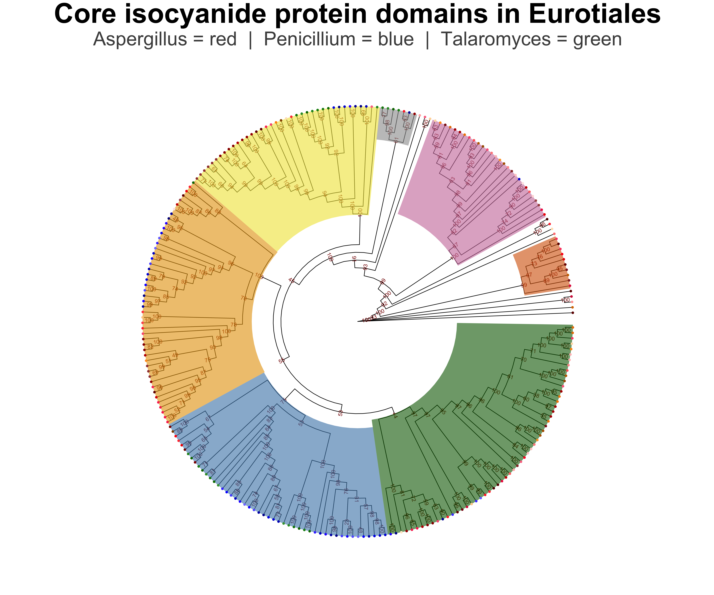
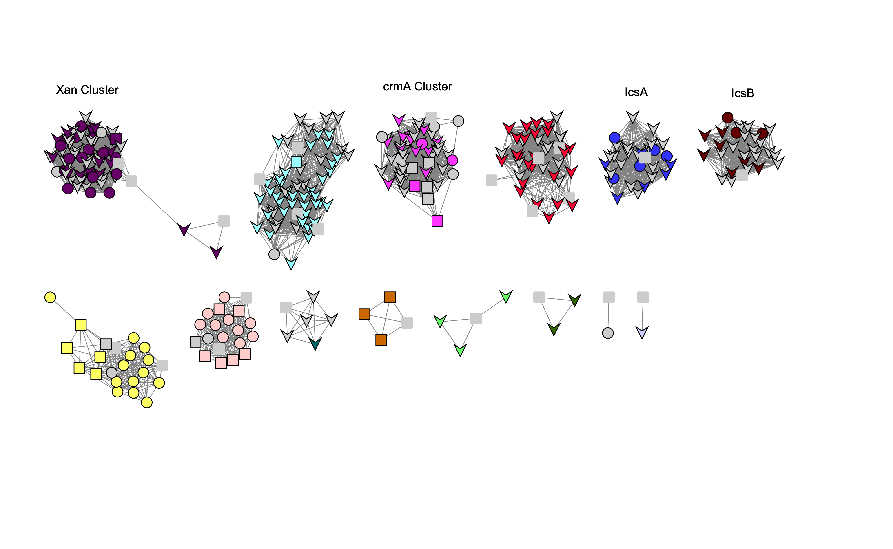

# Reproduciple script

Below I will include the steps I took and the justification behind doing each step. For clarity and concicness this page will only include what worked for me and what was used to generate the final product. My `Notes.md` file in this GitHub repo includes ALL my notes, failed attempts, troubleshooting, and iterations. If there is any confusion on how or why I got to the final script I did I would recomend finding this section in the other markdown file. 

Additionally for more insight into how or where I installed the software this information is located in the `Notes.md` file. 

___

**Goal of Project**: Construct a phylogenetic tree of every backbone isocyandide synthesis gene in the fungal order Eurotiales. 

**Background:** Secondary metabolites (SM), which are predominately produced by filamentous fungi, play a crucial role in development, virulence, and protection from environmental damage. These compounds, such as penicillin, have been historically leveraged for a variety of pharmaceutical applications. All SM that have been found in fungal genomes are arranged in a contiguous biosynthetic gene cluster (BGC). The regulation of these BGCs is a result of environmental and developmental stimuli. Temperature, light, nutrition, and stressors have all been shown to impact the synthesis of SM. 

There exists common patterns that underlys different classes of major secondary metabolite families. The main commonly studied and analyzed groups are nonribosomal peptide synthetases (NRPS), polyketide synthases (PKS), terpenes, and hybrid mixes between the other families. Bioinformaticians have been able to exploit these patterns allowing scientists to easily search for all of the BGCS within any genome(s) of interest. However, these programs rely on one very large assumtion: the program can only search for what is canonical. There are countless of examples off non-canonical BGCs in fungi, plants, and bacteria. 

There currently doesn't exist any tools geared toward helping users search for their own non-canoncal gene clusters. I have created a python tool called GBKCreator.py that has enabled me to develop the first dataset of isocyanide BGCS in every sequenced Eurotiales. These isocyanide synthatses (ICS) were first characterized the Keller Lab several years ago, and it's been found that every ICS contains the same core bacbone gene and protein domain. By searching for this protein domain in every annotated Eurotiales genome, and grabbing windows around the located backbone gene, I was also to manually analyze and network the distribution and patterns in this noval secondary metabilite family.

For class I will run a phylogenetic analysis of the backbone ICS protein domains that my program discovered **(amino acid sequences)**. My networking program I've already been running takes into account the evolution of entire gene clusters. This phylogenetic approach will allow me to get insite into the evolution of the core backbone ICS protein domain. The resulting cladogram that is made by this analysis might give inside into the evolutionary history of this novel secondary metabolite family.

***References of information in background***

Blin, K. *et al.* AntiSMASH 5.0: Updates to the secondary metabolite genome mining pipeline. *Nucleic Acids Res.* **47**, W81–W87 (2019).

Caesar, L. K., Kelleher, N. L. & Keller, N. P. In the fungus where it happens: history and future propelling Aspergillus nidulans as the archetype of natural products research. *Fungal Genet. Biol.* **144**, 103477 (2020).

Keller, N. P. Fungal secondary metabolism: regulation, function and drug discovery. *Nature Reviews Microbiology* vol. 17 167–180 (2019).

Lim, F. Y. *et al.* Fungal isocyanide synthases and xanthocillin biosynthesis in Aspergillus fumigatus. *MBio* **9**, (2018).


___


## Gathering the data

I used the follow on all of the Eurotiales annotated data. This was from every sequenced genome that was present in the NCBI databse late 2020. The main goal of this section is to grab my protein domain of interest everytime it occurs in all of the genomes, converting that into a fasta format, and condensing them all into a single document while adding in metadata to uniquly identify the sequences later on.

```sh
#!/bin/bash

for dir in */ ; do
  cd ./$dir
  grep "PF05141" *.fa.tsv > tsvFiltered
  cut -f1 tsvFiltered > temp
  echo $dir > proteinFastaFiltered
  grep -f temp -A 1 *prot.fa | grep -v -- "^--$" >> proteinFastaFiltered
  rm temp
  cd ..
done

for dir in */ ; do
  cd ./$dir
  cat proteinFastaFiltered >> ../EurotialesFastaAll
  cat tsvFiltered >> ../Eurotiales_tsvAll
  rm tsvFiltered
  rm proteinFastaFiltered
  cd ..
done
```

followed by 

```python
#! /usr/bin/env python
#Author: Grant Nickles

import os
import sys
import pdb
from Bio import SeqIO
def grepFixer(fastaPath, oldFastaPath):
    allRecords = {}
    for record in SeqIO.parse(oldFastaPath, "fasta"):
        allRecords[record.id[:-2]] = record.description
    editedFasta = []
    with open(fastaPath) as fa:
        lines = fa.readlines()
        genomeName = None
        for index, line in enumerate(lines):
            line = line.strip('\n')
            if line.startswith("GC"):
                genomeName = line.replace(".tar.gz_folder/", "")
            elif line.startswith(">"):
                editedLine = line + " " + allRecords[genomeName] + "\n"
                editedFasta.append(editedLine)
            else:
                editedFasta.append(line + "\n")
    outputPath = r"/Users/gnickles/Documents/GN_Botany563/MainProject/data/FinalPF04151.fa"
    with open(outputPath, "a+") as finalFasta:
        for l in editedFasta:
            finalFasta.write(l)

fastaPath = r"/Users/gnickles/Documents/GN_Botany563/MainProject/data/EurotialesFastaAll"
oldFastaPath = r"/Users/gnickles/Documents/GN_Botany563/MainProject/data/PF05141_Euro.fa"
grepFixer(fastaPath, oldFastaPath)
```

followed by

```python
#! /usr/bin/env python
#Author: Grant Nickles
import os
import sys
import pdb
from Bio import SeqIO

def MakePF05141(tsvPath, fastaPath):
    annotationInfo = {}
    with open (tsvPath) as tsv:
        lines = tsv.readlines()
        for index, line in enumerate(lines):
            line=line.rstrip()
            separated = line.split("\t")
            name = separated[0]
            start = separated[6]
            stop = separated[7]
            annotationInfo[name] = [start, stop]
    editedRecords = []
    for record in SeqIO.parse(fastaPath, "fasta"):
        try:
            start = int(annotationInfo[record.id][0])
            stop = int(annotationInfo[record.id][1])
            editedRecords.append(record[start-1:stop])
        except:
            editedRecords.append(record)
            print(record.id + " needs to be filtered by hand.")
    outputPath = os.path.join("/Users/gnickles/Documents/GN_Botany563/MainProject/data", "PF05141.fa")
    SeqIO.write(editedRecords, outputPath, 'fasta')

tsvPath = r'/Users/gnickles/Documents/GN_Botany563/MainProject/data/Eurotiales_tsvAll'
fastaPath = r'/Users/gnickles/Documents/GN_Botany563/MainProject/data/EurotialesFastaAll'
MakePF05141(tsvPath, fastaPath)
```

This made a single fasta file with the gene names. This may be the big issue for the time being as this doesn't include any of the identifying info. 

I then figured out how to add the identifying info. It wasn't hard and just used a single python script and and echo statement on my bash script.

```sh
rna-gnl|WGS:AHIG|ASPCADRAFT_mRNA21606 needs to be filtered by hand.
#looking into it this isn't anywhere in the tsv file. I opted to remove it.
>rna-gnl|WGS:AHIG|ASPCADRAFT_mRNA21606 GCA_001990825.1_4 Fungi,Ascomycota,Eurotiomycetes,Eurotiales,Aspergillaceae,Aspergillus,Aspergillus_carbonarius,Aspergillus_carbonarius_ITEM_5010
VSYQKLFPTRAGSHYIHIRFPNGRQFPAPAPGQAQQAVDAVIRAWEETECKQAQTPIQRELIIDANPWLRMTQWAVYLQGIHPCDLRQRARCPSAEISDPVEKAIQTLWWTVDQVVRKSQRTVQHCGVAIRMEAARTQQTELPYRPLLGYMDEDSIMKRVYPWQQVLTFFART
```

This is by far the hardest section for someone to reproduce as it is unfeasible to download hundreds of gbs of fungal genomes and annotate them. **Thus, I decided to upload the correct files into the git repository as they are relativley small fasta files.** 

These files that are of major importance are `/GN_Botany563/MainProject/data/PF05141.fa` and `/GN_Botany563/MainProject/data/PF05141_NoSameSeq.fa`

- the nosameseq file was made from the other fasta by removing duplicate sequences, this made sure I wasn't enriching for duplicates of the same species in my runs
- This nosameseq file is what was used in the later parts of my analysis

# Removing outliers from my data

This was in a recomendation by a reviewer. I'll remove the really poor sequences that I seem to have.

- after looking through my sequences some are vastly shorter than others. I might want to remove any sequences that are extremly short or extremly long as they are outliers
- The vast majority of the other sequences are the same size
- I still seem to have a large number of duplicates species wise and I should think about changing how I name these sequences
  - The ones that are left are not perfectly identical and have minor aa changes but are 90% the same

I ended up opting to remove any sequence that was more than 100 aa larger or smaller than the avg size. To determine this avg I did the following:

```python
​```python
$ python
Python 3.7.9 (default, Aug 31 2020, 07:22:35) 
[Clang 10.0.0 ] :: Anaconda, Inc. on darwin
Type "help", "copyright", "credits" or "license" for more information.
>>> fastaPath = r'/Users/gnickles/Documents/GN_Botany563/MainProject/data/PF05141_NoSameSeq.fa'
>>> from Bio import SeqIO
>>> total = 0
>>> counter = 0
>>> print(counter)
0
>>> for record in SeqIO.parse(fastaPath, "fasta"):
...     total = total + len(record.seq)
...     counter = counter + 1
... 
>>> print(counter)
267
>>> avgSeqLength = int(total) / int(counter)
>>> print(avgSeqLength)
257.7378277153558
```

According to this program the avg for all sequences is 257. I'll remove any sequences are are smaller than 150 aa or larger than 350.

```python
>>> seqToSave2 = []
>>> for record in SeqIO.parse(fastaPath, "fasta"):
...     seqlength = len(record.seq)
...     if int(seqlength) >= 150 and int(seqlength) <= 350:
...             seqToSave2.append(record)
... 
>>> print(len(seqToSave2))
247
```


# Changing the fasta IDs to temp names

In order to prevent trimAl, the alignment software, or iqtree from altering or breaking due to names I will change them to 1zzz, 2zzz, etc. etc. 

**tempNameMaker.py** which is stored in the Code section of the git repo

````python
from Bio import SeqIO
import pdb
import pandas as pd

def MakeTempNames(fastaPath):
    recordToSave = []
    tn = []
    sn = []
    gn = []
    GC = []
    counter = 1
    for record in SeqIO.parse(fastaPath, "fasta"):
        #adding the info to the key file
        tempName = str(counter) + "zzz"
        tn.append(tempName)
        counter += 1
        recordID = record.description
        geneName = recordID.split()[0]
        genome = recordID.split()[1]
        speciesName = recordID.split(",")[-2]
        sn.append(speciesName)
        gn.append(geneName)
        GC.append(genome)
        #changing to records ID to the tempName
        record.description = ""
        record.id = tempName
        recordToSave.append(record)
    df = pd.DataFrame({"TempName" : tn, "SpeciesName" : sn, "GeneName" : gn, "GenomeName" : GC})
    pdb.set_trace()
    SeqIO.write(recordToSave, "/Users/gnickles/Documents/GN_Botany563/MainProject/data/MafftAlignment/PF05141_aln_TN.fas", 'fasta')
    df.to_csv("/Users/gnickles/Documents/GN_Botany563/MainProject/data/MafftAlignment/PF05141_key.tsv", sep="\t", index=False, header = False)

fastaPath = r'/Users/gnickles/Documents/GN_Botany563/MainProject/data/MafftAlignment/PF05141_aln.fas'
MakeTempNames(fastaPath)
````

Next I made a script that changes back the temporary names to a designated column in the key file. I utilized a cool package I found called massedit that allows you to use regular expression over entire files or lists of files in one command. It's super cool that I can do this with a 6 line script. I added the print statement so you can see what it is changing what to. It also loops backwards to prevent small temp names from changing the larger ones. 

This script will be used after the tree building with iqtree to change the alignment names and newick tree names to the metadata of choice.

**EditingTempNames.py** which is in the git repo

```python
import pdb
import pandas as pd
import massedit

#assumes the key files has headers, code can be modified to the index of the columns if needed
def TempNamesToKeyNames(tempNameColumn, keyNameColumn, fileChanging, keyFile):
    df = pd.read_csv(keyFile, sep='\t', header=0) #reading in the key file
    #looping over the rows in the DataFrame from the bottom up (prevents 1zzz chaning 12(1zzz) for example
    for i, row in df[::-1].iterrows():
        tempName = row[tempNameColumn]
        keyName = row[keyNameColumn]
        print("Chaning " + tempName + " to " + keyName)
        #in order to pass variables in a reg expression you need to add the rf to the begining of the string
        #you also need to put the variable in '{}' with quotes around it
        massedit.edit_files(fileChanging, [rf"re.sub('{tempName}', '{keyName}', line)"], dry_run=False)


tempNameColumn = "TempName"
keyNameColumn = "SpeciesName"
keyFile = r'/Users/gnickles/Documents/GN_Botany563/MainProject/data/iqtree/PF05141_key.tsv'
fileChanging = [r'/Users/gnickles/Documents/GN_Botany563/MainProject/data/iqtree/gappyout/PF05141_trimGappyout.contree', r'/Users/gnickles/Documents/GN_Botany563/MainProject/data/iqtree/gappyout/PF05141_trimGappyout.treefile']
TempNamesToKeyNames(tempNameColumn, keyNameColumn, fileChanging, keyFile)
```

# Making the alignment

For this step I will be using Muscle and mafft. I chose them due to there efficiency and ability to auto choose the best alignment parameters. After running both programs I will evalute which one performed better by viewing the informational output that they provide.


I'm going to run the auto/default option as it has been shown in tests to produce similar trees to when parameters are provided. (see paper below for more information on this analysis)

Portik, D. M. & Wiens, J. J. Do Alignment and Trimming Methods Matter for Phylogenomic (UCE) Analyses? *Syst. Biol.* **0**, 1–22 (2020).

### mafft

```sh
$ /usr/local/bin/mafft --auto PF05141_editedSeqs.fa > PF05141_aln.fas
nthread = 0
nthreadpair = 0
nthreadtb = 0
ppenalty_ex = 0
stacksize: 8192 kb
rescale = 1
Gap Penalty = -1.53, +0.00, +0.00


Making a distance matrix ..
  201 / 247
done.

Constructing a UPGMA tree (efffree=0) ... 
  240 / 247
done.

Progressive alignment 1/2... 
STEP   233 / 246  f
Reallocating..done. *alloclen = 1666
STEP   246 / 246  d
done.

Making a distance matrix from msa.. 
  200 / 247
done.

Constructing a UPGMA tree (efffree=1) ... 
  240 / 247
done.

Progressive alignment 2/2... 
STEP   236 / 246  f
Reallocating..done. *alloclen = 1666
STEP   246 / 246  d
done.

disttbfast (aa) Version 7.475
alg=A, model=BLOSUM62, 1.53, -0.00, -0.00, noshift, amax=0.0
0 thread(s)

rescale = 1
dndpre (aa) Version 7.475
alg=X, model=BLOSUM62, 1.53, +0.12, -0.00, noshift, amax=0.0
0 thread(s)

minimumweight = 0.000010
autosubalignment = 0.000000
nthread = 0
randomseed = 0
blosum 62 / kimura 200
poffset = 0
niter = 2
sueff_global = 0.100000
nadd = 2
rescale = 1

  240 / 247
Segment   1/  1    1- 384
done 002-001-1  identical.   
dvtditr (aa) Version 7.475
alg=A, model=BLOSUM62, 1.53, -0.00, -0.00, noshift, amax=0.0
0 thread(s)


Strategy:
 FFT-NS-i (Standard)
 Iterative refinement method (max. 2 iterations)

If unsure which option to use, try 'mafft --auto input > output'.
For more information, see 'mafft --help', 'mafft --man' and the mafft page.

The default gap scoring scheme has been changed in version 7.110 (2013 Oct).
It tends to insert more gaps into gap-rich regions than previous versions.
To disable this change, add the --leavegappyregion option.
```

## muscle

```{sh}
$ muscle -in PF05141_editedSeqs.fa -out ./MuscleAlignment/PF05141_aln.fas

MUSCLE v3.8.1551 by Robert C. Edgar

http://www.drive5.com/muscle
This software is donated to the public domain.
Please cite: Edgar, R.C. Nucleic Acids Res 32(5), 1792-97.

PF05141_editedSeqs 247 seqs, lengths min 156, max 330, avg 270
00:00:00      2 MB(0%)  Iter   1  100.00%  K-mer dist pass 1
00:00:00      2 MB(0%)  Iter   1  100.00%  K-mer dist pass 2
00:00:01     45 MB(1%)  Iter   1  100.00%  Align node       
00:00:01     45 MB(1%)  Iter   1  100.00%  Root alignment
00:00:01     45 MB(1%)  Iter   2  100.00%  Refine tree   
00:00:01     45 MB(1%)  Iter   2  100.00%  Root alignment
00:00:01     45 MB(1%)  Iter   2  100.00%  Root alignment
00:00:03     45 MB(1%)  Iter   3  100.00%  Refine biparts
00:00:05     45 MB(1%)  Iter   4  100.00%  Refine biparts
00:00:05     45 MB(1%)  Iter   5  100.00%  Refine biparts
00:00:05     45 MB(1%)  Iter   5  100.00%  Refine biparts
00:00:07     45 MB(1%)  Iter   6  100.00%  Refine biparts
00:00:08     45 MB(1%)  Iter   7  100.00%  Refine biparts
00:00:08     45 MB(1%)  Iter   8  100.00%  Refine biparts
00:00:08     45 MB(1%)  Iter   8  100.00%  Refine biparts
```

### Determining best alignment

Both of the programs made the alignments very fast. I was very dissapointed at both programs not making the score explicitly clear on the std.err/out pages. However, mafft displayed vastly more information about what it used to do it's alignment. I strongly think both would work for my purposes, but due to the increase in information that mafft provided in it's online documentation and output on my terminal I will choose to move forward with it. 

Since I am not trying to construct a tree that captures evolutionary history or time this decision is not vital to my output. The groupings or clades that three tree makes is the goal of this tree construction.

# Trimming the gaps (masking the data)

The parameters for trimAl are as follows:

```sh
$ ./bin/trimAl/source/trimal -h

trimAl 1.2rev59. Copyright (C) 2009. Salvador Capella-Gutierrez and Toni Gabaldón.

trimAl webpage: http://trimal.cgenomics.org

This program is free software: you can redistribute it and/or modify 
it under the terms of the GNU General Public License as published by 
the Free Software Foundation, the last available version.

Please cite:	Salvador Capella-Gutierrez, Jose M. Silla-Martinez and
            	Toni Gabaldon. trimAl: a tool for automated alignment 
            	trimming (2009).

Basic usage
	trimal -in <inputfile> -out <outputfile> -(other options).

Common options (for a complete list please see the User Guide or visit http://trimal.cgenomics.org):

    -h                       Print this information and show some examples.
    --version                Print the trimAl version.

    -in <inputfile>          Input file in several formats (clustal, fasta, NBRF/PIR, nexus, phylip3.2, phylip).
    -compareset <inputfile>  Input list of paths for the files containing the alignments to compare.
    -matrix <inpufile>       Input file for user-defined similarity matrix (default is Blosum62).

    -out <outputfile>        Output alignment in the same input format (default stdout). (default input format)
    -htmlout <outputfile>    Get a summary of trimal's work in an HTML file.

    -clustal                 Output file in CLUSTAL format
    -fasta                   Output file in FASTA format
    -nbrf                    Output file in NBRF/PIR format
    -nexus                   Output file in NEXUS format
    -mega                    Output file in MEGA format
    -phylip3.2               Output file in PHYLIP3.2 format
    -phylip                  Output file in PHYLIP/PHYLIP4 format

    -complementary           Get the complementary alignment.
    -colnumbering            Get the relationship between the columns in the old and new alignment.

    -select { n,l,m-k }      Selection of columns to be removed from the alignment. (see User Guide).
    -gt -gapthreshold <n>    1 - (fraction of sequences with a gap allowed).
    -st -simthreshold <n>    Minimum average similarity allowed.
    -ct -conthreshold <n>    Minimum consistency value allowed.
    -cons <n>                Minimum percentage of the positions in the original alignment to conserve.

    -nogaps                  Remove all positions with gaps in the alignment.
    -noallgaps               Remove columns composed only by gaps.

    -gappyout                Use automated selection on "gappyout" mode. This method only uses information based on gaps' distribution. (see User Guide).
    -strict                  Use automated selection on "strict" mode. (see User Guide).
    -strictplus              Use automated selection on "strictplus" mode. (see User Guide).
                             (Optimized for Neighbour Joining phylogenetic tree reconstruction).

    -automated1              Use a heuristic selection of the automatic method based on similarity statistics. (see User Guide).
                             (Optimized for Maximum Likelihood phylogenetic tree reconstruction).

    -resoverlap              Minimum overlap of a positions with other positions in the column to be considered a "good position". (see User Guide).
    -seqoverlap              Minimum percentage of "good positions" that a sequence must have in order to be conserved. (see User Guide).

    -w <n>                   (half) Window size, score of position i is the average of the window (i - n) to (i + n).
    -gw <n>                  (half) Window size only applies to statistics/methods based on Gaps.
    -sw <n>                  (half) Window size only applies to statistics/methods based on Similarity.
    -cw <n>                  (half) Window size only applies to statistics/methods based on Consistency.

    -sgc                     Print gap percentage count for columns in the input alignment.
    -sgt                     Print accumulated gap percentage count.
    -scc                     Print conservation values for columns in the input alignment.
    -sct                     Print accumulated conservation values count.
    -sfc                     Print compare values for columns in the selected alignment from compare files method.
    -sft                     Print accumulated compare values count for the selected alignment from compare files method.
    -sident                  Print identity statistics for all sequences in the alignemnt. (see User Guide).

Some Examples:

1) Removes all positions in the alignment with gaps in 10% or more of
   the sequences, unless this leaves less than 60%. In such case, print
   the 60% best (with less gaps) positions.

   trimal -in <inputfile> -out <outputfile> -gt 0.9 -cons 60

2) As above but, the gap percentage is averaged over a window starting
   3 positions before and ending 3 positions after the column.

   trimal -in <inputfile> -out <outputfile> -gt 0.9 -cons 60 -w 3

3) Uses an automatic method to decide optimal thresholds, based in the gap percentage
   count over the whole alignment. (see User Guide for details).

   trimal -in <inputfile> -out <outputfile> -gappyout

4) Uses automatics methods to decide optimal thresholds, based on the combination 
   of strict method and similarity values. (see User Guide for details).

   trimal -in <inputfile> -out <outputfile> -strictplus

5) Uses an heuristic to decide the optimal method to trimming the alignment. 
   (see User Guide for details).

   trimal -in <inputfile> -out <outputfile> -automated1

6) Uses residue and sequences overlap thresholds to delete some sequences from the 
   alignemnt. (see User Guide for details).

   trimal -in <inputfile> -out <outputfile> -resoverlap 0.8 -seqoverlap 75

7) Selection of columns to be deleted from the alignment. The selection can 
   be a column's number or a column's number interval.

   trimal -in <inputfile> -out <outputfile> -select { 2,3,10,45-60,68,70-78 }

8) Get the complementary alignment from the alignment previously trimmed.

   trimal -in <inputfile> -out <outputfile> -select { 2,3,45-60 } -complementary
```

I want to avoid removing too much. So I will try the automated verison of the software to see how that performs, and I will try running it is a really generous `-gt 0.1` to only remove columns with 90% or more gaps.

```sh
$ ~/bin/trimAl/source/trimal -in ./MafftAlignment/PF05141_aln.fas -out ./MafftAlignment/PF05141_aln_trimmed.fas -gappyout
#running it again with the -gt parameter
$ ~/bin/trimAl/source/trimal -in ./MafftAlignment/PF05141_aln.fas -out ./MafftAlignment/PF05141_aln_trimmed2.fas -gt 0.1
```


# Running IQTree

The parameters:

```sh
$ iqtree -h
IQ-TREE multicore version 2.0.3 for Mac OS X 64-bit built Dec 19 2020
Developed by Bui Quang Minh, Nguyen Lam Tung, Olga Chernomor,
Heiko Schmidt, Dominik Schrempf, Michael Woodhams.

Usage: iqtree [-s ALIGNMENT] [-p PARTITION] [-m MODEL] [-t TREE] ...

GENERAL OPTIONS:
  -h, --help           Print (more) help usages
  -s FILE[,...,FILE]   PHYLIP/FASTA/NEXUS/CLUSTAL/MSF alignment file(s)
  -s DIR               Directory of alignment files
  --seqtype STRING     BIN, DNA, AA, NT2AA, CODON, MORPH (default: auto-detect)
  -t FILE|PARS|RAND    Starting tree (default: 99 parsimony and BIONJ)
  -o TAX[,...,TAX]     Outgroup taxon (list) for writing .treefile
  --prefix STRING      Prefix for all output files (default: aln/partition)
  --seed NUM           Random seed number, normally used for debugging purpose
  --safe               Safe likelihood kernel to avoid numerical underflow
  --mem NUM[G|M|%]     Maximal RAM usage in GB | MB | %
  --runs NUM           Number of indepedent runs (default: 1)
  --redo               Ignore checkpoint and overwrite outputs (default: OFF)
  -v, --verbose        Verbose mode, printing more messages to screen
  -V, --version        Display version number
  --quiet              Quiet mode, suppress printing to screen (stdout)
  -fconst f1,...,fN    Add constant patterns into alignment (N=no. states)
  --epsilon NUM        Likelihood epsilon for parameter estimate (default 0.01)
  -T NUM|AUTO          No. cores/threads or AUTO-detect (default: 1)
  --threads-max NUM    Max number of threads for -T AUTO (default: all cores)

PARTITION MODEL:
  -p FILE|DIR          NEXUS/RAxML partition file or directory with alignments
                       Edge-linked proportional partition model
  -q FILE|DIR          Like -p but edge-linked equal partition model 
  -Q FILE|DIR          Like -p but edge-unlinked partition model
  -S FILE|DIR          Like -p but separate tree inference
  --subsample NUM      Randomly sub-sample partitions (negative for complement)
  --subsample-seed NUM Random number seed for --subsample

LIKELIHOOD/QUARTET MAPPING:
  --lmap NUM           Number of quartets for likelihood mapping analysis
  --lmclust FILE       NEXUS file containing clusters for likelihood mapping
  --quartetlh          Print quartet log-likelihoods to .quartetlh file

TREE SEARCH ALGORITHM:
  --ninit NUM          Number of initial parsimony trees (default: 100)
  --ntop NUM           Number of top initial trees (default: 20)
  --nbest NUM          Number of best trees retained during search (defaut: 5)
  -n NUM               Fix number of iterations to stop (default: OFF)
  --nstop NUM          Number of unsuccessful iterations to stop (default: 100)
  --perturb NUM        Perturbation strength for randomized NNI (default: 0.5)
  --radius NUM         Radius for parsimony SPR search (default: 6)
  --allnni             Perform more thorough NNI search (default: OFF)
  -g FILE              (Multifurcating) topological constraint tree file
  --fast               Fast search to resemble FastTree
  --polytomy           Collapse near-zero branches into polytomy
  --tree-fix           Fix -t tree (no tree search performed)
  --treels             Write locally optimal trees into .treels file
  --show-lh            Compute tree likelihood without optimisation
  --terrace            Check if the tree lies on a phylogenetic terrace

ULTRAFAST BOOTSTRAP/JACKKNIFE:
  -B, --ufboot NUM     Replicates for ultrafast bootstrap (>=1000)
  -J, --ufjack NUM     Replicates for ultrafast jackknife (>=1000)
  --jack-prop NUM      Subsampling proportion for jackknife (default: 0.5)
  --sampling STRING    GENE|GENESITE resampling for partitions (default: SITE)
  --boot-trees         Write bootstrap trees to .ufboot file (default: none)
  --wbtl               Like --boot-trees but also writing branch lengths
  --nmax NUM           Maximum number of iterations (default: 1000)
  --nstep NUM          Iterations for UFBoot stopping rule (default: 100)
  --bcor NUM           Minimum correlation coefficient (default: 0.99)
  --beps NUM           RELL epsilon to break tie (default: 0.5)
  --bnni               Optimize UFBoot trees by NNI on bootstrap alignment

NON-PARAMETRIC BOOTSTRAP/JACKKNIFE:
  -b, --boot NUM       Replicates for bootstrap + ML tree + consensus tree
  -j, --jack NUM       Replicates for jackknife + ML tree + consensus tree
  --jack-prop NUM      Subsampling proportion for jackknife (default: 0.5)
  --bcon NUM           Replicates for bootstrap + consensus tree
  --bonly NUM          Replicates for bootstrap only
  --tbe                Transfer bootstrap expectation

SINGLE BRANCH TEST:
  --alrt NUM           Replicates for SH approximate likelihood ratio test
  --alrt 0             Parametric aLRT test (Anisimova and Gascuel 2006)
  --abayes             approximate Bayes test (Anisimova et al. 2011)
  --lbp NUM            Replicates for fast local bootstrap probabilities

MODEL-FINDER:
  -m TESTONLY          Standard model selection (like jModelTest, ProtTest)
  -m TEST              Standard model selection followed by tree inference
  -m MF                Extended model selection with FreeRate heterogeneity
  -m MFP               Extended model selection followed by tree inference
  -m ...+LM            Additionally test Lie Markov models
  -m ...+LMRY          Additionally test Lie Markov models with RY symmetry
  -m ...+LMWS          Additionally test Lie Markov models with WS symmetry
  -m ...+LMMK          Additionally test Lie Markov models with MK symmetry
  -m ...+LMSS          Additionally test strand-symmetric models
  --mset STRING        Restrict search to models supported by other programs
                       (raxml, phyml or mrbayes)
  --mset STR,...       Comma-separated model list (e.g. -mset WAG,LG,JTT)
  --msub STRING        Amino-acid model source
                       (nuclear, mitochondrial, chloroplast or viral)
  --mfreq STR,...      List of state frequencies
  --mrate STR,...      List of rate heterogeneity among sites
                       (e.g. -mrate E,I,G,I+G,R is used for -m MF)
  --cmin NUM           Min categories for FreeRate model [+R] (default: 2)
  --cmax NUM           Max categories for FreeRate model [+R] (default: 10)
  --merit AIC|AICc|BIC  Akaike|Bayesian information criterion (default: BIC)
  --mtree              Perform full tree search for every model
  --mredo              Ignore .model.gz checkpoint file (default: OFF)
  --madd STR,...       List of mixture models to consider
  --mdef FILE          Model definition NEXUS file (see Manual)
  --modelomatic        Find best codon/protein/DNA models (Whelan et al. 2015)

PARTITION-FINDER:
  --merge              Merge partitions to increase model fit
  --merge greedy|rcluster|rclusterf
                       Set merging algorithm (default: rclusterf)
  --merge-model 1|all  Use only 1 or all models for merging (default: 1)
  --merge-model STR,...
                       Comma-separated model list for merging
  --merge-rate 1|all   Use only 1 or all rate heterogeneity (default: 1)
  --merge-rate STR,...
                       Comma-separated rate list for merging
  --rcluster NUM       Percentage of partition pairs for rcluster algorithm
  --rclusterf NUM      Percentage of partition pairs for rclusterf algorithm
  --rcluster-max NUM   Max number of partition pairs (default: 10*partitions)

SUBSTITUTION MODEL:
  -m STRING            Model name string (e.g. GTR+F+I+G)
                 DNA:  HKY (default), JC, F81, K2P, K3P, K81uf, TN/TrN, TNef,
                       TIM, TIMef, TVM, TVMef, SYM, GTR, or 6-digit model
                       specification (e.g., 010010 = HKY)
             Protein:  LG (default), Poisson, cpREV, mtREV, Dayhoff, mtMAM,
                       JTT, WAG, mtART, mtZOA, VT, rtREV, DCMut, PMB, HIVb,
                       HIVw, JTTDCMut, FLU, Blosum62, GTR20, mtMet, mtVer, mtInv, Q.LG
			Q.pfam, Q.pfam_gb, Q.bird, Q.mammal, Q.insect, Q.plant, Q.yeast
     Protein mixture:  C10,...,C60, EX2, EX3, EHO, UL2, UL3, EX_EHO, LG4M, LG4X
              Binary:  JC2 (default), GTR2
     Empirical codon:  KOSI07, SCHN05
   Mechanistic codon:  GY (default), MG, MGK, GY0K, GY1KTS, GY1KTV, GY2K,
                       MG1KTS, MG1KTV, MG2K
Semi-empirical codon:  XX_YY where XX is empirical and YY is mechanistic model
      Morphology/SNP:  MK (default), ORDERED, GTR
      Lie Markov DNA:  1.1, 2.2b, 3.3a, 3.3b, 3.3c, 3.4, 4.4a, 4.4b, 4.5a,
                       4.5b, 5.6a, 5.6b, 5.7a, 5.7b, 5.7c, 5.11a, 5.11b, 5.11c,
                       5.16, 6.6, 6.7a, 6.7b, 6.8a, 6.8b, 6.17a, 6.17b, 8.8,
                       8.10a, 8.10b, 8.16, 8.17, 8.18, 9.20a, 9.20b, 10.12,
                       10.34, 12.12 (optionally prefixed by RY, WS or MK)
      Non-reversible:  STRSYM (strand symmetric model, equiv. WS6.6),
                       NONREV, UNREST (unrestricted model, equiv. 12.12)
           Otherwise:  Name of file containing user-model parameters

STATE FREQUENCY:
  -m ...+F             Empirically counted frequencies from alignment
  -m ...+FO            Optimized frequencies by maximum-likelihood
  -m ...+FQ            Equal frequencies
  -m ...+FRY           For DNA, freq(A+G)=1/2=freq(C+T)
  -m ...+FWS           For DNA, freq(A+T)=1/2=freq(C+G)
  -m ...+FMK           For DNA, freq(A+C)=1/2=freq(G+T)
  -m ...+Fabcd         4-digit constraint on ACGT frequency
                       (e.g. +F1221 means f_A=f_T, f_C=f_G)
  -m ...+FU            Amino-acid frequencies given protein matrix
  -m ...+F1x4          Equal NT frequencies over three codon positions
  -m ...+F3x4          Unequal NT frequencies over three codon positions

RATE HETEROGENEITY AMONG SITES:
  -m ...+I             A proportion of invariable sites
  -m ...+G[n]          Discrete Gamma model with n categories (default n=4)
  -m ...*G[n]          Discrete Gamma model with unlinked model parameters
  -m ...+I+G[n]        Invariable sites plus Gamma model with n categories
  -m ...+R[n]          FreeRate model with n categories (default n=4)
  -m ...*R[n]          FreeRate model with unlinked model parameters
  -m ...+I+R[n]        Invariable sites plus FreeRate model with n categories
  -m ...+Hn            Heterotachy model with n classes
  -m ...*Hn            Heterotachy model with n classes and unlinked parameters
  --alpha-min NUM      Min Gamma shape parameter for site rates (default: 0.02)
  --gamma-median       Median approximation for +G site rates (default: mean)
  --rate               Write empirical Bayesian site rates to .rate file
  --mlrate             Write maximum likelihood site rates to .mlrate file

POLYMORPHISM AWARE MODELS (PoMo):
  -s FILE              Input counts file (see manual)
  -m ...+P             DNA substitution model (see above) used with PoMo
  -m ...+N<POPSIZE>    Virtual population size (default: 9)
  -m ...+WB|WH|S]      Weighted binomial sampling
  -m ...+WH            Weighted hypergeometric sampling
  -m ...+S             Sampled sampling
  -m ...+G[n]          Discrete Gamma rate with n categories (default n=4)

COMPLEX MODELS:
  -m "MIX{m1,...,mK}"  Mixture model with K components
  -m "FMIX{f1,...fK}"  Frequency mixture model with K components
  --mix-opt            Optimize mixture weights (default: detect)
  -m ...+ASC           Ascertainment bias correction
  --tree-freq FILE     Input tree to infer site frequency model
  --site-freq FILE     Input site frequency model file
  --freq-max           Posterior maximum instead of mean approximation

TREE TOPOLOGY TEST:
  --trees FILE         Set of trees to evaluate log-likelihoods
  --test NUM           Replicates for topology test
  --test-weight        Perform weighted KH and SH tests
  --test-au            Approximately unbiased (AU) test (Shimodaira 2002)
  --sitelh             Write site log-likelihoods to .sitelh file

ANCESTRAL STATE RECONSTRUCTION:
  --ancestral          Ancestral state reconstruction by empirical Bayes
  --asr-min NUM        Min probability of ancestral state (default: equil freq)

TEST OF SYMMETRY:
  --symtest               Perform three tests of symmetry
  --symtest-only          Do --symtest then exist
  --symtest-remove-bad    Do --symtest and remove bad partitions
  --symtest-remove-good   Do --symtest and remove good partitions
  --symtest-type MAR|INT  Use MARginal/INTernal test when removing partitions
  --symtest-pval NUMER    P-value cutoff (default: 0.05)
  --symtest-keep-zero     Keep NAs in the tests

CONCORDANCE FACTOR ANALYSIS:
  -t FILE              Reference tree to assign concordance factor
  --gcf FILE           Set of source trees for gene concordance factor (gCF)
  --df-tree            Write discordant trees associated with gDF1
  --scf NUM            Number of quartets for site concordance factor (sCF)
  -s FILE              Sequence alignment for --scf
  -p FILE|DIR          Partition file or directory for --scf
  --cf-verbose         Write CF per tree/locus to cf.stat_tree/_loci

TIME TREE RECONSTRUCTION:
  --date FILE          Dates of tips or ancestral nodes
  --date TAXNAME       Extract dates from taxon names after last '|'
  --date-tip STRING    Tip dates as a real number or YYYY-MM-DD
  --date-root STRING   Root date as a real number or YYYY-MM-DD
  --dating STRING      Dating method: LSD for least square dating (default)

```


<u>Parameters I will use:</u>

`-m MFP` : which will tell the program to perform ModelFinder in order to select the ideal model for my data

`-s [alignment file]` 

`--safe` according to the documentation this will avoid numerical underflow. Mickey often runs this when he is making trees and I will do the same

`--mem 8 ` as my computer has a max of 8 gigs of ram

`-T 4` as my computer has 4 cores and the default is only 1 core being used

`-B 1000` tells the program to run an UFBoot of 1000 on the tree that is constructed 

- this is `-bb` in the first version of the software which is why Mickey uses `-bb`

`--prefix [prefix]` depending on which trimmed or untrimmed alignment I am making a tree from

Since my data has severe model violations (the data doesn't have single copy orthologs and instead includes paralogs) I will also add the `-bnni` after `-B` which will prevent overestimating branch supports with UFBoot from the model violations

I looked into the other parameters but I won't specify an outgroup as I want mine to me unrooted, I don't have a partition model, and I don't want to set any of the model parameters as model finder is going to do that for me.

Thus I will run the following:

```sh
IQ-TREE multicore version 2.0.3 for Mac OS X 64-bit built Dec 19 2020
Developed by Bui Quang Minh, Nguyen Lam Tung, Olga Chernomor,
Heiko Schmidt, Dominik Schrempf, Michael Woodhams.

Host:    Nymeria-Keller-Lab.local (AVX512, FMA3, 8 GB RAM)
Command: iqtree -s PF05141_aln_editedTrimmed10.fas -m MFP --safe --mem 8G -T 4 -B 1000 --prefix PF05141_trim10
Seed:    703958 (Using SPRNG - Scalable Parallel Random Number Generator)
Time:    Mon Apr 26 21:13:16 2021
OMP: Info #270: omp_set_nested routine deprecated, please use omp_set_max_active_levels instead.
Kernel:  Safe AVX+FMA - 4 threads (8 CPU cores detected)
```

In order to see the full logs for both trees I built with the two different versions from trimAl look into the following directories.

Gappyout log:

`GN_Botany563/MainProject/data/iqtree/gappout/PF05141_trimGappyout.log`

Trim10 log:

`GN_Botany563/MainProject/data/iqtree/trim10/PF05141_trim10.log`

## Determing the best tree

here is the last section of the log file from iqtree

```sh
--------------------------------------------------------------------
|                    FINALIZING TREE SEARCH                        |
--------------------------------------------------------------------
Performs final model parameters optimization
Estimate model parameters (epsilon = 0.010)
1. Initial log-likelihood: -26057.086
Optimal log-likelihood: -26057.083
Proportion of invariable sites: 0.017
Gamma shape alpha: 1.083
Parameters optimization took 1 rounds (0.130 sec)
BEST SCORE FOUND : -26057.083
Creating bootstrap support values...
Split supports printed to NEXUS file PF05141_trimGappyout.splits.nex
Total tree length: 35.517

Total number of iterations: 311
CPU time used for tree search: 3242.722 sec (0h:54m:2s)
Wall-clock time used for tree search: 585.694 sec (0h:9m:45s)
Total CPU time used: 3294.729 sec (0h:54m:54s)
Total wall-clock time used: 598.462 sec (0h:9m:58s)

Computing bootstrap consensus tree...
Reading input file PF05141_trimGappyout.splits.nex...
246 taxa and 1628 splits.
Consensus tree written to PF05141_trimGappyout.contree
Reading input trees file PF05141_trimGappyout.contree
Log-likelihood of consensus tree: -26058.203

Analysis results written to: 
  IQ-TREE report:                PF05141_trimGappyout.iqtree
  Maximum-likelihood tree:       PF05141_trimGappyout.treefile
  Likelihood distances:          PF05141_trimGappyout.mldist

Ultrafast bootstrap approximation results written to:
  Split support values:          PF05141_trimGappyout.splits.nex
  Consensus tree:                PF05141_trimGappyout.contree
  Screen log file:               PF05141_trimGappyout.log

Date and Time: Tue Apr 27 12:00:04 2021

```

**Best-fit model** according to BIC: JTT+I+G4

**MAXIMUM LIKELIHOOD TREE**

Log-likelihood of the tree: -26057.0825 (s.e. 1018.0952)
Unconstrained log-likelihood (without tree): -1354.3116
Number of free parameters (#branches + #model parameters): 491
Akaike information criterion (AIC) score: 53096.1651
Corrected Akaike information criterion (AICc) score: 536240.1651
Bayesian information criterion (BIC) score: 54817.2829

Total tree length (sum of branch lengths): 35.5167
Sum of internal branch lengths: 16.8405 (47.4158% of tree length)

___

Consensus tree is constructed from 5000bootstrap trees
Log-likelihood of consensus tree: -26058.203490
Robinson-Foulds distance between ML tree and consensus tree: 14

Branches with support >0.000000% are kept (extended consensus)
Branch lengths are optimized by maximum likelihood on original alignment


### Trimming regions with >=90% gaps

Here is the last section of the log file

```sh
--------------------------------------------------------------------
|                    FINALIZING TREE SEARCH                        |
--------------------------------------------------------------------
Performs final model parameters optimization
Estimate model parameters (epsilon = 0.010)
1. Initial log-likelihood: -31162.244
Optimal log-likelihood: -31162.238
Site proportion and rates:  (0.161,0.098) (0.155,0.345) (0.149,0.601) (0.181,0.972) (0.235,1.554) (0.118,2.535)
Parameters optimization took 1 rounds (1.329 sec)
BEST SCORE FOUND : -31162.238
Creating bootstrap support values...
Split supports printed to NEXUS file PF05141_trim10.splits.nex
Total tree length: 44.806

Total number of iterations: 254
CPU time used for tree search: 6984.218 sec (1h:56m:24s)
Wall-clock time used for tree search: 1261.777 sec (0h:21m:1s)
Total CPU time used: 7069.242 sec (1h:57m:49s)
Total wall-clock time used: 1281.310 sec (0h:21m:21s)

Computing bootstrap consensus tree...
Reading input file PF05141_trim10.splits.nex...
247 taxa and 1379 splits.
Consensus tree written to PF05141_trim10.contree
Reading input trees file PF05141_trim10.contree
Log-likelihood of consensus tree: -31163.075

Analysis results written to: 
  IQ-TREE report:                PF05141_trim10.iqtree
  Maximum-likelihood tree:       PF05141_trim10.treefile
  Likelihood distances:          PF05141_trim10.mldist

Ultrafast bootstrap approximation results written to:
  Split support values:          PF05141_trim10.splits.nex
  Consensus tree:                PF05141_trim10.contree
  Screen log file:               PF05141_trim10.log

Date and Time: Tue Apr 27 10:22:21 2021

```

**Best-fit model** according to BIC: JTT+R6

**MAXIMUM LIKELIHOOD TREE**

Log-likelihood of the tree: -31162.2378 (s.e. 1136.0995)
Unconstrained log-likelihood (without tree): -1878.3569
Number of free parameters (#branches + #model parameters): 501
Akaike information criterion (AIC) score: 63326.4756
Corrected Akaike information criterion (AICc) score: 566330.4756
Bayesian information criterion (BIC) score: 65222.1720

Total tree length (sum of branch lengths): 44.8058
Sum of internal branch lengths: 21.3878 (47.7344% of tree length)

___

Consensus tree is constructed from 5000bootstrap trees
Log-likelihood of consensus tree: -31163.075262
Robinson-Foulds distance between ML tree and consensus tree: 30

Branches with support >0.000000% are kept (extended consensus)
Branch lengths are optimized by maximum likelihood on original alignment


**Log Likelihood** value is a measure of goodness of fit for any model. Higher the value, better **is the** model. We should remember that **Log Likelihood** can lie between -Inf to +Inf. Hence, the absolute look at the value cannot give any indication. We can only compare the **Log Likelihood** values between multiple models.

Based on this the log-likelihood of the gappyout tree scored higher. 

I can also use the Robinson-Foulds metric to help get some insight on my scoring. The gappyout tree had a lower RF value meaning it required less operations to convert the ML tree to the consensus tree. Based on all of this I am confident that I'll move forward with the gappyout constructed tree. 

# Tree Visualization

I'll be using ggtree for my visualization in addition to Rmd. Here is the link to that document:

`GN_Botany563/MainProject/dataPF05141_treeVisualization.Rmd`

**The following an edited version of my full Rmd file that shows the final script that I used to make my tree:**

```R
rm(list=ls())
```

Installing Biostrings: http://bioconductor.org/packages/release/bioc/html/Biostrings.html

```R
if (!requireNamespace("BiocManager", quietly = TRUE))
    install.packages("BiocManager")

#BiocManager::install("Biostrings")
```

Installing ggtree: I found the link that told me where to install this here: http://bioconductor.org/packages/release/bioc/html/ggtree.html

```R
if (!requireNamespace("BiocManager", quietly = TRUE))
    install.packages("BiocManager")

#BiocManager::install("ggtree")
```

```R
library(tidyverse)
## ── Attaching packages ─────────────────────────────────────── tidyverse 1.3.1 ──
## ✓ ggplot2 3.3.3     ✓ purrr   0.3.4
## ✓ tibble  3.1.1     ✓ dplyr   1.0.5
## ✓ tidyr   1.1.3     ✓ stringr 1.4.0
## ✓ readr   1.4.0     ✓ forcats 0.5.1
## ── Conflicts ────────────────────────────────────────── tidyverse_conflicts() ──
## x dplyr::filter() masks stats::filter()
## x dplyr::lag()    masks stats::lag()
library(ggtree)
## Warning: package 'ggtree' was built under R version 4.0.5
## ggtree v2.4.2  For help: https://yulab-smu.top/treedata-book/
## 
## If you use ggtree in published research, please cite the most appropriate paper(s):
## 
## 1. Guangchuang Yu. Using ggtree to visualize data on tree-like structures. Current Protocols in Bioinformatics, 2020, 69:e96. doi:10.1002/cpbi.96
## 2. Guangchuang Yu, Tommy Tsan-Yuk Lam, Huachen Zhu, Yi Guan. Two methods for mapping and visualizing associated data on phylogeny using ggtree. Molecular Biology and Evolution 2018, 35(12):3041-3043. doi:10.1093/molbev/msy194
## 3. Guangchuang Yu, David Smith, Huachen Zhu, Yi Guan, Tommy Tsan-Yuk Lam. ggtree: an R package for visualization and annotation of phylogenetic trees with their covariates and other associated data. Methods in Ecology and Evolution 2017, 8(1):28-36. doi:10.1111/2041-210X.12628
## 
## Attaching package: 'ggtree'
## The following object is masked from 'package:tidyr':
## 
##     expand
library(Biostrings)
## Warning: package 'Biostrings' was built under R version 4.0.3
## Loading required package: BiocGenerics
## Warning: package 'BiocGenerics' was built under R version 4.0.5
## Loading required package: parallel
## 
## Attaching package: 'BiocGenerics'
## The following objects are masked from 'package:parallel':
## 
##     clusterApply, clusterApplyLB, clusterCall, clusterEvalQ,
##     clusterExport, clusterMap, parApply, parCapply, parLapply,
##     parLapplyLB, parRapply, parSapply, parSapplyLB
## The following objects are masked from 'package:dplyr':
## 
##     combine, intersect, setdiff, union
## The following objects are masked from 'package:stats':
## 
##     IQR, mad, sd, var, xtabs
## The following objects are masked from 'package:base':
## 
##     anyDuplicated, append, as.data.frame, basename, cbind, colnames,
##     dirname, do.call, duplicated, eval, evalq, Filter, Find, get, grep,
##     grepl, intersect, is.unsorted, lapply, Map, mapply, match, mget,
##     order, paste, pmax, pmax.int, pmin, pmin.int, Position, rank,
##     rbind, Reduce, rownames, sapply, setdiff, sort, table, tapply,
##     union, unique, unsplit, which.max, which.min
## Loading required package: S4Vectors
## Warning: package 'S4Vectors' was built under R version 4.0.3
## Loading required package: stats4
## 
## Attaching package: 'S4Vectors'
## The following object is masked from 'package:ggtree':
## 
##     expand
## The following objects are masked from 'package:dplyr':
## 
##     first, rename
## The following object is masked from 'package:tidyr':
## 
##     expand
## The following object is masked from 'package:base':
## 
##     expand.grid
## Loading required package: IRanges
## Warning: package 'IRanges' was built under R version 4.0.3
## 
## Attaching package: 'IRanges'
## The following object is masked from 'package:ggtree':
## 
##     collapse
## The following objects are masked from 'package:dplyr':
## 
##     collapse, desc, slice
## The following object is masked from 'package:purrr':
## 
##     reduce
## Loading required package: XVector
## Warning: package 'XVector' was built under R version 4.0.3
## 
## Attaching package: 'XVector'
## The following object is masked from 'package:purrr':
## 
##     compact
## 
## Attaching package: 'Biostrings'
## The following object is masked from 'package:base':
## 
##     strsplit
```

```R
rm(list=ls())
ML <- read.tree("./iqtree/gappyout/PF05141_trimGappyout.treefile")
```

**Adding in the tsv key file as metadata for the tips**

```R
tipKeyData = read.csv("./iqtree/PF05141_key.tsv", sep = '\t', header=TRUE, stringsAsFactors=FALSE)

info = as.data.frame(tipKeyData)
#creating the tree and coloring the clades
p = ggtree(ML, branch.length = "none", layout = "circular") + 
  ggtitle(label="Core isocyanide protein domains in Eurotiales",
          subtitle = "Aspergillus = red  |  Penicillium = blue  |  Talaromyces = green") +
  geom_nodelab(color = "#000031", size = 3) +
  geom_highlight(node=316, fill='steelblue', alpha=.6) + 
  geom_highlight(node=261, fill='darkgreen', alpha=.6) + 
  geom_highlight(node=363, fill="#E69F00", alpha=.6) + 
  geom_highlight(node=410, fill="#F0E442", alpha=.6) + 
  geom_highlight(node=454, fill="#CC79A7", alpha=.6) + 
  geom_highlight(node=483, fill="#D55E00", alpha=.6) + 
  geom_highlight(node=447, fill="#999999", alpha=.6) +
  #editing the title and subtitle to look cleaner
  theme(plot.title=element_text(face="bold", hjust = 0.5, size = 30), 
        plot.subtitle = element_text(hjust = 0.5, color = "#4D4D4D", size = 20)
  )

#adding the species metadata and coloring based on
p2 <- p %<+% info + geom_tippoint(aes(color = label)) + 
  scale_color_manual(values=c(Aspergillus_aculeatinus= '#FFE6E6', Aspergillus_aculeatus= '#FFD9D9', Aspergillus_alliaceus= '#FFCCCC', Aspergillus_arachidicola= '#FFBFBF', Aspergillus_avenaceus= '#FFB3B3', Aspergillus_awamori= '#FFA6A6', Aspergillus_bertholletiae= '#FF9999', Aspergillus_bombycis= '#FF8C8C', Aspergillus_brasiliensis= '#FF8080', Aspergillus_brunneoviolaceus= '#FF7373', Aspergillus_caelatus= '#FF6666', Aspergillus_campestris= '#FF5959', Aspergillus_candidus= '#FF4D4D', Aspergillus_carbonarius= '#FF4040', Aspergillus_clavatus= '#FF3333', Aspergillus_coremiiformis= '#FF2626', Aspergillus_costaricensis= '#FF1919', Aspergillus_cristatus= '#FF0D0D', Aspergillus_ellipticus= '#F20000', Aspergillus_eucalypticola= '#E60000', Aspergillus_felis= '#D90000', Aspergillus_fijiensis= '#CC0000', Aspergillus_fischeri= '#BF0000', Aspergillus_flavus= '#B30000', Aspergillus_fumigatiaffinis= '#A60000', Aspergillus_fumigatus= '#990000', Aspergillus_glaucus= '#8C0000', Aspergillus_heteromorphus= '#800000', Aspergillus_hiratsukae= '#730000', Aspergillus_homomorphus= '#660000', Aspergillus_ibericus= '#590000', Aspergillus_indologenus= '#AC5959', Aspergillus_japonicus= '#A64D4D', Aspergillus_lentulus= '#A04040', Aspergillus_leporis= '#993333', Aspergillus_luchuensis= '#932626', Aspergillus_minisclerotigenes= '#8D1919', Aspergillus_mulundensis= '#860D0D', Aspergillus_neoniger= '#7A0000', Aspergillus_nidulans= '#730000', Aspergillus_niger= '#6D0000', Aspergillus_nomiae= '#FFA333', Aspergillus_novofumigatus= '#FF9D26', Aspergillus_novoparasiticus= '#FF9819', Aspergillus_ochraceoroseus= '#FF920D', Aspergillus_oryzae= '#F28500', Aspergillus_parasiticus= '#E67E00', Aspergillus_phoenicis= '#D97700', Aspergillus_piperis= '#CC7000', Aspergillus_pseudocaelatus= '#BF6900', Aspergillus_pseudonomius= '#B36200', Aspergillus_pseudotamarii= '#A65B00', Aspergillus_rambellii= '#995400', Aspergillus_ruber= '#8C4D00', Aspergillus_saccharolyticus= '#FFE8CC', Aspergillus_sclerotioniger= '#FFE2BF', Aspergillus_sergii= '#FFDDB3', Aspergillus_steynii= '#FFD7A6', Aspergillus_sydowii= '#FFD199', Aspergillus_taichungensis= '#FFCB8C', Aspergillus_tamarii= '#FC6A88', Aspergillus_tanneri= '#FC7591', Aspergillus_thermomutatus= '#FB5F80', Aspergillus_transmontanensis= '#FB5577', Aspergillus_tubingensis= '#FB4A6F', Aspergillus_turcosus= '#FB3F66', Aspergillus_udagawae= '#FA355E', Aspergillus_uvarum= '#EE2851', Aspergillus_vadensis= '#E1264D', Aspergillus_versicolor= '#D52448', Aspergillus_welwitschiae= '#D52448', Penicilliopsis_zonata= '#4D4DFF', Penicillium_arizonense= '#4040FF', Penicillium_brasilianum= '#3333FF', Penicillium_camemberti= '#2626FF', Penicillium_chrysogenum= '#1919FF', Penicillium_coprophilum= '#0D0DFF', Penicillium_decumbens= '#0000F2', Penicillium_digitatum= '#0000E6', Penicillium_expansum= '#0000D9', Penicillium_griseofulvum= '#0000CC', Penicillium_italicum= '#0000BF', Penicillium_nordicum= '#0000B3', Penicillium_oxalicum= '#0000A6', Penicillium_polonicum= '#000099', Penicillium_rolfsii= '#00008C', Penicillium_roqueforti= '#5959FF', Penicillium_rubens= '#6666FF', Penicillium_steckii= '#7373FF', Penicillium_vulpinum= '#8080FF', Talaromyces_atroroseus= '#40A040', Talaromyces_cellulolyticus= '#339933', Talaromyces_islandicus= '#269326', Talaromyces_marneffei= '#198D19', Talaromyces_pinophilus= '#0D860D', Talaromyces_stipitatus= '#007A00', Talaromyces_verruculosus= '#007300')) +
  theme(legend.position = "none")

p2
```


```R
consensusTree <- read.tree("./iqtree/gappyout/PF05141_trimGappyout.contree")
#creating the tree and coloring the clades
c = ggtree(consensusTree, branch.length = "none", layout = "circular") + 
  
  ggtitle(label="Core isocyanide protein domains in Eurotiales",
          subtitle = "Aspergillus = red  |  Penicillium = blue  |  Talaromyces = green") +
  geom_nodelab(color = "#000031", size = 3) +
  geom_highlight(node=316, fill='steelblue', alpha=.6) + 
  geom_highlight(node=261, fill='darkgreen', alpha=.6) + 
  geom_highlight(node=363, fill="#E69F00", alpha=.6) + 
  geom_highlight(node=410, fill="#F0E442", alpha=.6) + 
  geom_highlight(node=454, fill="#CC79A7", alpha=.6) + 
  geom_highlight(node=483, fill="#D55E00", alpha=.6) + 
  geom_highlight(node=447, fill="#999999", alpha=.6) +
  #editing the title and subtitle to look cleaner
  theme(plot.title=element_text(face="bold", hjust = 0.5, size = 30), 
        plot.subtitle = element_text(hjust = 0.5, color = "#4D4D4D", size = 20)
  )

#adding the species metadata and coloring based on
c2 <- c %<+% info + geom_tippoint(aes(color = label)) + 
  scale_color_manual(values=c(Aspergillus_aculeatinus= '#FFE6E6', Aspergillus_aculeatus= '#FFD9D9', Aspergillus_alliaceus= '#FFCCCC', Aspergillus_arachidicola= '#FFBFBF', Aspergillus_avenaceus= '#FFB3B3', Aspergillus_awamori= '#FFA6A6', Aspergillus_bertholletiae= '#FF9999', Aspergillus_bombycis= '#FF8C8C', Aspergillus_brasiliensis= '#FF8080', Aspergillus_brunneoviolaceus= '#FF7373', Aspergillus_caelatus= '#FF6666', Aspergillus_campestris= '#FF5959', Aspergillus_candidus= '#FF4D4D', Aspergillus_carbonarius= '#FF4040', Aspergillus_clavatus= '#FF3333', Aspergillus_coremiiformis= '#FF2626', Aspergillus_costaricensis= '#FF1919', Aspergillus_cristatus= '#FF0D0D', Aspergillus_ellipticus= '#F20000', Aspergillus_eucalypticola= '#E60000', Aspergillus_felis= '#D90000', Aspergillus_fijiensis= '#CC0000', Aspergillus_fischeri= '#BF0000', Aspergillus_flavus= '#B30000', Aspergillus_fumigatiaffinis= '#A60000', Aspergillus_fumigatus= '#990000', Aspergillus_glaucus= '#8C0000', Aspergillus_heteromorphus= '#800000', Aspergillus_hiratsukae= '#730000', Aspergillus_homomorphus= '#660000', Aspergillus_ibericus= '#590000', Aspergillus_indologenus= '#AC5959', Aspergillus_japonicus= '#A64D4D', Aspergillus_lentulus= '#A04040', Aspergillus_leporis= '#993333', Aspergillus_luchuensis= '#932626', Aspergillus_minisclerotigenes= '#8D1919', Aspergillus_mulundensis= '#860D0D', Aspergillus_neoniger= '#7A0000', Aspergillus_nidulans= '#730000', Aspergillus_niger= '#6D0000', Aspergillus_nomiae= '#FFA333', Aspergillus_novofumigatus= '#FF9D26', Aspergillus_novoparasiticus= '#FF9819', Aspergillus_ochraceoroseus= '#FF920D', Aspergillus_oryzae= '#F28500', Aspergillus_parasiticus= '#E67E00', Aspergillus_phoenicis= '#D97700', Aspergillus_piperis= '#CC7000', Aspergillus_pseudocaelatus= '#BF6900', Aspergillus_pseudonomius= '#B36200', Aspergillus_pseudotamarii= '#A65B00', Aspergillus_rambellii= '#995400', Aspergillus_ruber= '#8C4D00', Aspergillus_saccharolyticus= '#FFE8CC', Aspergillus_sclerotioniger= '#FFE2BF', Aspergillus_sergii= '#FFDDB3', Aspergillus_steynii= '#FFD7A6', Aspergillus_sydowii= '#FFD199', Aspergillus_taichungensis= '#FFCB8C', Aspergillus_tamarii= '#FC6A88', Aspergillus_tanneri= '#FC7591', Aspergillus_thermomutatus= '#FB5F80', Aspergillus_transmontanensis= '#FB5577', Aspergillus_tubingensis= '#FB4A6F', Aspergillus_turcosus= '#FB3F66', Aspergillus_udagawae= '#FA355E', Aspergillus_uvarum= '#EE2851', Aspergillus_vadensis= '#E1264D', Aspergillus_versicolor= '#D52448', Aspergillus_welwitschiae= '#D52448', Penicilliopsis_zonata= '#4D4DFF', Penicillium_arizonense= '#4040FF', Penicillium_brasilianum= '#3333FF', Penicillium_camemberti= '#2626FF', Penicillium_chrysogenum= '#1919FF', Penicillium_coprophilum= '#0D0DFF', Penicillium_decumbens= '#0000F2', Penicillium_digitatum= '#0000E6', Penicillium_expansum= '#0000D9', Penicillium_griseofulvum= '#0000CC', Penicillium_italicum= '#0000BF', Penicillium_nordicum= '#0000B3', Penicillium_oxalicum= '#0000A6', Penicillium_polonicum= '#000099', Penicillium_rolfsii= '#00008C', Penicillium_roqueforti= '#5959FF', Penicillium_rubens= '#6666FF', Penicillium_steckii= '#7373FF', Penicillium_vulpinum= '#8080FF', Talaromyces_atroroseus= '#40A040', Talaromyces_cellulolyticus= '#339933', Talaromyces_islandicus= '#269326', Talaromyces_marneffei= '#198D19', Talaromyces_pinophilus= '#0D860D', Talaromyces_stipitatus= '#007A00', Talaromyces_verruculosus= '#007300')) +
  theme(legend.position = "none")

c2
```




Path to these png files:

`GN_Botany563/MainProject/data/MLTree.png`

`GN_Botany563/MainProject/data/ConsensusTree.png`


This cladogram looks really good! My next step will be to compare these groupings with my networks once I refine them. I want to see if I have matching groups between them. I'll include an example on one of these networks below. As a reminder the network is based on the **entire gene clusters** while the cladogram is based on the **amino acid sequences of the core protein domain (PF05141)**. 



