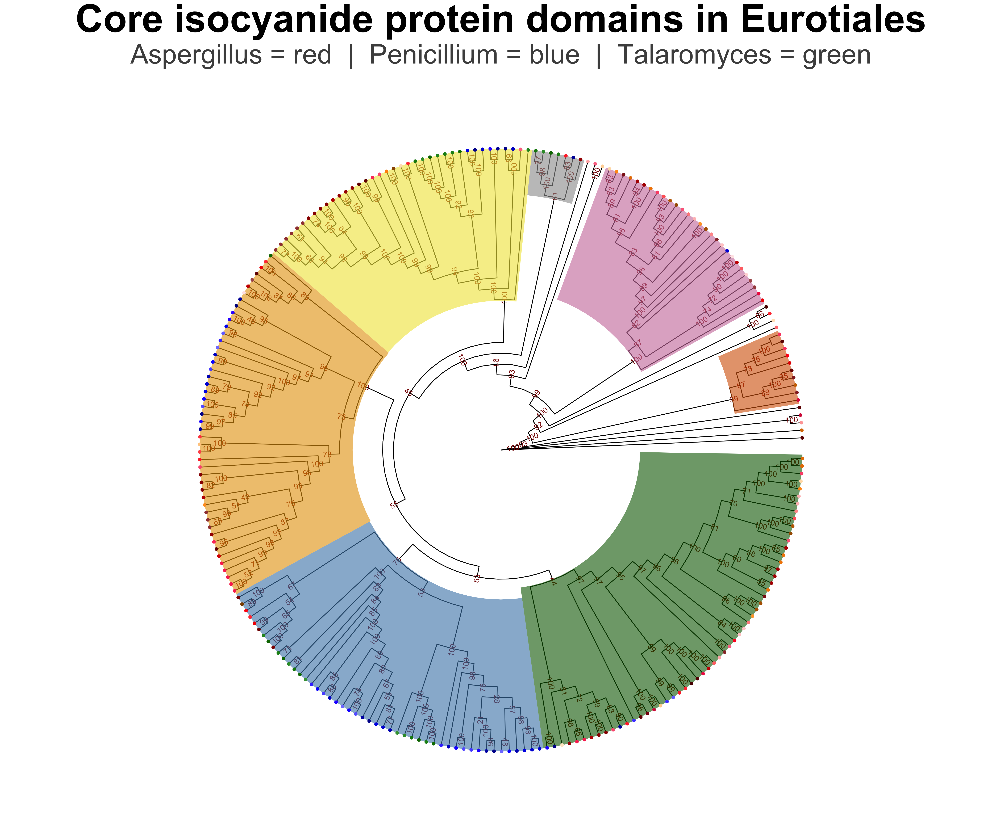

# GN_Botany563
Class repo for Botany 563 to store my scripts and md files.

Any side projects will be in their own file storage location. The main project folder will have my own personal data and all of the script notes that are used in the process of running analysis on said data.

# Main Project
My main project is stored within the MainProject folder. There are two main files that document all of my data, analysis, and steps/troublshooting. Notes.md which is directly in the Main Project folder is all of my notes. This includes how I downloaded software, issues I had, and iterations of steps throughout my project. ReproducibleScript.md is a highly condensed version of Notes.md that only includes the scripts and steps that were involved in the making of my final result.

## Location of Report and Reproducible Script
I created both on the same document. The top of the `./MainProject/ReproducibleScript.md` has the report for my work. The methods and explanation of the methods is included as I also list the scripts i used and the steps that I did.

# Final cladogram that I made as a result of this work 

